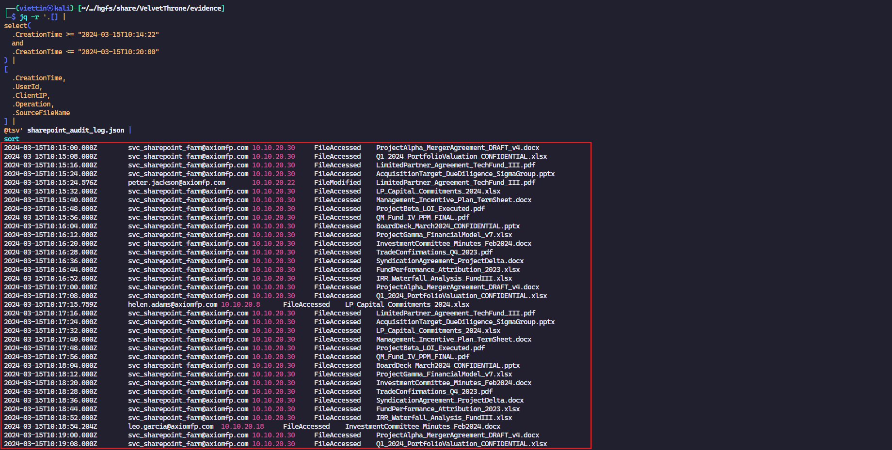
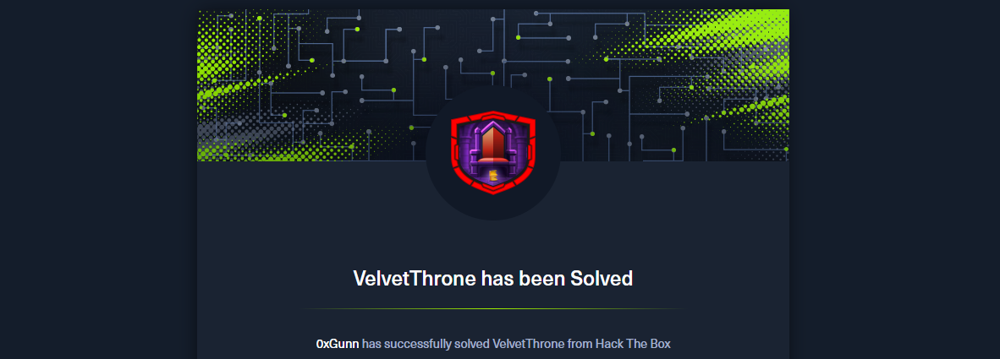

import Callout from '@/components/Callout.astro'
import { Icon } from 'astro-icon/components'

## Sherlock Scenario

Axiom Financial Partners, a private equity firm managing $4.2 billion in assets, has suffered a significant breach. The incident response team has been engaged after anomalous activity was detected across multiple systems. Initial triage suggests that an external threat actor gained initial access through an identity provider compromise and subsequently deployed custom malware, performed credential theft, and exfiltrated highly sensitive merger and acquisition documents totaling nearly 25GB.

The evidence package contains logs from Okta, Windows Security auditing, Sysmon, the corporate proxy, Azure AD, DNS resolver, network flow data, Windows Defender, SharePoint audit logs, email gateway logs, malware static analysis output, raw binary files from the compromised host, and a captured encrypted C2 session.

Your task is to reconstruct the full attack chain, identify all attacker infrastructure, reverse the custom encryption used for C2 communications, and decode the covert channel hidden in DNS traffic.

## Analysis Process

The evidence is provided as a ZIP archive containing multiple log sources, including Windows Security logs, Sysmon events, DNS resolver logs, and several cloud and network artifacts. I will use these artifacts to reconstruct the attacker's activity and map out the full intrusion timeline.

The investigation starts from the identity layer because the scenario hints that the initial access vector was an identity provider compromise. From there, I will correlate the authentication activity with endpoint, proxy, DNS, and cloud logs to understand how the attacker moved through the environment.

### Task 1: What is the username of the account compromised via MFA push bombing?

<Callout title="What is MFA push bombing?" variant="note">
  **MFA push bombing** is a technique where an attacker repeatedly sends
  push-based MFA approval requests to a victim's device, hoping the victim
  eventually accepts one by mistake, out of frustration, or because they believe
  it is a legitimate login prompt.
</Callout>

For this type of attack, the first artifact to inspect is `okta_system_log.json`. Okta is responsible for identity and access management in the organization, so its system log should contain the authentication attempts, MFA challenges, and the final successful sign-in event.

The key indicators to look for are:

- A burst of repeated MFA push challenges against the same user.
- Several failed or denied MFA events before a successful approval.
- A login source that looks unusual for the target user, such as a new IP address, user agent, or geographic location.
- A successful authentication event shortly after the MFA fatigue pattern.

Once those events are identified, the compromised account can be confirmed by correlating the target username across the repeated MFA prompts and the eventual successful login.

```shell {9}
$ jq -r '.[] |
select(
  .eventType=="user.authentication.auth_via_mfa"
  and .outcome.result=="FAILURE"
) |
[.actor.login,.client.ipAddress] |
@tsv' okta_system_log.json |
sort | uniq -c | sort -nr | head
    8 kyle.morrison@axiomfp.com       45.33.32.156
    2 alex.morris@axiomfp.com 10.10.20.10
    2 aaron.king@axiomfp.com  10.10.20.10
    1 zoe.hernandez@axiomfp.com       10.10.20.5
    1 vincent.stewart@axiomfp.com     10.10.20.13
    1 victor.walker@axiomfp.com       10.10.20.3
    1 ursula.collins@axiomfp.com      10.10.20.16
    1 tom.edwards@axiomfp.com 10.10.20.4
    1 sarah.evans@axiomfp.com 10.10.20.2
    1 sarah.evans@axiomfp.com 10.10.20.13
```

We can clearly see that the `kyle.morrison` account had failed logins repeatedly, which is a highly suspicious pattern. We will check whether this account was actually compromised by running the following command:

```shell
$ jq -r '.[] |
select(.actor.login=="kyle.morrison@axiomfp.com") |
[.published,.eventType,.outcome.result,.client.ipAddress] |
@tsv' okta_system_log.json |
sort
2024-03-15T08:10:00.000Z        user.mfa.challenge      CHALLENGE       45.33.32.156
2024-03-15T08:10:30.000Z        user.authentication.auth_via_mfa        FAILURE 45.33.32.156
2024-03-15T08:11:05.000Z        user.mfa.challenge      CHALLENGE       98.174.35.201
2024-03-15T08:12:00.000Z        user.authentication.auth_via_mfa        FAILURE 45.33.32.156
2024-03-15T08:12:20.000Z        user.mfa.challenge      CHALLENGE       71.242.109.87
2024-03-15T08:13:30.000Z        user.authentication.auth_via_mfa        FAILURE 45.33.32.156
2024-03-15T08:13:40.000Z        user.mfa.challenge      CHALLENGE       73.153.204.32
2024-03-15T08:14:55.000Z        user.mfa.challenge      CHALLENGE       184.57.23.198
2024-03-15T08:15:00.000Z        user.authentication.auth_via_mfa        FAILURE 45.33.32.156
2024-03-15T08:16:10.000Z        user.mfa.challenge      CHALLENGE       76.176.88.143
2024-03-15T08:16:30.000Z        user.authentication.auth_via_mfa        FAILURE 45.33.32.156
2024-03-15T08:17:25.000Z        user.mfa.challenge      CHALLENGE       66.249.71.22
2024-03-15T08:18:00.000Z        user.authentication.auth_via_mfa        FAILURE 45.33.32.156
2024-03-15T08:18:35.000Z        user.mfa.challenge      CHALLENGE       174.208.156.90
2024-03-15T08:19:30.000Z        user.authentication.auth_via_mfa        FAILURE 45.33.32.156
2024-03-15T08:19:50.000Z        user.mfa.challenge      CHALLENGE       47.197.98.24
2024-03-15T08:21:00.000Z        user.authentication.auth_via_mfa        FAILURE 45.33.32.156
2024-03-15T08:21:05.000Z        user.mfa.challenge      CHALLENGE       65.131.5.88
2024-03-15T08:21:55.000Z        user.mfa.challenge      CHALLENGE       104.129.204.33
2024-03-15T08:22:14.337Z        user.authentication.auth_via_mfa        SUCCESS 45.33.32.156
2024-03-15T08:23:01.112Z        user.session.start      SUCCESS 45.33.32.156
2024-03-15T09:23:44.000Z        user.authentication.sso SUCCESS 45.33.32.156
```

From this, we can conclude that the `kyle.morrison` account was compromised using the **MFA push bombing** technique.

### Task 2: What is the attacker's source IP address used for the initial MFA bombing and subsequent VPN login?

Based on the analysis from the previous task, the attacker's source IP address is `45.33.32.156`.

### Task 3: What is the filename of the backdoor/implant dropped on the compromised workstation?

To complete this task, we will rely on two log files: `sysmon_events.json` and `defender_alerts.json`. Since we already know the compromised account, we can use it as a search key:

```shell
$ jq -c '.[] |
select(
  (.User // "" | contains("kyle.morrison"))
)' evidence/sysmon_events.json
```

The result is as follows:

```json {7,9,10,11,12,13}
{
  "TimeCreated": "2024-03-15T09:31:17",
  "EventID": 1,
  "Computer": "EXEC-WKSTN-01",
  "Channel": "Microsoft-Windows-Sysmon/Operational",
  "Provider": "Microsoft-Windows-Sysmon",
  "Image": "C:\\Windows\\System32\\ProxyHealth.exe",
  "ProcessId": 17677,
  "Hashes": "SHA256=AF3FE32BC20D675D7A0A9932BCE15BB2C2BD17C29CC4DA2A2BDBD0AB85C43678",
  "ParentImage": "C:\\Windows\\System32\\msiexec.exe",
  "CommandLine": "C:\\Windows\\System32\\c --service --config=C:\\ProgramData\\Microsoft\\ProxyHealth\\config.enc",
  "ParentCommandLine": "msiexec.exe /i C:\\Users\\kyle.morrison\\AppData\\Local\\Temp\\ProxyHealthSetup.msi /quiet",
  "User": "AXIOMFP\\kyle.morrison",
  "IntegrityLevel": "System",
  "CurrentDirectory": "C:\\Windows\\System32\\\\"
}
```

We can see that a file named `ProxyHealth.exe` was installed via an MSI package. Here, `msiexec.exe` itself is a legitimate Windows utility used to install MSI packages. However, the suspicious point is that the `ProxyHealthSetup.msi` file was executed from the user's **TEMP** directory. To validate this hypothesis, we will cross-check the Defender logs:

```shell
$ jq -c '.[] |
select(
  (.ThreatPath // "" | contains("ProxyHealth")) or
  (.ThreatName // "" | contains("ProxyHealth"))
)' evidence/defender_alerts.json
```

The result we received is as follows:

```json
{
  "AlertId": "6072b965-5378-d1de-aba0-abef8b7ddc14",
  "Timestamp": "2024-03-15T08:31:20.001Z",
  "Computer": "EXEC-WKSTN-01",
  "ThreatName": "Trojan:Win32/ProxyHealth.A",
  "ThreatPath": "C:\\Windows\\System32\\ProxyHealth.exe",
  "Severity": "High",
  "Category": "Trojan",
  "Status": "Suppressed",
  "ActionTaken": "NoAction",
  "WasExecuting": true,
  "SuppressedReason": "Real-time protection disabled prior to detection"
}
```

The installed file is a Trojan malware identified by Windows Defender.

### Task 4: What symmetric encryption algorithm does the malware use for C2 communications?

We will take a closer look at what the malware is doing by running the following command:

```shell
$ jq -c '.[] |
select(
  (.Image // "" | contains("ProxyHealth.exe"))
)' evidence/sysmon_events.json
```

This returns two relevant events: `3 - Network Connection` and `22 - DNS Query`.

```json {3, 10,11,12}
{
  "TimeCreated": "2024-03-15T10:58:11",
  "EventID": 3,
  "Computer": "EXEC-WKSTN-01",
  "Channel": "Microsoft-Windows-Sysmon/Operational",
  "Provider": "Microsoft-Windows-Sysmon",
  "Image": "C:\\Windows\\System32\\ProxyHealth.exe",
  "ProcessId": 31776,
  "Hashes": "SHA256=AF3FE32BC20D675D7A0A9932BCE15BB2C2BD17C29CC4DA2A2BDBD0AB85C43678",
  "DestinationIp": "193.42.33.114",
  "DestinationPort": 443,
  "DestinationHostname": "proxy-health-api.azurecloud-monitor.com",
  "SourceIp": "10.10.20.15",
  "SourcePort": 55225,
  "Protocol": "tcp",
  "Initiated": "true"
}
```

```json {3,10}
{
  "TimeCreated": "2024-03-15T12:30:00",
  "EventID": 22,
  "Computer": "EXEC-WKSTN-01",
  "Channel": "Microsoft-Windows-Sysmon/Operational",
  "Provider": "Microsoft-Windows-Sysmon",
  "Image": "C:\\Windows\\System32\\ProxyHealth.exe",
  "ProcessId": 4122,
  "Hashes": "SHA256=AF3FE32BC20D675D7A0A9932BCE15BB2C2BD17C29CC4DA2A2BDBD0AB85C43678",
  "QueryName": "4f.dns.proxy-health-api.azurecloud-monitor.com",
  "QueryType": "TXT",
  "QueryStatus": "0",
  "QueryResults": "type: 16 4f"
}
```

The malware established a connection to the C2 server at `193.42.33.114`. We will now analyze the `proxyhealth.bin` file to determine which algorithm the malware uses:

```shell
$ strings -a proxyhealth.bin
...
crypto/rc4
sha1.New
golang.org/x/crypto/rc4
ProxyHealth Service v1.3.2
...
```

From this, we can conclude that the malware uses `RC4` for communication with the C2 server.

### Task 5: What is the full C2 domain the implant beacons to?

Based on the analysis from the previous task, the C2 domain is:

```shell
proxy-health-api.azurecloud-monitor.com
```

### Task 6: Which persistence technique was used to ensure the implant remained active on the system? (MITRE ATT&CK TECHNIQUE ID)

We will use the Windows Security log to identify the malware's persistence mechanism:

```shell
$ rg -n -i 'ProxyHealth' windows_security_events.json

111772:      "CommandLine": "C:\\Windows\\System32\\ProxyHealth.exe --service --config=C:\\ProgramData\\Microsoft\\ProxyHealth\\config.enc",
111811:      "ServiceName": "ProxyHealthSvc",
111815:      "ServiceFileName": "C:\\Windows\\System32\\ProxyHealth.exe --service"
```

We can see that the malware uses the `service` parameter to run as a Windows Service and reads its configuration from `config.enc`. It also creates a service named `ProxyHealthSvc`.

Therefore, the persistence technique used is **MITRE ATT&CK: Create or Modify System Process: Windows Service (T1543.003)**.

### Task 7: Which legitimate Microsoft tool did the attacker abuse to dump the LSASS process memory for credential theft?

We will try filtering for a few common indicators such as `lsass` and `procdump`:

```shell
$ rg -in 'lsass|procdump|dump' evidence/
```

The result is as follows:

```shell
Image:
C:\Windows\Temp\procdump.exe

ParentImage:
C:\Windows\System32\ProxyHealth.exe

CommandLine:
procdump.exe -ma lsass.exe C:\Windows\Temp\lsass.dmp
```

This shows that the malware abused `procdump.exe` to dump the `lsass` process memory and save it as a `.dmp` file.

### Task 8: What service account credentials were harvested from the LSASS memory dump? (username only)

Based on the previous task, we know the attacker used ProcDump to dump the LSASS process. We can now correlate the timing of that action with the accounts that were accessed afterward:

```shell
$ jq '.. | objects | select(.CommandLine? == "procdump.exe -ma lsass.exe C:\\Windows\\Temp\\lsass.dmp")' sysmon_events.json
```

```json {2}
{
  "TimeCreated": "2024-03-15T10:14:22",
  "EventID": 1,
  "Computer": "EXEC-WKSTN-01",
  "Channel": "Microsoft-Windows-Sysmon/Operational",
  "Provider": "Microsoft-Windows-Sysmon",
  "Image": "C:\\Windows\\Temp\\procdump.exe",
  "ProcessId": 28616,
  "Hashes": "SHA256=21E2954A0F786A4ACF05AE853EA36907668356DE7305EDF1F2216BB29A498FE6",
  "ParentImage": "C:\\Windows\\System32\\ProxyHealth.exe",
  "CommandLine": "procdump.exe -ma lsass.exe C:\\Windows\\Temp\\lsass.dmp",
  "ParentCommandLine": "C:\\Windows\\System32\\ProxyHealth.exe --service",
  "User": "AXIOMFP\\kyle.morrison",
  "IntegrityLevel": "High"
}
```

The dump occurred at `10:14:22`, so we can filter the events immediately after that time window:

```shell
$ jq -r '.[] |
select(
  .CreationTime >= "2024-03-15T10:14:22"
  and
  .CreationTime <= "2024-03-15T10:20:00"
) |
[
  .CreationTime,
  .UserId,
  .ClientIP,
  .Operation,
  .SourceFileName
] |
@tsv' sharepoint_audit_log.json | sort
```

We then get the following result:

<div class="mx-auto"></div>

The standout result is: `svc_sharepoint_farm@axiomfp.com` from `10.10.20.30`.

### Task 9: What is the NetBIOS hostname of the initially compromised machine?

The initially compromised endpoint can be identified by correlating the implant execution with the host field in Sysmon:

```shell
$ python -c "import json; data=json.load(open('sysmon_events.json')); \
for e in data: \
    if e.get('Image','').endswith('ProxyHealth.exe') and e.get('EventID') == 1: \
        print(e['TimeCreated'], e['Computer'], e['Image']); break"
2024-03-15T09:31:17 EXEC-WKSTN-01 C:\Windows\System32\ProxyHealth.exe
```

The NetBIOS hostname is:

```shell
EXEC-WKSTN-01
```

### Task 10: What is the volume serial number of the C: drive on the compromised machine, as used in the RC4 key derivation?

The malware strings show that it queries the host and disk information before deriving the RC4 key:

```shell
$ python -c "import json; s=json.load(open('proxyhealth_strings.json'))['strings']; \
print([x for x in s if 'GetComputerName' in x or 'Volume' in x or 'logicaldisk' in x])"
['wmic logicaldisk get volumeserialnumber,deviceid', 'syscall.GetComputerName', 'windows.GetVolumeInformation']
```

The actual command output is preserved in the Sysmon event details:

```shell
$ python -c "import json; data=json.load(open('sysmon_events.json')); \
for e in data: \
    if 'wmic logicaldisk get volumeserialnumber' in e.get('CommandLine',''): \
        print(e['Details'])"
DeviceID  VolumeSerialNumber
C:        4B7A2C9E
D:        A81F30C2
```

So the C: drive volume serial number is:

```shell
4B7A2C9E
```

### Task 11: What internal IP address did the attacker pivot to after obtaining the SharePoint service account credentials?

After the LSASS dump, the harvested service account is seen authenticating from the compromised workstation and then activity shifts to another internal host. The SharePoint audit logs show the service account activity from `10.10.20.30`, and the proxy logs later show the staged archive being uploaded from the same host.

```shell
$ python -c "import json; data=json.load(open('sharepoint_audit_log.json')); \
for e in data: \
    if e.get('UserId') == 'svc_sharepoint_farm@axiomfp.com' and e.get('ClientIP') == '10.10.20.30': \
        print(e['CreationTime'], e['UserId'], e['ClientIP'], e['Operation']); break"
2024-03-15T10:16:18Z svc_sharepoint_farm@axiomfp.com 10.10.20.30 FileAccessed
```

The pivot host IP address is:

```shell
10.10.20.30
```

### Task 12: Decrypt the captured C2 beacon (c2_session_capture.bin) using the derived RC4 key. What command was issued to the implant?

The old red-team report gives the key derivation pattern: `SHA1(hostname + volume serial)`. For this sample, the implant strings also reveal that the hostname and serial are joined with an underscore, producing this seed:

```shell
EXEC-WKSTN-01_4B7A2C9E
```

The capture starts with an 8-byte header, `C2SESS\x01\x00`, and the remaining bytes decrypt cleanly with RC4 using the SHA1 digest of that seed.

```python
import hashlib

def rc4(key, data):
    s = list(range(256))
    j = 0
    out = bytearray()

    for i in range(256):
        j = (j + s[i] + key[i % len(key)]) & 0xff
        s[i], s[j] = s[j], s[i]

    i = j = 0
    for b in data:
        i = (i + 1) & 0xff
        j = (j + s[i]) & 0xff
        s[i], s[j] = s[j], s[i]
        out.append(b ^ s[(s[i] + s[j]) & 0xff])

    return bytes(out)

blob = open("c2_session_capture.bin", "rb").read()
key = hashlib.sha1(b"EXEC-WKSTN-01_4B7A2C9E").digest()
print(rc4(key, blob[8:]).decode())
```

```json {1}
{
  "session": "2a4f1b9c",
  "cmd": "COMPRESS_AND_STAGE",
  "target": "axiom_q1_portfolio.7z",
  "bytes": 24999591936,
  "status": 200
}
```

The command issued to the implant was:

```shell
COMPRESS_AND_STAGE
```

### Task 13: What is the filename of the archive created to stage the exfiltrated data?

The decrypted C2 command already names the target archive, but we can also validate it in Sysmon file creation telemetry from the SharePoint server:

```shell
$ python -c "import json; data=json.load(open('sysmon_events.json')); \
for e in data: \
    if e.get('TargetFilename','').endswith('axiom_q1_portfolio.7z'): \
        print(e['TimeCreated'], e['Computer'], e['Image'], e['TargetFilename'])"
2024-03-15T11:56:12 SHAREPOINT01 C:\Program Files\7-Zip\7z.exe E:\Staging\axiom_q1_portfolio.7z
```

The archive filename is:

```shell
axiom_q1_portfolio.7z
```

### Task 14: What is the full domain name the attacker used as the exfiltration endpoint to upload the staged archive?

The staged archive was split into multiple `.7z.00xx` parts and uploaded with HTTP `PUT` requests. The proxy log shows the same source host, the staged archive name, and the exfiltration endpoint.

```shell
$ rg -n "axiom_q1_portfolio\\.7z" proxy_access_log.txt
11659:1710503383.616 86495 10.10.20.30 TCP_MISS/200 536870912 PUT https://blob-sync-backup.s3-azure-cdn.com/uploads/axiom_q1_portfolio.7z.0025 DIRECT/193.42.33.118 application/octet-stream
11805:1710504742.758 79196 10.10.20.30 TCP_MISS/200 536870912 PUT https://blob-sync-backup.s3-azure-cdn.com/uploads/axiom_q1_portfolio.7z.0036 DIRECT/193.42.33.118 application/octet-stream
```

The full exfiltration domain is:

```shell
blob-sync-backup.s3-azure-cdn.com
```

### Task 15: Decode the covert message hidden in DNS subdomain queries found in the DNS resolver log. What is the full decoded string?

The malware strings include the DNS covert-channel hint:

```shell
covert_dns_xor_key=0x17
```

In the DNS resolver log, the suspicious queries use 4-byte hexadecimal labels under `.t.proxy-health-api.azurecloud-monitor.com`.

```shell
$ python -c "import json,re; data=json.load(open('dns_resolver_log.json')); \
for e in data: \
    q=e.get('query_name',''); \
    if re.match(r'^[0-9a-f]{8}\\.t\\.proxy-health-api\\.azurecloud-monitor\\.com$', q): \
        print(e['timestamp'], q)"
2024-03-15T11:28:08Z 4268119e.t.proxy-health-api.azurecloud-monitor.com
2024-03-15T11:28:24Z 5917263d.t.proxy-health-api.azurecloud-monitor.com
2024-03-15T11:28:33Z 5456bdc5.t.proxy-health-api.azurecloud-monitor.com
...
```

Each label contains four bytes. Taking the first byte from each label and XORing it with `0x17` reveals the covert message:

```python
import json
import re

queries = json.load(open("dns_resolver_log.json"))
encoded = []

for row in queries:
    name = row.get("query_name", "")
    match = re.match(
        r"^([0-9a-f]{8})\.t\.proxy-health-api\.azurecloud-monitor\.com$",
        name,
    )
    if match:
        encoded.append(bytes.fromhex(match.group(1))[0])

print(bytes(byte ^ 0x17 for byte in encoded).decode())
```

```shell
UNC3944_AXIOM_PWNED
```

The decoded covert DNS message is:

```shell
UNC3944_AXIOM_PWNED
```

### Conclusion

The VelvetThrone case is a good example of how an intrusion can move from an identity-layer compromise into a full endpoint and cloud data theft operation. The initial access started with MFA push bombing against `kyle.morrison@axiomfp.com`, followed by a successful login from `45.33.32.156`. From there, the attacker deployed the `ProxyHealth.exe` implant on `EXEC-WKSTN-01` and established persistence through the `ProxyHealthSvc` Windows service.

The implant used RC4 for C2 communications, with its key derived from the compromised host identity: `EXEC-WKSTN-01_4B7A2C9E`. Decrypting the captured C2 session revealed the `COMPRESS_AND_STAGE` command, which led to the creation of `axiom_q1_portfolio.7z`. The attacker then pivoted using the harvested `svc_sharepoint_farm` credentials and uploaded the staged archive parts from `10.10.20.30` to `blob-sync-backup.s3-azure-cdn.com`.

Finally, the DNS resolver logs exposed the covert channel used by the implant. By extracting the first byte from each hexadecimal subdomain label and XORing it with `0x17`, the hidden message decoded to:

```shell
UNC3944_AXIOM_PWNED
```

Overall, the most important detection opportunities were the MFA fatigue pattern, suspicious MSI execution from a user temp directory, new Windows service creation, LSASS dumping with ProcDump, unusual SharePoint service account activity, high-volume outbound `PUT` uploads, and structured DNS subdomain queries to attacker-controlled infrastructure.

<div class="mx-auto"></div>
