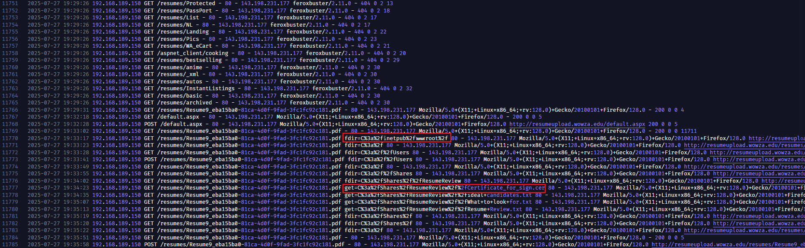
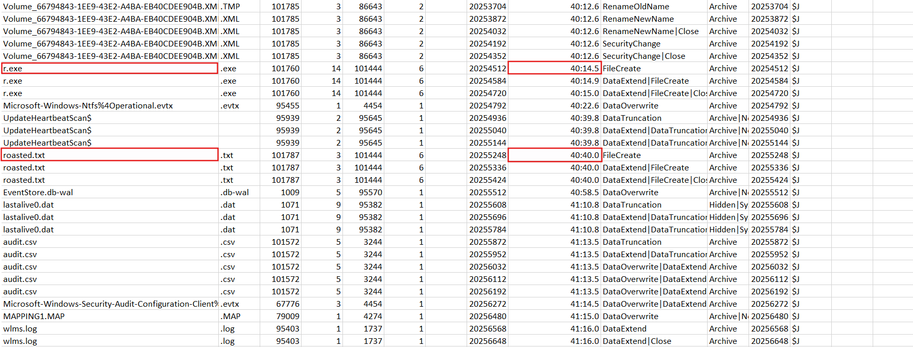

import Callout from '@/components/Callout.astro'
import { Icon } from 'astro-icon/components'

## Sherlock Scenario

Wowza Grand College has opened a job application portal by creating a website for applicants to upload their resumes for HR to review. Recently, the SOC team observed suspicious enrollments to a certificate template in their ADCS infrastructure. The team began collecting evidence from the compromised domain controller to investigate the cause of the unauthorized certificate enrollments.

## Analysis Process

I started with the **C drive** provided by HackTheBox, and my task was to complete 19 questions. Let's begin with the first question.

### Task 1: When did the threat actor first interact with the College's IT Infrastructure?

To determine when the threat actor first interacted with the IT infrastructure, we focused on **IIS web logs**. In the `inetpub/logs/LogFiles/W3SVC1/` directory, the file `u_ex250727.log` records all requests to the website.

When examining the logs chronologically, we found that the suspicious public IP address `143.198.231.177` first appeared in the request:

```shell
2025-07-27 19:27:35 192.168.189.150 GET /index.aspx - 80 - 143.198.231.177 Mozilla/5.0+(X11;+Linux+x86_64;+rv:128.0)+Gecko/20100101+Firefox/128.0 - 404 0 0 737
```

Since this is the earliest request from the attacker's IP address to the portal, the time the threat actor first interacted with the infrastructure is `2025-07-27 19:27:35` UTC.

### Task 2: What is the malicious IP address used for initial reconnaissance and discovery?

To identify the malicious IP used for **initial reconnaissance and discovery**, I checked the IIS web logs because the attacker initially interacted via the job application portal. In the file:

```shell
inetpub/logs/LogFiles/W3SVC1/u_ex250727.log
```

I noticed the public IP address `143.198.231.177` appeared very early on and made many requests to search for paths. Notably, the logs include a User-Agent [feroxbuster](https://github.com/epi052/feroxbuster).

### Task 3: The threat actor uploaded a file using the file upload functionality. Under what name did the server store the uploaded resume file?

Following POST requests to `/default.aspx` from the attacker's IP address `143.198.231.177`, the logs show that the attacker successfully accessed files in the `/resumes/ directory`:

```shell
GET /resumes/Resume9_eba15ba0-81ca-4d0f-9fad-3fc1fc92c181.pdf
```

This line returns status `200`, indicating that the file already exists on the server.

### Task 4: The threat actor uploaded another file in order to change the behavior of this website, allowing the first uploaded file to act as a webshell. What is the name of the uploaded file?

To find the second file the attacker uploaded to make the PDF file act as a webshell, I continued analyzing the IIS logs after the initial resume upload.

After the file `Resume9_eba15ba0-81ca-4d0f-9fad-3fc1fc92c181.pdf` was uploaded, the attacker uploaded another configuration file and then accessed the PDF file again using control parameters such as `fdir` and `get`.

<div class="mx-auto"></div>

In **IIS/ASP.NET**, you can change how the website handles extensions by configuring the following file `web.config`. This file can map a `.pdf` file to an **ASP.NET handler**, causing the PDF file to be executed as a script instead of just downloaded.

### Task 5: Using the webshell, the threat actor uploaded a file on the endpoint to facilitate initial remote access. Identify the full path of this file.

To identify the file the attacker uploaded using a webshell to facilitate initial remote access, I further analyzed the requests after the webshell `Resume9_eba15ba0-81ca-4d0f-9fad-3fc1fc92c181.pdf` had been executed.

The IIS logs contain requests using webshell parameters, particularly during the cleanup phase when the attacker called the file deletion command:

```shell
del=C%3a%2finetpub%2fwwwroot%2fresumes%2f%2f8619.exe
```

When URL-decodes this string, we get the path: `C:\inetpub\wwwroot\resumes\8619.exe`.

### Task 6: The threat actor accessed a shared folder meant for the resume reviewers. What is the full path of the first file they retrieved?

To identify the first file the attacker retrieved from the resume reviewers' shared folder, I analyzed the webshell requests in the IIS logs.

After the webshell started, the attacker used the `get=` parameter to read files from the system. In the logs, the first request to access the `C:\Shares\ResumeReview\` directory was in the form of URL-encoded:

```shell
get=C%3a%2fShares%2fResumeReview%2f%2fCertificate_for_sign.cer
```

When decoding this string, the full path is: `C:\Shares\ResumeReview\Certificate_for_sign.cer`.

### Task 7: Who was the first ideal candidate the company was seeking?

To answer this question, we need to recover the contents of the file that the attacker stole from the shared folder:

```shell
C:\Shares\ResumeReview\ideal candidates.txt
```

Since the Shares folder is no longer directly visible in the file tree, I analyzed the `$MFT` to find the MFT record for this file.

The file `ideal candidates.txt` is a resident file, meaning its data is stored directly within the MFT record, not in an external cluster. After recovering the contents from `$MFT` and performing the MFT fixup, the file contents are:

```shell
Looking for someone like them
- warlocksmurf
- tmechen
- lukasLUZSC
```

### Task 8: A file was dropped to perform a potential Kerberoasting attack in the Active Directory environment. What is the name of this file?

To identify the dropped file intended for a potential **Kerberoasing** attack, I further analyzed the webshell requests in the IIS logs.

After the attacker used the webshell to upload and execute files in the resumes directory, the cleanup phase included a request to delete a file with the URL-encoded parameter:

```shell
del=C%3a%2finetpub%2fwwwroot%2fresumes%2f%2fr.exe
```

When URL-decoded, the path becomes: `C:\inetpub\wwwroot\resumes\r.exe`. Additionally, in `$J`, after the `r.exe` file appears, a file named `roasted.txt` is also created.

<div class="mx-auto"></div>

The name `roasted.txt` is a very clear indicator of **Kerberoasing** output, usually containing a service ticket for offline cracking.

### Task 9: Which service account was targeted by this active directory attack?

I've written a blog post about the offensive and defensive aspects of this technique [here](https://0xgunn.github.io/blog/research---kerberoasting-attack-and-defense/); I think it might help you find the answer to this question.

To identify the targeted service account in Kerberoasting, I analyzed `Security.evtx` and filtered for **Kerberos Event ID 4769** — this log reads **“A Kerberos service ticket was requested”**.

You'll see a lot of log entries; however, don't be afraid. For this technique, the key to a successful attack is the **type of encryption**. We'll filter logs related to **RC4 encryption** – that is, `0x17`.

```xml {3,4,5,8}
<Event xmlns="http://schemas.microsoft.com/win/2004/08/events/event">
- <EventData>
  <Data Name="TargetUserName">iis_svc@WOWZA.EDU</Data>
  <Data Name="TargetDomainName">WOWZA.EDU</Data>
  <Data Name="ServiceName">ca_svc</Data>
  <Data Name="ServiceSid">S-1-5-21-2525499130-77348690-3507557611-1106</Data>
  <Data Name="TicketOptions">0x40800000</Data>
  <Data Name="TicketEncryptionType">0x17</Data>
  <Data Name="IpAddress">::1</Data>
  <Data Name="IpPort">0</Data>
  <Data Name="Status">0x0</Data>
  <Data Name="LogonGuid">{b287db3e-1db1-8457-7046-c433a7e9aeeb}</Data>
  <Data Name="TransmittedServices">-</Data>
  </EventData>
</Event>
```

### Task 10: Attacker dropped another tool to exploit a misconfiguration in AD CS. When was this tool successfully created on the endpoint?

In the IIS logs, after Kerberoasting and AD CS operations, the attacker used a webshell to upload additional tools.

Immediately afterwards, the attacker cleans up the files in the `C:\inetpub\wwwroot\resumes\` directory, which includes `Certipy.exe`. Searching by its name in `C:\$Extend\$J`, we find:

```shell
2025-07-27 19:52:03.015636  0x80000102  Certipy.exe
```

In this context, **CLOSE** indicates that the file writing process is complete, so this is when the file was successfully created on the endpoint.

### Task 11: When was AD CS exploited successfully on the domain controller?

To determine when AD CS was successfully exploited on the domain controller, I analyzed `Security.evtx` and filtered events related to **Certificate Services** around the time the attacker dropped `Certipy.exe`.

The important event is Event ID **4886**: **Certificate Services received a certificate request**.

```xml
<EventData>
  <Data Name="RequestId">6</Data>
  <Data Name="Requester">WOWZA\ca_svc</Data>
  <Data Name="Attributes">CertificateTemplate:PDFSigner SAN:upn=Administrator</Data>
</EventData>
```

At `2025-07-27 19:56:38`, the log shows a request from the account: `WOWZA.edu\ca_svc` with suspicious attributes:

```shell
CertificateTemplate: PDFSigner
SAN: upn=Administrator
```

`SAN:upn=Administrator` proves that the attacker abused the misconfiguration of the **AD CS template** to request a certificate impersonating an **Administrator**.

### Task 12: Identify the name and version of the vulnerable certificate template exploited in the attack.

To identify the name and version of the exploited certificate template, I analyzed `Security.evtx` around the time the attacker exploited AD CS. In the **Certificate Services events**, the suspicious request had the following attribute:

```xml
  <Data Name="TemplateInternalName">PDFSigner</Data>
  <Data Name="TemplateVersion">100.4</Data>
  <Data Name="TemplateSchemaVersion">2</Data>
```

This indicates that the abused template is **PDFSigner**. Then, checking the detailed event log related to the template, the log shows the template version as `100.4`.

### Task 13: A new security descriptor was applied to the vulnerable certificate template and this security descriptor grants full control over the certificate template to a specific group. What is the name of that group?

To determine which group has been granted Full Control on the vulnerable certificate template, I analyzed `Security.evtx` and looked for events related to the PDFSigner template. In the newly applied security descriptor, the log shows the following SDDL:

```shell
(A;;CCDCLCSWRPWPDTLOCRSDRCWDWO;;;AU)
```

In SDDL, AU stands for **Authenticated Users**. The granted permissions correspond to **Full Control** on the certificate template.

### Task 14: When was the certificate issued to the threat actor for a high-privilege user, allowing privilege escalation?

To determine when a certificate was issued to a high-privilege user, I analyzed `Security.evtx` on the domain controller and filtered Certificate Services events, especially:

```shell
Event ID 4887 - Certificate Services approved a certificate request and issued a certificate
```

```xml
<Provider Name="Microsoft-Windows-Security-Auditing" Guid="{54849625-5478-4994-a5ba-3e3b0328c30d}" />
<EventID>4887</EventID>
<Version>0</Version>
<Level>0</Level>
<Task>12805</Task>
<Opcode>0</Opcode>
<Keywords>0x8020000000000000</Keywords>
<TimeCreated SystemTime="2025-07-27T19:57:55.6763111Z" />
<EventRecordID>26793</EventRecordID>
<Correlation ActivityID="{2e19ccb6-fddc-0000-48cd-192edcfddb01}" />
<Execution ProcessID="708" ThreadID="3956" />
<Channel>Security</Channel>
<Computer>MAIN-DC.wowza.edu</Computer>
<Security />
```

This proves the certificate was issued to impersonate an administrator account. Event ID 4887 indicates the certificate was successfully issued.

### Task 15: The threat actor successfully retrieved the NTLM hash of a high-privilege user using the newly issued certificate. What was the serial number of the certificate used to achieve this privilege escalation?

To find the serial number of the certificate used for privilege escalation, I analyzed `Security.evtx` after the certificate was issued by AD CS.

```shell
Event ID 4768 - A Kerberos authentication ticket was requested
```

This event is important because it records the moment an attacker uses a newly issued certificate to request Kerberos TGT for an administrator-privileged account. During the event:

```xml
<Data Name="TargetUserName">Administrator</Data>
<Data Name="TargetDomainName">WOWZA.EDU</Data>
<Data Name="TargetSid">S-1-5-21-2525499130-77348690-3507557611-500</Data>
<Data Name="ServiceName">krbtgt</Data>
<Data Name="ServiceSid">S-1-5-21-2525499130-77348690-3507557611-502</Data>
<Data Name="TicketOptions">0x40800010</Data>
<Data Name="Status">0x0</Data>
<Data Name="TicketEncryptionType">0x12</Data>
<Data Name="PreAuthType">16</Data>
<Data Name="IpAddress">::ffff:127.0.0.1</Data>
<Data Name="IpPort">57899</Data>
<Data Name="CertIssuerName">wowza-MAIN-DC-CA</Data>
<Data Name="CertSerialNumber">1D00000008A6E7524F029E603A000000000008</Data>
<Data Name="CertThumbprint">15F5FE778E03BB9278B655827572EB2AA1AAFA9F</Data>
</EventData>
```

### Task 16: The attacker exploited an Active Directory misconfiguration to gain access to Active Directory secrets stored on the domain controller. What is the MITRE ATT&CK ID for this technique?

Check the evidence in `Security.evtx` on the domain controller. After the attacker used the certificate to impersonate the Administrator, the following events appeared in the logs:

```shell
Event ID 4662 - An operation was performed on an object
```

The key point lies in the Properties section, which contains **GUIDs**:

```shell
{1131f6aa-9c07-11d1-f79f-00c04fc2dcd2}
{1131f6ad-9c07-11d1-f79f-00c04fc2dcd2}
```

These two GUIDs correspond to the **replication permissions** in Active Directory:

```shell
DS-Replication-Get-Changes
DS-Replication-Get-Changes-All
```

This is a typical sign of **DCSync**: the attacker uses privileged access to request Domain Controller replication of credential data, thereby obtaining the user's NTLM hash in AD.

### Task 17: When was the attack mentioned in the previous task successfully carried out?

The previous attack was DCSync, so I checked `Security.evtx` for Event ID `4662`. The successful activity appeared at: `2025-07-27 20:05:14`.

### Task 18: A Golden Ticket was issued using a previously dropped tool. What is the filename of this ticket?

The Golden Ticket filename was identified from the IIS webshell activity. During cleanup, the attacker deleted a `.kirbi` file from:

```shell
C:\inetpub\wwwroot\resumes\
```

The `.kirbi` extension indicates a Kerberos ticket, and the filename contains Administrator and `krbtgt@WOWZA.EDU`, confirming it was the **Golden Ticket**.

```shell
shinyboi_wowza_edu_2025_07_27_20_06_33_Administratorr_to_krbtgt@WOWZA.EDU.kirbi
```

### Task 19: The threat actor used the web shell to delete all files involved in this operation. When did the deletion routine begin?

Evidence was found in the IIS log, where the attacker used the web shell with the `del=` parameter. The first deletion request was for:

```shell
C:\inetpub\wwwroot\resumes\8619.exe
```

Since this is the first `del=` request in the cleanup sequence, the deletion routine began at `2025-07-27 20:11:13`.

## Conclusion

This JobApplicant Sherlock challenge demonstrates a sophisticated and multi-staged attack chain that leverages common misconfigurations in Windows environments. The threat actor skillfully exploited a vulnerable file upload mechanism to establish initial access, then systematically escalated privileges through a series of well-coordinated attacks.

**Attack Chain Summary:**
The attacker began with reconnaissance using feroxbuster to map the application, then uploaded a malicious PDF resume. By deploying a `web.config` file to change ASP.NET handler mappings, the attacker transformed the PDF into a functional webshell. From this foothold, the attacker executed a cascading series of attacks: **Kerberoasting** against the service account, **AD CS exploitation** via the vulnerable PDFSigner template to impersonate an administrator, and finally **DCSync** to extract the krbtgt hash for Golden Ticket generation.

**Key Takeaways:**

1. **Defense in Depth Matters**: The attack exploited multiple layers of misconfiguration — the web application's unsafe file upload, AD CS template weaknesses, and overly permissive NTLM usage.
2. **Monitoring is Critical**: Event logs (Security.evtx), IIS logs, and MFT records were invaluable for forensic reconstruction and showed clear evidence of compromise.
3. **Certificate Services Hardening**: The ESC1 vulnerability highlights why organizations must carefully review AD CS template permissions and enforce certificate autoenrollment restrictions.
4. **Credential Protection**: The transition from Kerberoasting to certificate-based privilege escalation shows how attackers chain techniques to bypass traditional defenses.

This challenge reinforces that defenders must implement comprehensive logging, harden certificate services infrastructure, validate all file uploads rigorously, and maintain strict monitoring of authentication events in Active Directory environments.

<div class="mx-auto"></div>
