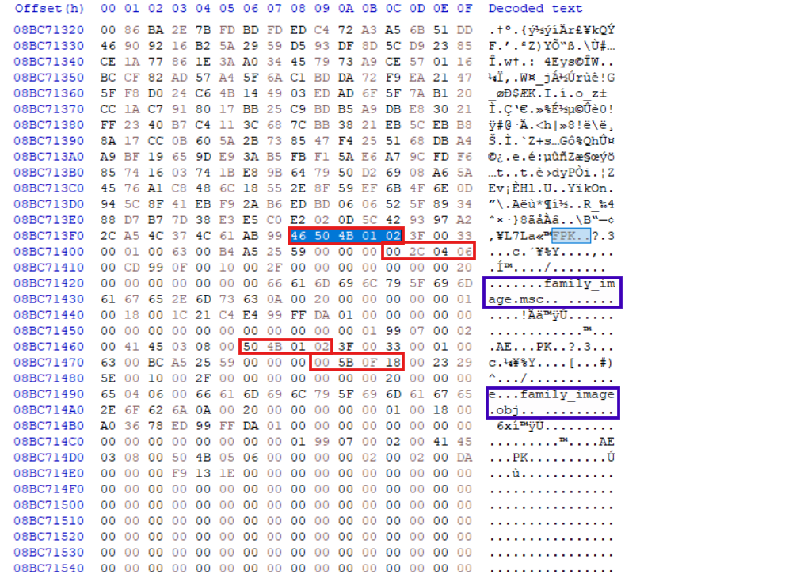
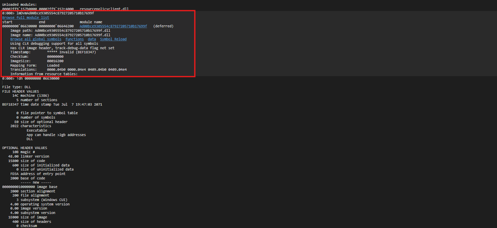
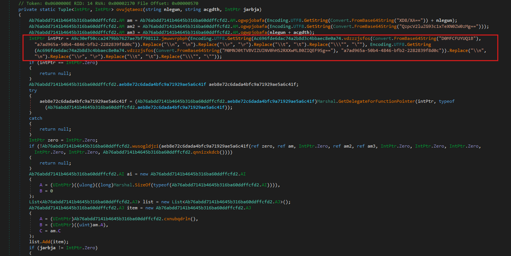
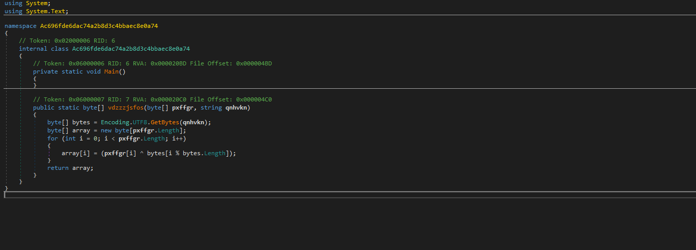
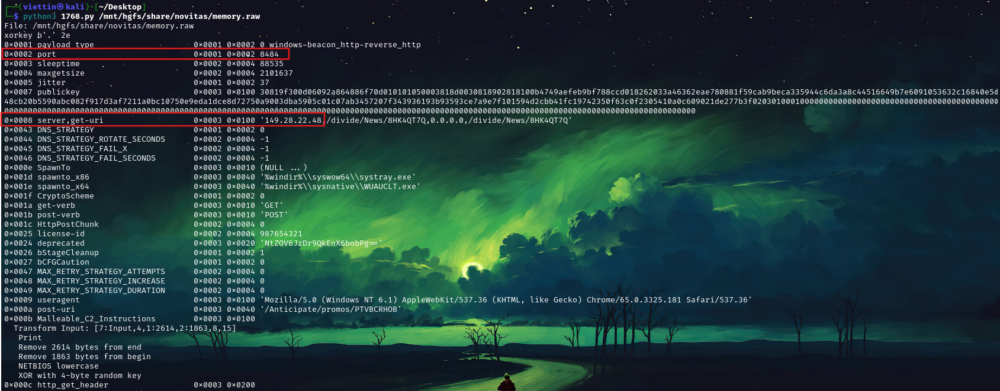
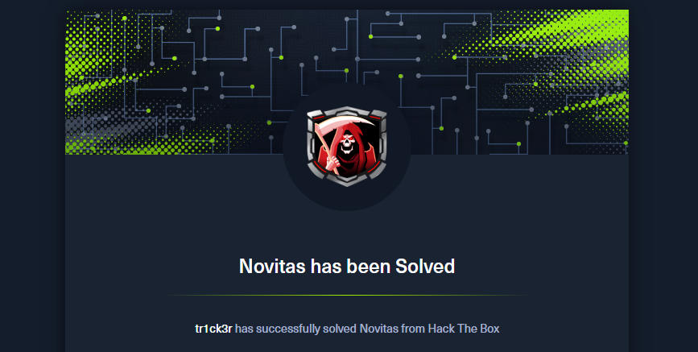

import Callout from '@/components/Callout.astro'
import { Icon } from 'astro-icon/components'

## Sherlock Scenario

Recently, Binz received a request via email to create a 3D model for a client's family. Upon downloading and opening the provided files, he observed unusual system behavior that raised suspicion. Acting on instinct, he promptly deleted the files; however, he remained concerned that the system might still be compromised.

In response, we acquired a full memory dump from the affected machine for in-depth malware analysis. The objective of this investigation is to identify indicators of compromise (IOCs) that can be integrated into our Endpoint Detection and Response (EDR) systems, as we suspect the use of a novel and sophisticated infection vector.

## Analysis Process

I started with a `.raw` file provided by HackTheBox, and my task was to complete ten questions. Let's begin with the first question.

### Task 1: When does the suspicious process start?

The first task is to find the start time of the suspicious process. We can use some of the plugins provided by [Volatility3](https://github.com/volatilityfoundation/volatility3), such as `pslist`, `pstree`, and `psscan`.

```shell
python3 ~/Desktop/volatility3/vol.py -f memory.raw windows.pslist
```

I noticed two suspicious processes:

- `HxOutlook.exe`
- `mmc.exe`

When I used the filescan plugin to filter by `.pst` file, the results were empty. However, after analyzing the `mmc.exe` process, I discovered the suspicious file was `family_image.msc`.

**Process Details:**

```shell
PID:        3120
PPID:       3144
Process:    mmc.exe
Offset(V):  0xa78511394080
Threads:    14
Session:    1
Wow64:      False
Start (UTC):2024-09-05 15:58:11.000000
ExitTime:   N/A

ImagePath:  \Device\HarddiskVolume3\Windows\System32\mmc.exe
CommandLine:"C:\Windows\system32\mmc.exe" "C:\Users\IEUser\AppData\Local\Temp\MicrosoftEdgeDownloads\91617dd3-f62f-4c28-ba7d-8769251040b3\family_image.msc"
FilePath:   C:\Windows\system32\mmc.exe
```

**Key Finding:**

Microsoft Management Console (`mmc.exe`) is a legitimate Windows process, but the fact that it opens an `.msc` file from the `MicrosoftEdgeDownloads` folder in Temp is highly suspicious.

<Callout
  title="What are Microsoft Management Console and .msc files?"
  variant="note"
>
  **Microsoft Management Console (MMC)** is an add-on utility in Microsoft Windows that allows users to centrally manage and maintain their system. The MMC provides access to various management utilities such as Device Manager, Event Viewer, Performance Monitor, and Disk Management.

**.msc file** is a MMC Console file: a configuration file that defines which snap-ins will be loaded and how the console will be displayed.

</Callout>

Therefore, we can easily find the answer to be `2024-09-05 15:58:11`

### Task 2: What is the size of the archive file containing the malware in bytes?

I used a plugin to find the hold file but got no results because the victim had deleted all the files. So I decided to use the strings command and filter by filename.

It appears the victim downloaded a file named `family_image.zip`. In this case, the user deleted the file, so I can no longer check its size by looking at the filesystem. However, traces of the ZIP file still remain in the RAM dump. Standard ZIP file structures have signatures that are easily found in hex:

- Local File Header: `50 4B 03 04`.
- Central Directory File Header: `50 4B 01 02`.
- End of Central Directory: `50 4B 05 06`.

You can read more
[here](http://medium.com/@felixstridsberg/the-zip-file-format-6c8a160d1c34). Even though ZIP files are scattered throughout the dump and cannot be reassembled, Central Directory still shows you which files are in the ZIP, and the Compressed Size of each file. From there, you can add them up plus the overhead header to get the ZIP size.

<div class="mx-auto"></div>

We see that the first file has a compressed size of `0x180f5b`, and the second file has a compressed size of `0x6042c`.

```shell
0x180f5b + 0x6042c = 0x1e1387
```

Converting `0x1e1387` to decimal gives us `1,971,079` bytes. In addition, a ZIP file contains not only "compressed data," but also Local File Headers for each file, Central Directory headers for each file, End of Central Directory, and length variables such as FileName, ExtraField, Comment, etc.

```shell
1,971,079 (compressed data) + 354 (headers/metadata) = 1,971,433 bytes
```

Another way is to use Edge's HISTORY file, which is much simpler. Just use the dumpfile plugin and sqlite3 to open it.

### Task 3: Unzip the malware archive, then list its files in alphabetical order.

As we analyzed in task 2, the answer is `family_image.msc`,`family_image.obj`.

### Task 4: How many native (NAT) modules are loaded in the suspicious process?

First, we need to understand what a native module is.

<Callout
  title="What is native modules?"
  variant="note"
>
When a process runs, it loads many pieces of code from elsewhere into memory, for example: `kernel32.dll`, `ntdll.dll`, `user32.dll`, etc. These are collectively called modules.

**Native** means code that runs directly on the CPU (x86/x64), in the Windows PE format. Examples include standard Windows DLLs/EXE files.

The opposite is **managed** (usually .NET), for example, .NET assemblies running through the CLR (Common Language Runtime).

</Callout>

To find native modules loaded into the suspicious process, we can use the `dlllist` plugin.

```shell
python3 ~/Desktop/volatility3/vol.py -f memory.raw windows.dlllist --pid 3120
```

The output has a total of **102** modules loaded. However, we only include the native modules. Therefore, removing the `.ni.dll` files, the final result will be **98**.

### Task 5: Submit the assembly address of all CLR modules in Ascending order.

To find the assembly address, we will use a tool called [MemProcsFS](https://github.com/ufrisk/MemProcFS) to extract artifacts from the memory file.

```shell
MemProcFS.exe -device D:\sharedVB\mnt\novitas\memory.raw
```

Once we have the minidump file of the suspected process, we can use WinDbg to analyze it.

We can see the assembly addresses of the modules. In addition to the four modules mentioned earlier, we also discovered another module named `Ad00bce9305554c87927205710b17699f`.
Arranged in order, we get the result:

```shell
0000000004e62fd0,0000000004e630f0,0000000004e63690,0000000004e638d0,0000000004e63b10
```

### Task 6: What is the name of the malicious module loaded?

As previously analyzed, the mathematical module is named `Ad00bce9305554c87927205710b17699f`.

### Task 7: Submit md5 of DLL file

The next task is to extract DLL file from memory and obtain its md5 code. We will still use Windbg for this task. We will use the `lmDvm` command to view detailed information about the module.

<div class="mx-auto"></div>

Once we have the start and end addresses, we can use the `.writemem` command to dump the module file.

```shell
  .writemem "D:\sharedVB\mnt\Ad00bce.dll" 00000000`06630000 00000000`066461ff
```

The MD5 hash can be easily found as follows: `e67f5692a35b8e40049e30ad04c12b41`

### Task 8: What is the xor key used to obfuscate strings in the dll?

This DLL file is written in C#, so we will use dnSpy to parse it. The program is very complex, making parsing very difficult.

Right in the first class, `Ae555509b7d114e538171cd15b0c6bd9a`, we see calls to the Base64 encoding function.

<div class="mx-auto"></div>

Delving deeper into the class `Ac696fde6dac74a2b8d3c4bbaec8e0a74`, we find it contains a function `vdzzzjsfos()` - this is the function that performs the XOR operation with the second parameter as the key.

<div class="mx-auto"></div>

Therefore, the key here is `a7ad965a-50b4-4846-bfb2-2282839f8d0c`.

### Task 9: What is the IP of C2 server and port the malware connects to?

After uploading the malicious DLL file to VirusTotal, we can see that it is a variant of Cobalt Strike. Therefore, we can use the following [script](https://raw.githubusercontent.com/DidierStevens/DidierStevensSuite/refs/heads/master/1768.py) to parse the configurations in memory.

<div class="mx-auto"></div>

So the IP address and port of the C2 Server are `149.28.22.48:8484`.

### Task 10: What is the md5 hash of shellcode used for the final stage?

In class `A350ef0f96fc540f795e5f85e7441820a`, we see a function called `emlajrwidb()` that performs the following functions:

```csharp
public bool emlajrwidb(string fmgdmb, Y jpbpzh, X ccnepm)
		{
			if (!this.efppbgegmi(jpbpzh))
			{
				return false;
			}
			string text = fmgdmb;
			if (ccnepm != X.A)
			{
				if (ccnepm != X.C)
				{
					goto IL_5F;
				}
			}
			else
			{
				try
				{
					text = File.ReadAllText(fmgdmb);
					goto IL_5F;
				}
				catch (Exception)
				{
					return false;
				}
			}
			string text2 = "";
			int num = 1;
			string environmentVariable;
			while (!string.IsNullOrEmpty(environmentVariable = Environment.GetEnvironmentVariable(string.Format("{0}_{1}", fmgdmb, num), EnvironmentVariableTarget.Process)))
			{
				text2 += environmentVariable;
				num++;
			}
			text = text2;
			IL_5F:
			if (string.IsNullOrEmpty(text))
			{
				return false;
			}
			if (jpbpzh == Y.B)
			{
				this.B = text;
			}
			else
			{
				this.A = text;
			}
			return true;
		}
```

This function retrieves the payload from the ENV process and stores it in the variable `this.B`. We can use the `envars` plugin to extract all the process's environment variables.

```shell
python3 ~/Desktop/volatility3/vol.py -f memory.raw windows.envars --pid 3120
```

After some searching, we will find the function `andxkgfxxp` that performs the payload decoding in the class `Abddcbaea7acb47039a7d3800a0862e5b`.

```csharp
internal static byte[] andxkgfxxp(string lpxpmd)
		{
			string text;
			try
			{
				text = lpxpmd.Replace("A$+", string.Empty);
			}
			catch (Exception)
			{
				return null;
			}
			char[] array;
			try
			{
				array = text.ToCharArray();
			}
			catch (Exception)
			{
				return null;
			}
			try
			{
				Array.Reverse(array);
			}
			catch (Exception)
			{
				return null;
			}
			string text2 = new string(array);
			string str;
			try
			{
				str = new string('=', (4 - text2.Length % 4) % 4);
			}
			catch (Exception)
			{
				return null;
			}
			byte[] result;
			try
			{
				result = Convert.FromBase64String(text2 + str);
			}
			catch (Exception)
			{
				result = null;
			}
			return result;
		}
```

Perform the decoding and you will get the hash code: `f7efce4bac431a5c703e73cce7c5f7c7`.

## Conclusion

This investigation demonstrates the sophistication of the **Novitas malware campaign**, which uses legitimate Windows tools and advanced obfuscation to evade detection. By analyzing memory artifacts, we identified critical IOCs across the attack chain:

- **Malicious Module Hash**: `e67f5692a35b8e40049e30ad04c12b41`
- **XOR Key**: `a7ad965a-50b4-4846-bfb2-2282839f8d0c`
- **Shellcode Hash**: `f7efce4bac431a5c703e73cce7c5f7c7`
- **Suspicious Pattern**: `mmc.exe` loading `.msc` files from temporary directories

The attack leverages code obfuscation, Cobalt Strike C2 infrastructure, and environment variable-based payload staging. Memory forensics proved essential in reconstructing the attack chain and identifying indicators that would evade signature-based detection. Organizations should prioritize memory analysis capabilities in their EDR systems to defend against similar threats.

<div class="mx-auto"></div>
