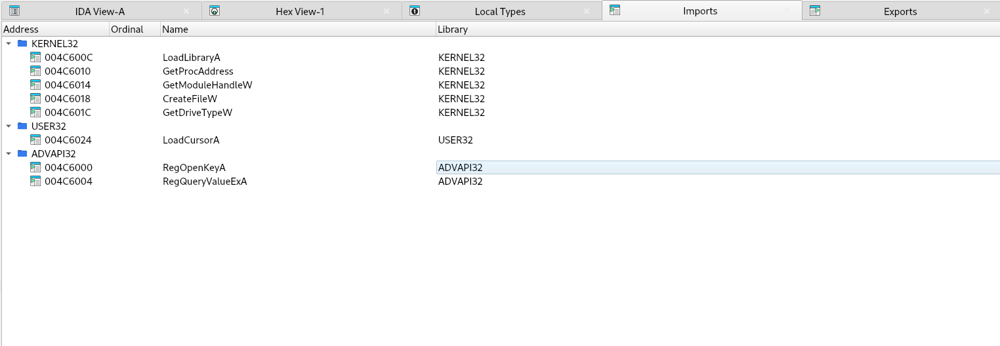
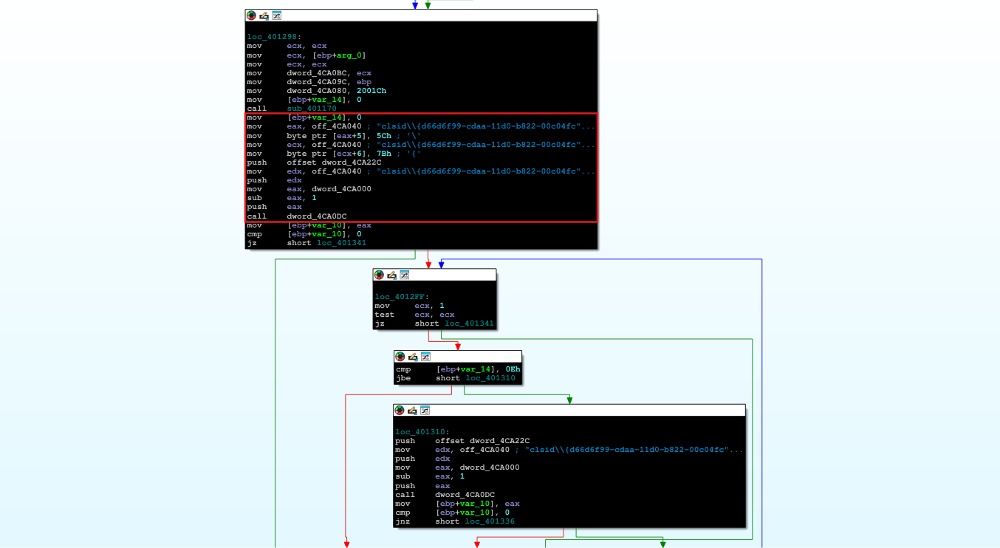
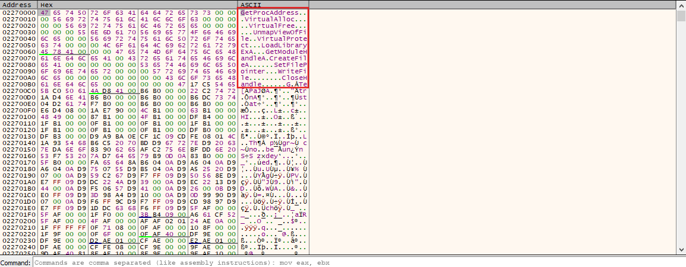
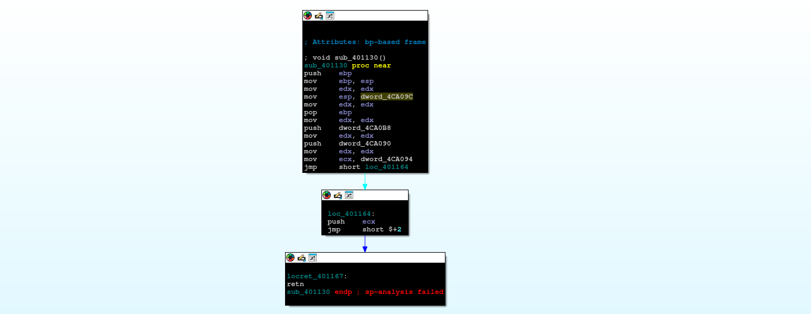

import Callout from '@/components/Callout.astro'
import { Icon } from 'astro-icon/components'

## Scenario

A workstation in your network has been flagged for suspicious outbound traffic to multiple foreign IP addresses linked to the Simda botnet. Forensic triage reveals a malicious file (`svchost32.exe`) in `C:\Users\Public\Libraries\` and DNS queries to random-looking domains resolving via fast-flux hosting. Simda is known as a loader, capable of downloading other malware. Your task is to investigate the provided PCAP, event logs, and filesystem artifacts to identify the initial infection vector, C2 infrastructure, and any additional payloads delivered, and to recommend containment steps.

## Analysis Process

This is a **real malware**, and there have been many analyses of it. Sample Hash (SHA-256):

```shell
b2e5f58e46da212ca0346b3973db515803b94140b297d5b2125c48394945c400
```

Analysis Challenge: https://malops.io/challenges/simda

### Task 1. What is the first windows API used by the malware to allocate memory?

In the **Imports tab** of IDA, we see that it imports two API functions: **LoadLibraryA** and **GetProcAddress**.

- **LoadLibraryA** : Load a DLL into the process and return an **HMODULE** handle.
- **GetProcAddress** : Get the **"function address" (function pointer)** from a loaded DLL.

<div class="mx-auto"></div>

When examining the references to `GetProcAddress`, we see that it is called in the function `sub_44016B0()`.

```c
LPVOID __cdecl sub_4016B0(SIZE_T a1)
{
  HMODULE LibraryA; // eax
  LPVOID (__stdcall *VirtualAllocEx)(HANDLE, LPVOID, SIZE_T, DWORD, DWORD); // [esp+0h] [ebp-10h]
  SIZE_T v4; // [esp+4h] [ebp-Ch]

  v4 = a1;
  LibraryA = LoadLibraryA(LibFileName);
  VirtualAllocEx = (LPVOID (__stdcall *)(HANDLE, LPVOID, SIZE_T, DWORD, DWORD))GetProcAddress(LibraryA, ProcName);
  if ( a1 == 2 )
    v4 = 634880;
  return VirtualAllocEx((HANDLE)-1, 0, v4, dword_4CA00C, 64);
}
```

This function uses `LoadLibraryA` and `GetProcAddress` to get the address of `VirtualAllocEx`, then calls `VirtualAllocEx` to allocate memory with a size depending on the parameter `a1`. This technique is called **Dynamic Loading** or **Dynamic API Resolution**.

This technique allows malware to **hide API** names in files, **bypass static parsing or signatures**, and **ensures compatibility** across multiple Windows versions.

### Task 2. What does the second parameter given to RegOpenKeyA call point to?

In the pseudocode of the `sub_401170()` function:

```c
LSTATUS (__stdcall *sub_40  1170())(HKEY hKey, LPCSTR lpSubKey, PHKEY phkResult)
{
  LSTATUS (__stdcall *result)(HKEY, LPCSTR, PHKEY); // eax

  result = RegOpenKeyA;
  dword_4CA0DC = (int)RegOpenKeyA;
  return result;
}
```

This is a function used to **initialize a function pointer**. It assigns the `RegOpenKeyA` API to a **global variable (`dword_4CA0DC`)** so that it can be called indirectly elsewhere.

In the `start` function, we see that it calls the function pointer `dword_4CA0DC` as follows:

<div class="mx-auto"></div>

This code modifies the registry string CLSID to the correct format. Then it pushes the parameters in the following order:

- `dword_4CA22C`: This is the **third parameter - PHKEY phkResult**.
- `off_4CA040`: This is the **second parameter - LPCSTR lpSubKey**.
- `dword_4CA000 - 1`: This is **first parameter - HKEY hKey (root)**.

So its function is to open `HKCR\clsid\{d66d6f99-cdaa-11d0-b822-00c04fc9b31f}`.

### Task 3. The malware dynamically resolves Windows API function names in memory, and decrypts a large blob of data, which function is responsible for grabbing the encrypted blobs? Provide address in hex

As we analyzed in **Task 1**, the malware uses **Dynamic API Resolution** to allocate memory using the function `sub_4016B0` (`allocate_memory`). The return value of `VirtualAllocEx` is the **base address of the allocated memory**. Using the reference function, we see that this function is used in the start function.

```c {30,31, 32, 47, 52}
int __cdecl start(int a1)
{
  int v1; // ecx
  int v3; // ecx
  unsigned int v4; // [esp+4h] [ebp-14h]
  int v5; // [esp+10h] [ebp-8h]
  int savedregs; // [esp+18h] [ebp+0h] BYREF

  if ( LoadCursorA(0, (LPCSTR)0x142D) )
    sub_401130(v1);
  v5 = ((int (__cdecl *)(WCHAR *, int, int, _DWORD, int, int, _DWORD))CreateFileW)(word_4CA044, 1, 3, 0, 3, 128, 0);
  if ( v5 != -1 && v5 )
    return 66;
  CreateFileW(word_4CA044, 1u, 3u, 0, 3u, 0x80u, 0);
  GetDriveTypeW(&RootPathName);
  if ( LoadCursorA(0, (LPCSTR)0x142D) )
    sub_401130(v3);
  dword_4CA0BC = a1;
  dword_4CA09C = (int)&savedregs;
  dword_4CA080 = 131100;
  sub_401170();
  v4 = 0;
  off_4CA040[5] = 92;
  off_4CA040[6] = 123;
  if ( dword_4CA0DC(dword_4CA000 - 1, off_4CA040, &dword_4CA22C) )
  {
    while ( v4 <= 0xE && dword_4CA0DC(dword_4CA000 - 1, off_4CA040, &dword_4CA22C) )
      ++v4;
  }
  dword_4CA0C4 = (int)sub_4014F0(); // grab encrypted data
  dword_4CA084 = sub_401180(dword_4CA0C4);  // size of payload
  dword_4CA0C8 = (int)allocate_memory(dword_4CA084); // allocate buffer to save payload
  dword_4CA088 = dword_4CA084;
  dword_4CA0AC = 0;
  dword_4CA0B0 = 0;
  while ( 1 )
  {
    sub_401100(dword_4CA0A4, dword_4CA088);
    sub_401100(dword_4CA0A4, dword_4CA088);
    if ( dword_4CA0AC >= (unsigned int)dword_4CA084 )
      break;
    sub_401100(dword_4CA0A4, dword_4CA088);
    dword_4CA0A4 = 68;
    dword_4CA0A8 = 31;
    dword_4CA08C = sub_401100(68, dword_4CA088);
    dword_4CA0C0 = dword_4CA0AC + dword_4CA0C8;
    sub_4011B0(dword_4CA0AC + dword_4CA0C8, dword_4CA0B0 + dword_4CA0C4, dword_4CA08C);
    dword_4CA0B0 += dword_4CA0A4 + dword_4CA0A8;
    dword_4CA0AC += dword_4CA0A4;
    dword_4CA088 -= dword_4CA08C;
  }
  sub_401000(dword_4CA0C8, dword_4CA084);
  dword_4CA094 = dword_4CA0C8 + 552656;
  return sub_401130(dword_4CA0C8 + 552656);
}
```

Look at the pseudocode of the `sub_4011B0` function.

```c
int __cdecl sub_4011B0(int a1, int a2, unsigned int a3)
{
  int result; // eax
  unsigned int i; // [esp+4h] [ebp-4h]

  for ( i = 0; ; ++i )
  {
    result = 523;
    if ( i >= a3 )
      break;
    *(_BYTE *)(i + a1) = *(_BYTE *)(i + a2);
  }
  return result;
}
```

The `sub_4011B0` function essentially copies byte-by-byte from the source memory area to the destination memory area, up to a maximum of **3 bytes**, and always returns `523` (`0x20B`). So the function responsible for grabbing the encrypted blobs is located at address `0x4011B0`.

### Task 4. The malware uses a dynamic key for decryption, What is the initial decryption key used to decrypt the encrypted blobs (word size)?

At the end of the `start` function, we see it calls the `sub_401000` function with two parameters: a buffer containing the payload and the payload length. This is most likely the **payload decoding function**.

```c
int __cdecl sub_401000(int a1, unsigned int a2)
{
  int result; // eax

  result = 0;
  for ( offset = 0; offset < a2; offset += 4 )
  {
    dword_4CA230 = offset + a1;
    *(_DWORD *)(offset + a1) += offset;
    result = sub_401650(3, offset + 45238);
  }
  return result;
}

int __cdecl sub_401650(int a1, int a2)
{
  int result; // eax

  dword_4CA0D8 = a2;
  result = a2 ^ *(_DWORD *)dword_4CA230;
  *(_DWORD *)dword_4CA230 = result;
  return result;
}
```

It iterates through the buffer in **4-byte** increments, and for each DWORD at `a1+offset`, it adds the offset and then **XOR** it with (`offset+45238`) to transform the data.

```c
*(DWORD *)(a1 + offset) = ( *(DWORD *)(a1 + offset) + offset ) ^ (offset + 0xB0B6);
```

### Task 5. What is the name of the first Windows API function decrypted

According to the functions we have analyzed, the `sub_401650` function will perform the main encryption function and overwrite the data at `dword_4CA230`, which is `dword_4CA0C8 + offset`.

Using **x32Dbg**, jump to function `sub_401650` at address `0x00401650`.

```asm {21}
push ebp
mov ebp,esp
sub esp,D8
mov eax,dword ptr ds:[4CA230]
mov dword ptr ss:[ebp-8],eax
mov ecx,dword ptr ss:[ebp-A8]
add ecx,4
mov dword ptr ss:[ebp-A8],ecx
mov edx,dword ptr ss:[ebp-A8]
add edx,4
mov dword ptr ss:[ebp-A8],edx
mov eax,dword ptr ss:[ebp-A8]
add eax,4
mov dword ptr ss:[ebp-A8],eax
mov ecx,dword ptr ss:[ebp+C]
mov dword ptr ds:[4CA0D8],ecx
mov edx,dword ptr ss:[ebp-8]
mov eax,dword ptr ds:[edx]
xor eax,dword ptr ds:[4CA0D8]
mov ecx,dword ptr ss:[ebp-8]
mov dword ptr ds:[ecx],eax
```

Set the breakpoint at address `0x004016A5`, which is the command "`mov dword ptr [ecx], eax`". The **ECX register** is a pointer to the **DWORD** in the buffer (the destination address).

<div class="mx-auto"></div>

Ultimately, we discovered that the first decoded value was a Windows API corresponding to **GetProcAddress**.

### Task 6. What is the address of the ret instruction responsible for jumping to decrypted shellcode?

Looking at the function `sub_401130`, we can see the following code logic:

<div class="mx-auto"></div>

We see the following suspicious assembly instruction:

```asm {1,5,7,9}
mov     esp, dword_4CA09C
mov     edx, edx
pop     ebp
mov     edx, edx
push    dword_4CA0B8
mov     edx, edx
push    dword_4CA090
mov     edx, edx
mov     ecx, dword_4CA094
jmp     short loc_401164
```

Instead of using the current stack, it takes the value at global `dword_4CA09C` and assigns it to `ESP`, after which the stack is moved to a different memory location.

Next, in the `start` function, instead of terminating the program as usual, the address of `sub_401130` is placed in the `eax` register, then pushed onto the stack and the `ret` instruction is executed.

```asm {1,9}
mov     eax, offset sub_401130
mov     edi, edi
mov     ecx, ecx
mov     edi, edi
push    eax
mov     edi, edi
mov     ecx, ecx
mov     edi, edi
retn
```

Because on the `x86` architecture, the `ret` instruction takes the value at the top of the stack as the jump address (i.e., assigns that value to EIP), this action is equivalent to redirecting the execution thread to `sub_401130`.

This means the `EIP` will be assigned using the shellcode address stored in `dword_4CA094`. So the address of the ret instruction responsible for jumping to decrypted shellcode is `0x401167`.

### Task 7: Based on the memory allocated by the malware, what is the offset of the first instruction executed after decryption? in hex

From question 6, we identified that the address pointing to the start of the decrypted shellcode blob was stored in `dword_4CA094`. Looking at the `start` function, we see that it is formed by adding `dword_4CA0C8` to `0x86ED0`.

```asm {8,9,10}
loc_4014A0:
mov     edx, dword_4CA084
push    edx
mov     eax, dword_4CA0C8
push    eax
call    sub_401000
add     esp, 8
mov     ecx, dword_4CA0C8
add     ecx, 86ED0h
mov     dword_4CA094, ecx
mov     edi, edi
mov     eax, offset sub_401130
mov     edi, edi
mov     ecx, ecx
mov     edi, edi
push    eax
mov     edi, edi
mov     ecx, ecx
mov     edi, edi
retn
```

**Updates are ongoing...**
