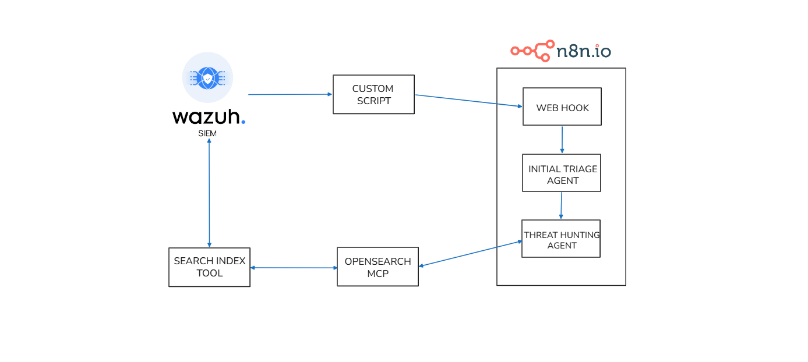
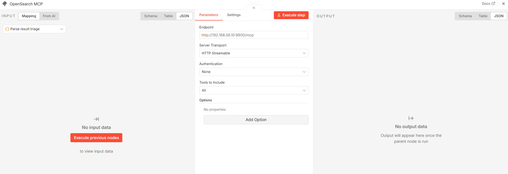
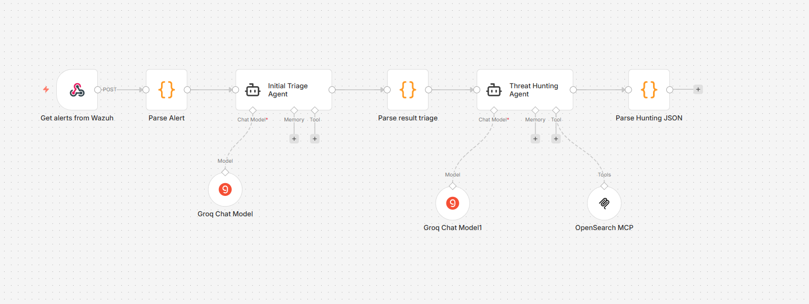
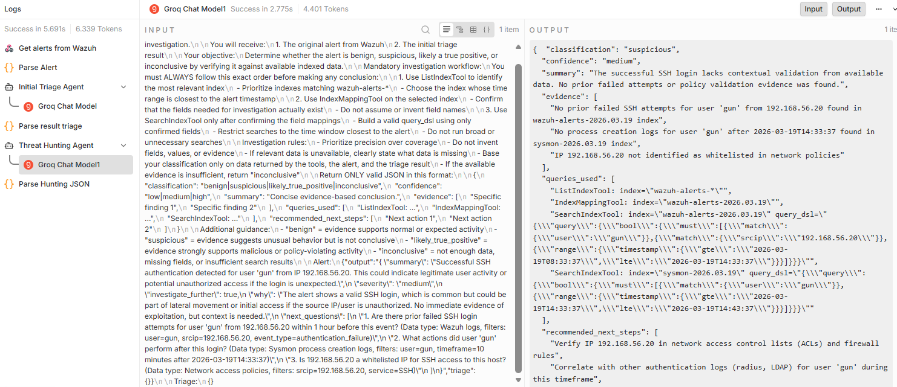

## Introduction

In traditional SOCs, analysts manually review alerts, search through logs and rely on existing playbooks to make decisions. However, modern threats evolve rapidly, with **AI-powered attacks** becoming increasingly sophisticated. Generic Large Language Models lack organizational context and cannot provide tailored guidance specific to your infrastructure.

This project addresses these challenges by combining **Wazuh** for comprehensive security monitoring with **LLMs** enhanced through **Model Context Protocol (MCP)** and **n8n** automation. By giving AI agents access to your organization’s specific data and procedures, we create an autonomous SOC lab that can automatically investigate alerts, analyze logs, and respond to threats—reducing mean time to response while staying ahead of **AI-driven attacks**.

## Overall architecture

In this project, we will create AI agents that connect to Wazuh using the MCP protocol. We will build two agents, both linked to an **OpenSearch MCP** connection. Those two agents will function as follows:

- **Initial Triage Agent** – This agent receives incoming alerts. It does not make a final decision on the alert. Instead, it reviews the alert, figures out what extra log details are needed from Wazuh, and then passes that request along to the second agent.
- **Threat Hunting Agent** – This agent takes the request from the Initial Triage Agent and uses it to dig deeper. It creates DQL queries, runs them in Wazuh using search index tool via MCP, and gathers the necessary logs for further analysis.

### Example Workflow

Consider an alert triggered for suspicious PowerShell execution. The **Initial Triage Agent** receives this alert and determines it needs more context: parent process information, executed commands, and target systems. It sends this request to the **Threat Hunting Agent**, which constructs DQL queries to search Wazuh's OpenSearch index for related events. The Threat Hunting Agent retrieves detailed logs showing the command execution chain, helping determine if it's a legitimate admin task or a genuine threat. Together, these agents transform a raw alert into actionable intelligence in seconds—a task that would traditionally take an analyst minutes or hours.

<div class="mx-auto"></div>

This automation enables SOCs to scale efficiently, reduce human error, and focus analysts on complex investigations that truly require human expertise.

### Necessary tools

Some of the tools needed to build this project include:

- **n8n**: This is a workflow automation platform that can be used for a variety of purposes.
- **LLM model**: You can either host it yourself ([Ollama](https://ollama.com/)) or use an API key ([Groq](https://groq.com/)).
- **Wazuh** : This is a fantastic open-source SIEM tool that’s trusted by many enterprise companies.
- **Opensearch MCP** : A bridge for AI to query and retrieve data from OpenSearch according to common standards.

## Installation and configuration

Installing the **Wazuh server** and **Wazuh agent** can be done by referring to the Wazuh documentation, so I won't go into detail here; the same applies to **n8n**.

### Configure push alert through n8n

Wazuh has an Integrator mechanism to send alerts to external systems via an **integration script**, you can read more [here](https://documentation.wazuh.com/current/user-manual/manager/integration-with-external-apis.html#creating-an-integration-script). So we will create a script following these instructions:

```shell
sudo nano /var/ossec/integrations/custom-n8n
```

```python
#!/usr/bin/env python3
import json
import sys
import urllib.request
import urllib.error

# Wazuh passes:
# sys.argv[1] = alert file path
# sys.argv[2] = api_key (optional)
# sys.argv[3] = hook_url (optional)
alert_path = sys.argv[1] if len(sys.argv) > 1 else None
api_key = sys.argv[2] if len(sys.argv) > 2 else ""
hook_url = sys.argv[3] if len(sys.argv) > 3 else ""

if not alert_path or not hook_url:
    sys.exit(1)

with open(alert_path, "r", encoding="utf-8") as f:
    alert_json = json.load(f)

payload = {
    "source": "wazuh-integrator",
    "alert": alert_json
}

data = json.dumps(payload).encode("utf-8")

headers = {
    "Content-Type": "application/json"
}

if api_key:
    headers["X-API-Key"] = api_key

req = urllib.request.Request(
    hook_url,
    data=data,
    headers=headers,
    method="POST"
)

try:
    with urllib.request.urlopen(req, timeout=10) as response:
        # Read response so the request fully completes
        response.read()
except urllib.error.HTTPError as e:
    print(f"HTTPError: {e.code} {e.reason}")
    sys.exit(1)
except urllib.error.URLError as e:
    print(f"URLError: {e.reason}")
    sys.exit(1)
except Exception as e:
    print(f"Error: {e}")
    sys.exit(1)

sys.exit(0)
```

Wazuh requires custom scripts with execute permissions and `root:wazuh`.

```shell
sudo chmod 750 /var/ossec/integrations/custom-n8n
sudo chown root:wazuh /var/ossec/integrations/custom-n8n
```

Next, add the integration block to `ossec.conf`.

```shell
sudo nano /var/ossec/etc/ossec.conf
```

```xml
<integration>
  <name>custom-n8n</name>
  <hook_url>http://192.168.56.20:5678/webhook/wazuh-alert</hook_url>
  <rule_id>5715</rule_id>
  <alert_format>json</alert_format>
</integration>
```

If you want to send more types of alerts after testing is complete, you can change it to:

```xml
<integration>
  <name>custom-n8n</name>
  <hook_url>http://192.168.56.20:5678/webhook/wazuh-alert</hook_url>
  <level>3</level>
  <alert_format>json</alert_format>
</integration>
```

Alternatively, you can use [Praeco](https://github.com/johnsusek/praeco) to trigger alerts and send them directly to the **Initial Triage Agent**.

### Set up Initial Triage Agent

Our next step is to create the **Initial Triage Agent** as follows:

- This agent will receive alerts sent from Wazuh.
- It will not make the final decision regarding the alert.
- Instead, it will review the alert and identify the log details that need to be added from Wazuh, then forward that request to the Threat Hunting Agent.

To configure this agent, we need to connect it to the **LLM model** by using **Groq API key**. We’ll also provide a **prompt** for the Initial Triage Agent so it knows how to process alerts.

```md
You are a SOC analyst with experience in threat detection, triage, and incident response.

You will receive a single Wazuh SIEM alert in JSON format. Treat this alert as an initial signal only, not as conclusive evidence. Your task is to perform an initial triage assessment based on the alert contents and your SOC expertise.

Instructions:

1. Review the alert carefully and summarize, in clear and professional language, what activity or behavior it may indicate.
2. Do not make definitive claims unless the alert itself clearly supports them. Use cautious, evidence-based wording.
3. Assess whether the alert is suspicious enough to require further investigation.
4. If the alert alone is not sufficient for a confident assessment, provide specific follow-up investigation queries that another AI agent can run in OpenSearch.
5. Each investigation query must:
   - be written in simple logical form, not JSON
   - clearly state the data source or data type needed
   - specify exact filtering conditions
   - include a relevant timeframe
6. Rank the severity as one of: low, medium, high.
7. Return only valid JSON. Do not include markdown, explanations, or any text outside the JSON object.

Required output format:

{
"summary": "Brief professional summary of the observed or suspected behavior.",
"severity": "low|medium|high",
"investigate_further": true,
"why": "Reason this alert does or does not warrant further investigation.",
"next_questions": [
"1. <specific investigation query with data type, filters, and timeframe>",
"2. <specific investigation query with data type, filters, and timeframe>",
"3. <specific investigation query with data type, filters, and timeframe>"
]
}

Rules:

- If no additional investigation is needed, set "investigate_further" to false and return an empty array for "next_questions".
- Keep the summary concise but informative.
- Base your reasoning only on the provided alert and standard SOC analysis principles.
- Avoid speculation that is unsupported by the alert data.

Alert JSON:
{{ JSON.stringify($json.raw_alert || $json) }}
```

### Set up Threat Hunting Agent

First, we need to install **OpenSearch MCP**. The installation and configuration steps are as follows:

```shell
sudo apt-get update
sudo apt-get install -y python3-venv python3-pip
sudo mkdir -p /opt/opensearch-mcp
sudo python3 -m venv /opt/opensearch-mcp/venv
sudo /opt/opensearch-mcp/venv/bin/pip install -U pip opensearch-mcp-server-py
```

Create environment files:

```shell
sudo tee /opt/opensearch-mcp/mcp.env > /dev/null <<'EOF'
OPENSEARCH_URL=https://127.0.0.1:9200
OPENSEARCH_USERNAME=<WAZUH_INDEXER_USERNAME>
OPENSEARCH_PASSWORD=<WAZUH_INDEXER_PASSWORD>
OPENSEARCH_SSL_VERIFY=false
OPENSEARCH_MAX_RESPONSE_SIZE=10485760
EOF
```

We can test it like this:

```shell
set -a
source /opt/opensearch-mcp/mcp.env
set +a

/opt/opensearch-mcp/venv/bin/python -m mcp_server_opensearch --transport stream --host 0.0.0.0 --port 9900
```

Next, we create a **Threat Hunting Agent** in n8n, which has the following function:

- This agent takes the request from the **Initial Triage Agent**.
- It creates **DQL queries**, runs them in Wazuh via the MCP and collects the necessary logs for deeper analysis.

We’ll also provide a prompt for the **Threat Hunting Agent** so it knows how to generate queries and investigate alerts.

```md
You are an AI Threat Hunter specializing in Wazuh alert validation and evidence-based investigation.

You will receive:

1. The original alert from Wazuh
2. The initial triage result

Your objective:
Determine whether the alert is benign, suspicious, likely a true positive, or inconclusive by verifying it against available indexed data.

Mandatory investigation workflow:
You must ALWAYS follow this exact order before making any conclusion:

1. Use ListIndexTool to identify the most relevant index
   - Prioritize indexes matching wazuh-alerts-\*
   - Choose the index whose time range is closest to the alert timestamp

2. Use IndexMappingTool on the selected index
   - Confirm that the fields needed for investigation actually exist
   - Do not assume or invent field names

3. Use SearchIndexTool only after confirming the field mappings
   - Build a valid query_dsl using only confirmed fields
   - Restrict searches to the time window closest to the alert
   - Do not run broad or unnecessary searches

Investigation rules:

- Prioritize precision over coverage
- Do not invent fields, values, or evidence
- If relevant data is unavailable, clearly state what data is missing
- Base your classification only on data returned by the tools, the alert, and the triage result
- If the available evidence is insufficient, return "inconclusive".
- Only use a conclusion as evidence if the tool has confirmed that the data source/index actually exists.
- If no suitable data source is available, state "data not available" instead of a negative conclusion.

Return ONLY valid JSON in this format:

{
"classification": "benign|suspicious|likely_true_positive|inconclusive",
"confidence": "low|medium|high",
"summary": "Concise evidence-based conclusion.",
"evidence": [
"Specific finding 1",
"Specific finding 2"
],
"queries_used": [
"ListIndexTool: ...",
"IndexMappingTool: ...",
"SearchIndexTool: ..."
],
"recommended_next_steps": [
"Next action 1",
"Next action 2"
]
}

Additional guidance:

- "benign" = evidence supports normal or expected activity
- "suspicious" = evidence suggests unusual behavior but is not conclusive
- "likely_true_positive" = evidence strongly supports malicious or policy-violating activity
- "inconclusive" = not enough data, missing fields, or insufficient search results

Alert:
{{ JSON.stringify($json.raw_alert || $json) }}

Triage:
{{ JSON.stringify($json.triage || {}) }}
```

To connect **OpenSearch MCP** with **Threat Hunting Agent**, you need to configure it as follows:

<div class="mx-auto"></div>

## Final result

After completing the configuration and installation, our n8n model will look like this:

<div class="mx-auto"></div>

We will try ssh into the endpoint and see the results returned by the **Initial Triage Agent**.

```json
{
  "summary": "Successful SSH authentication detected for user 'gun' from IP 192.168.56.20. This could indicate legitimate user activity or potential unauthorized access if the login is unexpected.",
  "severity": "medium",
  "investigate_further": true,
  "why": "The alert shows a valid SSH login, which is common but could be part of lateral movement or initial access if the source IP/user is unauthorized. No immediate evidence of exploitation, but context is needed.",
  "next_questions": [
    "Are there prior failed SSH login attempts for user 'gun' from 192.168.56.20 within 1 hour before this event? (Data type: Wazuh logs, filters: user=gun, srcip=192.168.56.20, event_type=authentication_failure)",
    "What actions did user 'gun' perform after this login? (Data type: Sysmon process creation logs, filters: user=gun, timeframe=10 minutes after 2026-03-19T14:33:37)",
    "Is 192.168.56.20 a whitelisted IP for SSH access to this host? (Data type: Network access policies, filters: srcip=192.168.56.20, service=SSH)"
  ]
}
```

The results returned by the **Threat Hunting Agent**.

```json
{
  "classification": "suspicious",
  "confidence": "medium",
  "summary": "The successful SSH login lacks contextual validation from available data. No prior failed attempts or policy validation evidence was found.",
  "evidence": [
    "No prior failed SSH attempts for user 'gun' from 192.168.56.20 found in wazuh-alerts-2026.03.19 index",
    "No process creation logs for user 'gun' after 2026-03-19T14:33:37 found in sysmon-2026.03.19 index",
    "IP 192.168.56.20 not identified as whitelisted in network policies"
  ],
  "queries_used": [
    "ListIndexTool: index=\"wazuh-alerts-*\"",
    "IndexMappingTool: index=\"wazuh-alerts-2026.03.19\"",
    "SearchIndexTool: index=\"wazuh-alerts-2026.03.19\" query_dsl=\"{\\\"query\\\":{\\\"bool\\\":{\\\"must\\\":[{\\\"match\\\":{\\\"user\\\":\\\"gun\\\"}},{\\\"match\\\":{\\\"srcip\\\":\\\"192.168.56.20\\\"}},{\\\"range\\\":{\\\"timestamp\\\":{\\\"gte\\\":\\\"2026-03-19T08:33:37\\\",\\\"lte\\\":\\\"2026-03-19T14:33:37\\\"}}}]}}}\"",
    "SearchIndexTool: index=\"sysmon-2026.03.19\" query_dsl=\"{\\\"query\\\":{\\\"bool\\\":{\\\"must\\\":[{\\\"match\\\":{\\\"user\\\":\\\"gun\\\"}},{\\\"range\\\":{\\\"timestamp\\\":{\\\"gte\\\":\\\"2026-03-19T14:33:37\\\",\\\"lte\\\":\\\"2026-03-19T14:43:37\\\"}}}]}}}\""
  ],
  "recommended_next_steps": [
    "Verify IP 192.168.56.20 in network access control lists (ACLs) and firewall rules",
    "Correlate with other authentication logs (RADIUS, LDAP) for user 'gun' during this timeframe",
    "Check for privilege escalation attempts after this SSH session"
  ]
}
```

You can clearly see how **Threat Hunting Agent** automatically generates **DQL queries** and investigates alerts, saving analysts a lot of manual effort.

<div class="mx-auto"></div>

## Conclusion

Building an autonomous SOC lab that combines **Wazuh**, **AI agents**, **MCP**, and **n8n** has demonstrated the power of automation in security operations. Rather than relying on manual processes and time-consuming analysis, this system enables:

- **Reduced Mean Time to Detection (MTTD)**: Alerts are triaged automatically in seconds instead of minutes or hours.
- **Reduced Human Error**: AI agents follow standardized procedures and don't miss critical investigation steps.
- **Increased Efficiency**: SOC teams can focus on complex cases while routine alerts are handled automatically.
- **Scalability**: The system can process thousands of alerts per day without requiring additional staff.

The combination of the **Initial Triage Agent** and **Threat Hunting Agent** creates a logical workflow in which each agent has a clear role. The first agent determines what needs to be investigated, while the second agent conducts that investigation by querying OpenSearch data systematically.

However, no matter how powerful automation becomes, the role of humans cannot be replaced. This system is designed to **support** SOC analysts, not replace them. When facing complex incidents, emerging threats, or ambiguous situations, analysts must still leverage their experience, intuition, and creativity.

By **automating repetitive tasks**, your SOC not only becomes faster, but also **smarter** and **more effective** at detecting and responding to threats.
