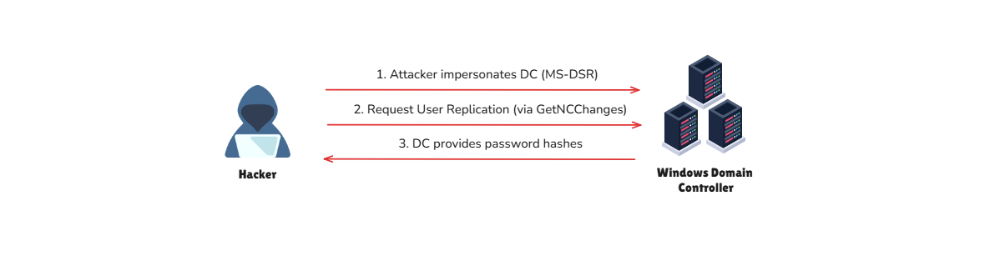

import Callout from '@/components/Callout.astro'
import { Icon } from 'astro-icon/components'

## Introduction

**DCSync** is an attack that threat agents utilize to **impersonate** a Domain Controller and perform replication with a targeted Domain Controller to extract password hashes from Active Directory. The attack can be performed both from the perspective of a user account or a computer, as long as they have the **necessary permissions assigned**, which are:

- **Replicating Directory Changes**
- **Replicating Directory Changes All**

<Callout
  title="What is the Directory Replication Service (DRS) Protocol?"
  variant="note"
>
  The DRS protocol is a fundamental component of Active Directory that
  facilitates data replication between domain controllers. This ensures
  consistency across the AD environment. The protocol operates over specific
  endpoints, allowing DCs to share user accounts, group memberships, and other
  directory objects.
</Callout>

Some other concepts you need to know include:

- **DRSUAPI (Directory Replication Service (Update) API)**: This API is used for **managing and performing replication operations** within Active Directory. Attackers interact with this API to request sensitive directory data.
- **DsGetNCChanges**: This is a **specific method within DRSUAPI** that enables domain controllers to retrieve changes from another domain controller. During a DC Sync attack, this request is abused to extract directory information like password hashes.

## Attack Path

The DCSync attack works as follows:

<div class="mx-auto"></div>

**Step 1.** **Abusing Permissions**: An attacker obtains or abuses an account with **“Replicating Directory Changes”** permissions. This permission is typically granted to accounts or systems that legitimately need to replicate directory information, such as backup solutions or custom scripts.

**Step 2.** **Mimicking a Domain Controller**: Using tools like **Mimikatz** or **Impacket**, the attacker simulates a domain controller and sends replication requests to the target DC.

**Step 3.** **Extracting Data**: The target DC, trusting the request as legitimate, provides the requested directory information, including sensitive credentials like password hashes and Kerberos tickets.

**Step 4.** **Exploiting the Information**: The attacker uses the extracted credentials for further attacks, such as **Pass-the-Hash**, lateral movement, or privilege escalation.

There are many tools available to carry out this attack, such as the following:

```shell
impacket-secretsdump '<domain>'/'<username>':'<password>'@'<target_ip>'
```

```shell
privilege::debug
lsadump::dcsync /user:<target_user>
lsadump::dcsync /domain:ignite.local /user:krbtgt
```

It is possible to specify the `/all` parameter instead of a specific username, which will dump the hashes of the entire AD environment. We can perform **pass-the-hash** with the obtained hash and authenticate against any Domain Controller.

## Prevention

What DCSync abuses is a **common operation** in Active Directory environments, as replications happen between Domain Controllers all the time. Therefore, preventing DCSync out of the box is not an option. The only prevention technique against this attack is using solutions such as the [RPC Firewall](https://github.com/zeronetworks/rpcfirewall), a third-party product that can block or allow specific RPC calls with robust granularity. For example, using RPC Firewall , we can only allow **replications from Domain Controllers**.

## Detection

Detecting DCSync is easy because each Domain Controller replication generates an event with the ID [4662](https://www.ultimatewindowssecurity.com/securitylog/encyclopedia/event.aspx?eventid=4662) . We can pick up abnormal requests immediately by monitoring for this event ID and checking whether the initiator account is a Domain Controller. Some of the indicators in **event ID 4662** are as follows:

- **The Account Name (Subject/Initiator)** is not the Domain Controller's account.

- **AccessMask**: `0x100` - Usually corresponds to **Control Access (extended rights)** and appears when using replication privileges.

- **Properties containing replication permission GUIDs**:

```shell
{1131f6aa-9c07-11d1-f79f-00c04fc2dcd2} - DS-Replication-Get-Changes
{1131f6ad-9c07-11d1-f79f-00c04fc2dcd2} - DS-Replication-Get-Changes-All
{9923a32a-3607-11d2-b9be-0000f87a36b2} - DS-Install-Replica
{89e95b76-444d-4c62-991a-0facbeda640c} - DS-Replication-Get-Changes-In-Filtered-Set
```

## Reference

- **[BLSOPS - Detecting DCSync](https://blog.blacklanternsecurity.com/p/detecting-dcsync)** - Comprehensive guide on detecting DCSync attacks through event log analysis and identifying abnormal replication activities.
- **[HackingArticles - Credential Dumping: DCSync Attack](https://www.hackingarticles.in/credential-dumping-dcsync-attack/)** - In-depth explanation of DCSync attack methodology, tools, and practical examples of credential extraction from Active Directory.
